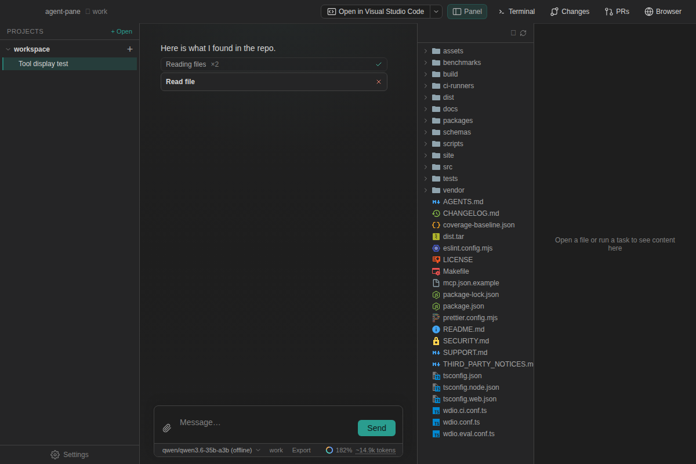

<p align="center">
  
</p>

# Copse

**An open-source AI coding assistant that lives alongside your code.**

Copse brings agent chat, an editor, terminal, git tools, and a browser into one desktop app. Ask it to understand a codebase, make a change, run tests, or investigate a problem while you follow its work and stay in control of what it can do.

Copse has no hosted backend of its own. Connect your preferred cloud provider directly, use a local model, or combine the two.

<p align="center">
  <a href="https://github.com/copse-dev/agent-pane"><strong>View on GitHub</strong></a>
  ·
  <a href="https://copse.dev/">Website</a>
  ·
  <a href="https://github.com/copse-dev/agent-pane/issues">Issues</a>
</p>



> Copse is currently distributed from source. The supported app target is macOS 26 or newer on Apple Silicon and Intel Macs. Linux and Windows can be used for source development, but are not supported release targets yet.

## Why Copse?

- **Everything in one workspace.** Chat with an agent beside a Monaco editor, terminal, file explorer, git changes, and an in-app browser.
- **Bring the models you want.** Use Anthropic, OpenAI, OpenRouter, and other hosted providers, or connect local models through LM Studio, Ollama, llama.cpp, Jan, vLLM, and OpenAI-compatible endpoints.
- **See the work, not just the answer.** Tool activity, diffs, commands, subagents, and failures stay visible in the conversation.
- **Keep meaningful control.** Review proposed file edits and approve actions that need access beyond the project sandbox. Copse sends requests directly to the provider you select and does not add its own cloud service in the middle.
- **Extend the agent.** Add reusable skills, MCP servers, custom tools, hooks, and compatible ACP coding agents. Copse can also reuse supported skills and MCP servers from your existing Cursor setup.
- **Work your way.** Attach files, editor selections, or screen recordings; search code by meaning; fork conversations; queue follow-up messages; and hand exploration to subagents.

## Get started

You need [Node.js](https://nodejs.org/) 22.18 or newer. On macOS, install the Xcode command-line tools too.

```bash
git clone https://github.com/copse-dev/agent-pane.git
cd agent-pane
npm ci
npm run dev
```

Then:

1. Open a project folder.
2. Choose a model during setup. You can enter a provider API key, scan your environment for an existing key, or connect a local model server.
3. Start with a concrete request such as “explain how authentication works,” “fix the failing tests,” or “add this feature and show me the diff.”

API keys entered in Copse are encrypted with the operating system's secure storage when it is available. Environment-only keys are not written to Copse's settings. See [Privacy and data flow](docs/privacy-data-flow.md) and [Provider data policies](docs/provider-data-policies.md) before choosing a hosted provider.

## What’s included

| Area       | Highlights                                                                           |
| ---------- | ------------------------------------------------------------------------------------ |
| Agent      | Multi-turn chat, plans, tool calls, message queueing, thread forks, and subagents    |
| Code       | Monaco editing, file, selection and video attachments, diffs, and semantic search    |
| Workspace  | Integrated terminal, git status and changes, file explorer, and web browser          |
| Models     | Direct cloud providers, OpenRouter, local servers, and ACP coding agents             |
| Extensions | Skills, Cursor-compatible hooks and plugin sources, MCP, and JavaScript custom tools |
| Control    | Edit review, permission prompts, macOS project sandboxing, and per-tool approvals    |

## Contributing

No model key is required to explore the development build: when no provider is configured, Copse uses a small built-in mock agent.

Before submitting a change, run:

```bash
npm run check
```

Changes to the Electron UI should also be built and covered by a focused end-to-end visual test. See [AGENTS.md](AGENTS.md) and the [testing strategy](docs/testing-strategy.md) for the full contributor workflow.

<details>
<summary><strong>Common development commands</strong></summary>

| Command            | Purpose                                                      |
| ------------------ | ------------------------------------------------------------ |
| `npm run dev`      | Build in watch mode and launch Electron                      |
| `npm run build`    | Create the application bundle in `dist/`                     |
| `npm start`        | Launch an existing build                                     |
| `npm test`         | Run unit and component tests                                 |
| `npm run test:e2e` | Run Electron end-to-end tests                                |
| `npm run check`    | Run typecheck, lint, formatting, dead-code checks, and tests |

</details>

<details>
<summary><strong>Install troubleshooting</strong></summary>

Copse's postinstall prepares native Electron dependencies and downloads the bundled semantic-search engine. If npm is configured with `ignore-scripts=true`, allow scripts for this install:

```bash
npm ci --ignore-scripts=false
```

Or run the native setup manually after installing dependencies:

```bash
SKIP_ELECTRON_REBUILD=1 node scripts/postinstall-native.mts
```

Use `SKIP_GORTEX_FETCH=1` if you intentionally do not want the bundled semantic-search binary.

</details>

## Learn more

- [Support and known issues](SUPPORT.md)
- [Security policy](SECURITY.md)
- [Privacy and data flow](docs/privacy-data-flow.md)
- [Provider retention and training policies](docs/provider-data-policies.md)
- [Backup and recovery](docs/recovery.md)
- [MCP example configuration](mcp.json.example)
- [Custom tools](docs/custom-tools.md)
- [Skills and feature packs](docs/packs.md)
- [ACP agent setup](docs/acp-setup-guide.md)
- [Screen recording support](docs/video-frames.md)
- [Conversation storage format](docs/thread-store-format.md)
- [Changelog and releases](CHANGELOG.md)

## License

Copse is available under the [Apache License 2.0](LICENSE).
