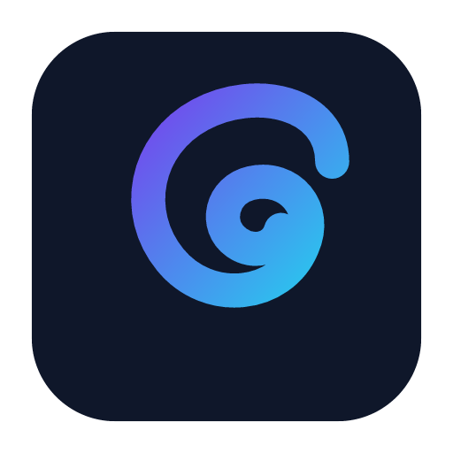

<p align="center">
  
</p>

# Copse

Electron desktop app (`copse-panel`): an AI coding assistant that chats with LLMs and uses tools against opened project folders. Three-pane UI with agent chat, Monaco editor, terminal, git, semantic search, built-in browser, MCP, and subagents — writes and shell commands wait for your approval.

Requires Node ≥ 22.

## Quick start

```bash
npm install
npm run dev
```

Set `ANTHROPIC_API_KEY` or `OPENAI_API_KEY` for cloud models, add an `OPENROUTER_API_KEY` (Settings → API Keys) to reach Claude, GPT, Gemini, Llama and more through [OpenRouter](https://openrouter.ai), or configure a local provider in Settings. For cheap/free tiers you can also add a `MISTRAL_API_KEY` (Mistral's free Experiment tier), `GEMINI_API_KEY` (Google's free-tier Gemini Flash models), or `DEEPSEEK_API_KEY` (low-cost DeepSeek) — each appears as its own group in the model picker. Without keys, the app falls back to a built-in mock LLM for development.

## Commands

| Command            | Purpose                                  |
| ------------------ | ---------------------------------------- |
| `npm run dev`      | Dev build + Electron                     |
| `npm run build`    | Production bundle to `dist/`             |
| `npm start`        | Run built app                            |
| `npm test`         | Unit tests                               |
| `npm run test:e2e` | WebdriverIO Electron e2e                 |
| `npm run check`    | typecheck, lint, format, dead-code, test |

## Shell command permissions

On **macOS** with the project sandbox (seatbelt) active, sandbox-contained commands auto-run inside the sandbox; external commands (network, `gh`, `git push`, etc.) prompt and run outside when approved.

On **Linux / Windows** (no OS sandbox), auto-run relies on static analysis plus an optional local safety classifier — a UX hint, not a security boundary. Approve external commands explicitly.

## Layout

```
src/
  main/          Electron main: window, IPC, agent service, tool registry, workspace, MCP, project sandbox
  preload/       `contextBridge` API exposed to the renderer
  renderer/      DOM UI (views, controllers, styles), Monaco setup
  shared/        Agent loop, reactive store, LLM providers, shared types
scripts/         esbuild dev/build and test runner
```

Path alias `@shared/*` maps to `src/shared/*` (see tsconfig).

## MCP servers

The agent is an MCP (Model Context Protocol) host and ships with no servers connected. Add them in `.cursor/mcp.json` / `.mcp.json` (project) or `~/.cursor/mcp.json` (global), using the standard `mcpServers` format (same as Cursor / Claude Desktop); reference secrets with `${env:VAR}`. See [`mcp.json.example`](./mcp.json.example) for optional MCP servers. Status, reload, and approval settings live under **Settings → MCP servers**.

## Semantic search

On supported platforms, `npm install` downloads a bundled `codesearch` binary to `vendor/codesearch/` (postinstall; skip with `SKIP_CODESEARCH_FETCH=1`). Native tools (`semantic_search`, `search_codebase` semantic mode) use codesearch or vera on PATH, preferring a system install over the bundled copy, and keep the index in sync with the workspace. Index data is stored globally under Copse app data (`codesearch/` inside the `copse-panel` userData directory), not in the project tree.
