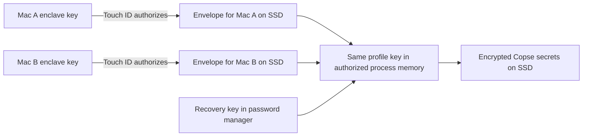

# Device-bound profile encryption with Touch ID and portable storage

Status: proposed implementation plan. Baseline: `origin/main` at `f5f1764c2`,
inspected on 2026-09-11. This document makes no changes to user credentials,
Keychain items, signing configuration or application behaviour.

## Outcome and binding requirements

An enrolled Mac opens the same Copse profile from internal storage or an external
SSD, asks for Touch ID when its secrets are locked, and resumes work offline.
A second enrolled Mac can open the profile without copying a private device key.
A recovery key saved separately in a password manager provides recovery and an
offline way to enroll a replacement machine.

This is a permanent portability capability for regular use, device changes and
recovery. The initial two Macs are the validation pair, not a limit on enrollment
or a temporary deployment scope. Supported machines must be able to join through
the documented process without depending on either original laptop.

The user's everyday workflow is `make run` against the real profile. Supporting
that ad-hoc-signed build is a requirement, not an optional developer exception.
Do not require signing each Electron rebuild with an Apple developer certificate,
switching to a test profile, or duplicating credentials. Packaged Copse and
`make run` may open the same profile sequentially; concurrent profile writers are
not part of this design. `make run-dev` retains its current separate default.

Use the same architecture for ordinary internal-disk profiles and portable ones.
All supporting application binaries may live on the SSD. The intentional host
state is the enrolled device's protected key and minimal authorization metadata.
This is not literally a host-state-free installation.

Scope is Copse-managed secrets: provider API keys and remembered SSH/VNC
credentials. Conversations, repositories, ordinary settings and Chromium cookies
are not encrypted by this feature. External-volume encryption remains separate;
the volume must be mounted before Copse can read the profile. Existing browser
logins are not promised to survive a machine change.

## Current implementation and gaps

| Area                | Verified behaviour                                                                                                | Work required                                                                                           |
| ------------------- | ----------------------------------------------------------------------------------------------------------------- | ------------------------------------------------------------------------------------------------------- |
| Profile paths       | `packages/store-kit/src/copse-paths.ts` derives the profile from `COPSE_DIR`; narrower overrides take precedence. | Reuse it; make startup explicitly target the chosen profile and avoid host-profile migration.           |
| Secret encryption   | `keyring-cipher.ts` uses AES-256-GCM and `CPS2` blobs; a random key is retrieved and cached in Node memory.       | Introduce a per-profile key, unlock lifecycle and versioned records.                                    |
| Key storage         | `os-keyring.ts` uses one OS-user item, `Copse / secret-data-key`.                                                 | Add a device-bound native backend; retain the old backend for migration and explicitly legacy profiles. |
| Legacy fallback     | `createMigratingCipher()` can write through Electron `safeStorage` when the primary fails.                        | Never allow this fallback in a migrated device-bound profile.                                           |
| Read failures       | Settings/SSH/VNC readers commonly turn decryption errors into `null`.                                             | Distinguish locked, absent, cancelled, corrupt and unsupported states.                                  |
| Migration           | Opportunistic sweeps cover some legacy records.                                                                   | Inventory every secret store and perform a recoverable, complete migration.                             |
| Credential lifetime | Settings may put credentials in `process.env`; providers and SSH retain them.                                     | Invalidate all managed consumers on lock, not just the cipher.                                          |
| Launch/signing      | `make run` uses the usual profile; dev Electron is ad-hoc signed as `dev.copse.app-dev`.                          | Prove stable native-key access across builds without requiring production signing keys on the SSD.      |

The pure path/cipher/migration tests passed previously. They do not validate
Secure Enclave, Touch ID, native helper identity or cross-device operation.

## Cryptographic model

Use two distinct kinds of key:

1. **Profile data key:** a cryptographically random 256-bit AES key unique to the
   profile and key generation. This encrypts its saved secrets.
2. **Device wrapping key:** a P-256 private key generated using the Mac's Secure
   Enclave, with a public key that can be exported. It protects a copy of a
   profile data key. Its private material is not exported or shared.

The SSD holds the encrypted secrets and one encrypted profile-key envelope per
enrolled device. All envelopes open to the same profile data key. Laptop A and
laptop B never share their enclave private keys.



Use Apple's Security framework for the envelope operation. The first candidate
is its documented ECIES algorithm
`eciesEncryptionCofactorX963SHA256AESGCM`, using `SecKeyCreateEncryptedData` and
`SecKeyCreateDecryptedData`; verify supported operations on the actual target
hardware. Do not implement a bespoke ECDH/KDF/encryption construction. The
envelope's decrypted payload must include and validate its profile ID, key ID,
recipient key fingerprint, format version and profile key, rather than trusting
unauthenticated labels outside the ciphertext. Apple's documentation describes
this use of enclave keys: [Protecting keys with the Secure Enclave](https://developer.apple.com/documentation/security/protecting-keys-with-the-secure-enclave).

For ordinary secret records retain AES-256-GCM, fresh random nonces and full
authentication tags. Add a new versioned envelope (proposed `CPS3`) with explicit
profile/key IDs. Authenticate format, profile ID, key ID, store kind and record
identity as associated data. A record copied between profiles or provider/host
slots must fail authentication. Use unambiguous canonical encoding and strict
bounded decoders. Keep old-format readers only in the migration path.

This is device-bound protection of keys at rest. After an authorized unlock the
profile key and credentials can exist in Copse memory. It does not defend against
malicious development code the user has authorized, a compromised running host,
or capture of plaintext by an already authorized consumer. Never describe it as
keeping all secrets or all AES operations inside the enclave.

## Recovery choice

Default recovery is the random profile key itself, exported as a versioned,
checksummed recovery record containing profile ID and key generation. The
checksum detects transcription errors; it is not a security boundary. Store
the record in the user's password manager, independently of the SSD.

No password-protected recovery envelope is placed on the SSD in the first
version. That avoids adding a password-guessing route to the disk. A passphrase
mode can be added separately with an established memory-hard KDF and an explicit
explanation that it is another unlocking route.

Recovery export is a native, user-initiated action requiring fresh authentication.
It must not appear in logs, telemetry, screenshots, generic renderer settings
IPC, command arguments or environment variables. Prefer a native reveal/import
surface. Clipboard export is explicit and carries a warning about clipboard
history/synchronization; clearing it later is only best effort.

Before completing migration, verify a saved recovery record by importing it in an
isolated verification flow and proving it opens a challenge before calling
recovery complete. Do not write it into the plan or repository. The password
manager must be usable offline on a device independent of the SSD. Losing both
enrolled devices and the recovery record means stored secrets cannot be recovered.

## Native component and ad-hoc builds

Preferred candidate: a small, consistently Developer-ID-signed native helper
application, containing the Security/LocalAuthentication integration and its
own authorization UI. Both production and `make run` invoke this component.
It owns the device-key identity independently of Electron's changing signature.
Ship a prebuilt, verified helper for development; ordinary `make run` must not
rebuild or re-sign it. Keep production signing credentials off the portable kit.

The helper should run as the user from its bundle on the SSD, without a privileged
daemon, a required `/Applications` install, or network dependency. Whether a
standalone helper with private IPC or an embedded XPC arrangement best satisfies
this is a **phase-0 prototype decision**. Do not promise that launching a signed
executable alone solves caller authentication or macOS foreground prompts.

Caller policy:

- Production: validate the live peer's code identity against the permitted team,
  app identity and required signing policy. Do not trust a claimed bundle ID.
- Ad-hoc development: explicitly authorize the actual running dev session to
  access the named profile. Bind approval to the live peer/channel and expire
  it when that process exits. A path or UID alone is insufficient proof of trust.
  Show the checkout/profile being authorized in the helper-owned UI. Do not
  silently persist trust across arbitrary rebuilds or claim that the Electron
  executable's signature authenticates all mutable JavaScript it loads.
- Use OS-authenticated IPC peer identity where available. Apple provides
  [XPC code-signing requirements](<https://developer.apple.com/documentation/foundation/nsxpcconnection/setcodesigningrequirement(_:)>).
  If the selected transport cannot reliably identify the dev peer, reconsider the
  transport instead of authorizing every process under the same user.
- Production/dev builds verify the helper signature before relying on it. The
  native helper also performs its own checks; caller-side verification is not
  sufficient for authorizing release of a key.
- Keep unlock capabilities process-, profile- and session-scoped. No public HTTP
  service, world-readable socket, or secret bearer token in argv/env. Any raw
  key returned to main uses a private, non-logged channel; never standard debug
  output. Handles must not leak into agent subprocesses.
- The helper must not silently unlock from a caller-provided `authenticated:true`
  field. User presence is enforced on the actual private-key operation.

Separate dev/prod profiles remain an option, not a requirement. Using the same
helper key does not automatically grant access to every profile. Sharing a real
profile is explicit and sequential. Supporting another shell later, such as the
existing plain-Node/Tauri path, must go through the same authorization boundary.

Alternatives if phase 0 fails: separately enrolled device keys for differently
signed app identities, or a suitably signed development launcher. Neither is
accepted until it preserves the user's ordinary ad-hoc rebuild workflow. Report
any unavoidable enrollment or host-install requirement instead of weakening
authentication to meet the UX goal.

## Touch ID and lock lifecycle

Create device keys with an accessibility/access-control policy appropriate to
an unlocked Mac and private-key use. Start by testing `userPresence` plus
`privateKeyUsage`, so macOS can use Touch ID or its system-password fallback.
Avoid a biometric-enrollment-change policy by default: adding a fingerprint
should not strand a profile. The UI says "Unlock with Touch ID" when available,
but does not promise fingerprint-only authentication after reboot or when macOS
requires a password. See [Apple user-presence access control](https://developer.apple.com/documentation/security/secaccesscontrolcreateflags/userpresence).

Proposed public state machine:

```text
legacy / needs-setup
locked -> unlocking -> unlocked -> locking -> locked
                  -> cancelled / device-unavailable / recovery-required
any persisted read -> corrupt / unsupported-format (never auto-reset)
```

`locked` is not "no API key", and an unavailable Touch ID sensor is not evidence
of corrupt ciphertext. Only explicit UI actions start authentication; background
availability probes must not prompt. Coalesce concurrent unlock requests into
one operation. Cancelled or failed unlock leaves data unchanged and avoids retry
loops. Non-secret local-model work may continue while secrets are locked.

Separate asynchronous unlock from synchronous secret access. Add a main-process
vault service with status, unlock, lock, device enrollment and recovery methods.
Keep a session cipher available only while unlocked. Update callers to gate
operations and return typed failures rather than turning everything into null.
Do not block Electron's main thread waiting for a Touch ID prompt.

Lock on explicit action, app quit, profile switch, device sleep/session lock and
SSD removal. Confirm event coverage on target macOS; do not rely only on focus
or window visibility. On lock:

1. Stop new secret-dependent operations and invalidate the unlock generation.
2. Cancel pending authentication and prevent late results from repopulating caches.
3. Cancel managed authenticated requests, dispose SDK/provider clients, clear
   SSH/VNC credential caches and close owned authenticated SSH/VNC sessions.
4. Remove environment entries injected from the vault, distinguishing them from
   externally supplied credentials. Prefer eliminating vault-to-env reflection
   in the new path; preserve child-process secret filtering.
5. Drop helper/main key references, invalidate authentication contexts and
   best-effort overwrite mutable key buffers. JavaScript strings and third-party
   libraries prevent a claim of guaranteed memory erasure.

Define lock narrowly and honestly: Copse can stop its own credential use, but
cannot revoke secrets already handed to an external process or retract completed
network requests. A window showing chats is not a locked encrypted document
vault. Resume after sleep requires an explicit unlock for secret-dependent work;
ordinary offline model activity does not require cloud credentials.

## Profile metadata and storage

Proposed layout, entirely relative to `COPSE_DIR`:

```text
profile/
  security/
    manifest.json             # version, profile ID, active key ID, device envelopes
    migration.json            # non-secret journal, present only during migration
  user-data/
    settings.json             # versioned encrypted API/VNC records
    ssh-credentials.json      # versioned encrypted SSH records
  workspace/
  worktrees/
  ...existing profile stores
```

Manifest fields include a random stable profile ID; format/minimum-reader
version; active key ID; revision; recipient public-key fingerprints, display
labels and opaque key envelopes. Device labels are not authentication and must
be escaped as untrusted text. Use random key IDs/fingerprints rather than serial
numbers or usernames for identity.

Authenticate security-relevant manifest content using a domain-separated key
derived from the unlocked profile key, in addition to envelope/record checks.
Verify before trusting enrollment metadata or committing changes. Bound sizes,
counts and algorithms; reject duplicates, unknown critical fields, malformed
public keys and path traversal. A modified manifest may deny access but must
not cause plaintext fallback, unnoticed enrollment or key replacement.

Atomic writes use an adjacent temporary file, flush as appropriate and rename on
the same filesystem. All metadata/secret changes have one writer. Extend profile
locking to helper, migration and headless paths; Electron's single-instance lock
alone does not cover every writer. Stale ownership requires host/session evidence,
not just a PID that may be reused on another laptop. Never force-take an ambiguous
active lock.

Device-bound keys and any local trust metadata remain outside the portable
profile. Non-secret identifiers may be backed up, but are not a substitute for
the device's private key. No persisted decrypted profile key, unlock lease or
authentication token belongs on the SSD.

## Enrollment, recovery and device removal

**First Mac:** create the profile key and native device key; seal an envelope;
authenticate and prove it opens; create and verify the recovery export. For an
existing installation, use the migration procedure below before enabling writes.

**Second Mac, simplest first implementation:** connect the SSD, choose "Add this
Mac", import the recovery record through the native surface, validate its profile
and generation and authenticate a known vault record/manifest. Create B's enclave
key, seal a B envelope and commit it atomically. Immediately discard imported
key material after the session no longer needs it. Restart and verify B unlocks
with Touch ID without accessing the password manager. A's envelope is retained.

**Optional later enrollment without recovery-key entry:** B exports a public-key
enrollment request; A opens the profile and confirms a fingerprint displayed on
both machines before sealing for B. Bind requests to profile, protocol version,
fresh nonce and expiration. Reject substitutions and replay. This can use the
SSD as transport and requires no cloud service. Do not make this extra protocol
a prerequisite for the first complete portable-encryption implementation.

**Recovery:** import the verified recovery record, authenticate the vault, then
enroll a new native device key. Missing device keys never trigger creation of a
new profile data key over existing ciphertext. Hardware resets, replacement Macs
and reinstalling keychain state are explicit recovery cases.

**Removal:** removing a recipient prevents its use against the current manifest;
it does not revoke an old copy of the SSD or keys already recovered. For future
protection rotate the profile key, re-encrypt current secrets, reseal to retained
public keys and issue a new recovery record. Rotation cannot erase old backups
or revoke underlying API tokens; suspected credential compromise also requires
rotation at the provider. Fully offline copies cannot guarantee global rollback
detection; a manifest revision is not an anti-rollback security guarantee.

## Migration and external-disk transfer

Perform migration on the original machine while its existing credentials remain
readable. Read legacy `safeStorage` and current `CPS2` values using the old
backend, but write all new records with the new per-profile key. Do not export
the old account-wide key or delete its Keychain item; other profiles may use it.

Use an explicit migration registry covering API keys, SSH host/password/key-
passphrase records and both VNC username/password records. Inspect all consumers
of `getSecretCipher` before finalizing it. Do not assume opportunistic sweeps
cover everything: the current SSH store does not register that sweep, and a read
may conceal an error as null. Inventory unreadable records without logging values.

For the requested SSD move:

1. Stop Copse and owned background services; acquire exclusive profile access.
2. Copy the complete source profile into a sibling staging directory on the SSD.
   Preserve IDs and the original source. Reserve space and reject symlink/path
   escapes or non-local destinations inconsistent with the chosen target.
   Secret-store files pass through the migration registry rather than a blind
   copy: previously consented plaintext secrets must be encrypted before they
   reach staging, not duplicated as plaintext and cleaned up afterwards.
3. Create the new manifest/key and rewrite every known secret in staging. Do not
   temporarily persist plaintext. Track non-secret migration progress and counts.
4. Verify every migrated record and the recovery export. If any existing secret
   cannot be read, stop completion until it is re-entered or explicitly omitted;
   never silently declare the profile portable with stranded credentials.
5. Flush the completed staging tree and rename it to the final SSD profile root.
   The launch configuration changes only after that commit. Failure leaves the
   source active and staging clearly incomplete. Clean up plaintext only in
   memory; encrypted source/backups are retained for recovery.
6. Launch with `COPSE_DIR=<disk profile>` and explicit matching
   `COPSE_PANEL_USER_DATA=<disk profile>/user-data` to skip legacy-host migration.
7. Validate A, enroll B and complete the A-to-B-to-A rehearsal before retiring the
   old working copy. Backups on the same SSD do not protect against losing it.

For an internal-disk installation, use the same staged migration and an
exclusive, journaled directory replacement. A two-rename swap is not intrinsically
atomic: startup must recover deterministically from either intermediate state.

Persist and enforce the minimum supported reader version before stores open.
Old unmodified binaries cannot be retroactively made safe by a new marker;
supported launchers must refuse incompatible builds and documentation must forbid
opening migrated data with old apps. Keep a pre-migration backup for use with a
supported recovery procedure; do not automatically downgrade live data.

Changing mount paths must not affect cryptographic identity. Profile/project IDs
are independent of absolute paths. Project relocation, Git worktree repair,
build-cache symlinks and ephemeral sockets still need the companion
[portable environment plan](portable-development-environment.md). Missing/read-only
disks fail clearly; never redirect writes or create a replacement profile in the
host home directory.

## Implementation sequence and exit criteria

| Phase                           | Work                                                                                                                                             | Must demonstrate before proceeding                                                                                                                                               |
| ------------------------------- | ------------------------------------------------------------------------------------------------------------------------------------------------ | -------------------------------------------------------------------------------------------------------------------------------------------------------------------------------- |
| 0: Native feasibility           | Prototype signed helper identity, authenticated transport, enclave ECIES, Touch ID/system fallback and ad-hoc authorization.                     | Same profile unlocks from packaged Copse and repeated `make run` rebuilds, offline, with helper on SSD and no privileged install. Denied/cancelled/untrusted callers get no key. |
| 1: Profile vault primitives     | Versioned manifest/records, per-profile keys, envelope validation, recovery format, typed status and migration interfaces in `@copse/store-kit`. | Tamper/wrong-profile/wrong-record failures, strict parsing, no downgrade fallback and reliable key-generation tracking.                                                          |
| 2: Runtime integration          | Main-process asynchronous unlock service, IPC, consumer gating, lock lifecycle and cache cleanup.                                                | One prompt per unlock, no prompts from background probes, no secret use after lock, local-model work remains available.                                                          |
| 3: Migration and recovery       | Complete secret registry, staging/journal, native recovery reveal/import and interrupted-operation handling.                                     | Representative legacy/CPS2/plaintext-consented records migrate with every store accounted for; failures preserve source. Recovery round-trip passes.                             |
| 4: Device enrollment            | Recovery-assisted enrollment, recipient management, rotation and diagnostics.                                                                    | A and B each unlock independently with Touch ID after reboot, without password-manager access on normal launches.                                                                |
| 5: Portable launch and delivery | Include signed helper in releases/dev preparation, explicit SSD paths, version checks and documentation.                                         | Actual offline A-to-B-to-A handoff with normal `make run`, packaged app and model/tool work.                                                                                     |

Expected code areas:

- `packages/store-kit/src/`: vault schemas, record cipher, session state contracts,
  recovery records and migration engine; keep OS-independent primitives here.
- Proposed native helper package and scripts: Security/LocalAuthentication,
  native confirmation/recovery UI, IPC, signing and packaging. Confirm exact
  directory/names in phase 0; do not add a native library to the renderer.
- `src/main/services/storage/`: service adapters, secret status/readability,
  complete migration registry and setting integration.
- `src/main/index.ts`, preload/types and `src/main/ipc/register-handlers.ts`:
  startup gating and tightly scoped unlock/status operations.
- SSH/VNC stores/caches, provider construction and `child-process-env.ts`:
  lock invalidation and removal of secret-bearing environment plumbing.
- `Makefile`, `scripts/patch-dev-name.mts`, build/packaging scripts and macOS
  entitlements: stable helper delivery, explicit identity, offline dependencies.
- `docs/profiles.md`, `docs/recovery.md`, `docs/agent-development.md`: document
  actual security scope, everyday `make run`, recovery and device enrollment.

## Validation plan

Use existing standard scripts and the lowest useful tier. Run `pnpm run check`
before committing; build and run focused Electron/native validation for actual
platform integration. Avoid using real user secrets in tests.

**Unit/component:** format/nonce/authentication tests, wrong keys/records/profile,
truncated/oversized metadata, no plaintext or legacy fallback, state transitions,
concurrent unlock coalescing, cancelled/late results, migration registry coverage,
crash checkpoints, read-only/full-disk failures, manifest/recipient changes,
recovery checksum/key mismatch and generation rotation. Verify lock clears managed
credential consumers and never deletes stored records merely because locked.

**Native on each target Mac:** hardware availability, real enclave operations,
Touch ID success/cancel/failure, system-password fallback, post-reboot behaviour,
screen lock/sleep, enrollment changes, lost device key, helper signature update,
ad-hoc rebuilds and changed checkout paths. Test untrusted/wrong-profile callers,
replayed session requests and helper replacement. Hardware-backed tests are a
separate explicit suite; mock tests must not count as enclave validation.

**Visual:** focused WDIO Electron specs for locked status, unlock cancellation,
missing-device recovery, migration results and enrolled-device management, with
DOM assertions and screenshots. Follow `.cursor/skills/screenshot-validate/SKILL.md`
when implementing these screens. Native macOS Touch ID UI requires on-machine
validation alongside those screenshots; synthetic success must never bypass a
production authorization boundary.

**Cross-device portability validation:** use synthetic credentials first, then the migrated profile;
Wi-Fi off; volume path with spaces; `make run` and packaged app sequentially on A;
read/edit/test a project with the local model; quit/eject; enroll and unlock on B;
repeat after restart; return to A. Change the mount point and prove the same
profile/key identities survive. Inspect writes and subprocess environments for
host dependencies and secret leakage. Verify the password-manager recovery record
works offline and is absent from the SSD, logs and captured screenshots.

## Extension: detached headless agents

Additional requirement: a remote agent should continue after the initiating
laptop shuts down, while reducing credential theft from the remote workload.
This extends authorization and execution ownership; it is not permission to
enroll a server as an unrestricted recipient of the human profile key.

Keep the desktop vault design above and add a separate automation principal and
run-scoped credential authority. Touch ID authorizes delegation on the desktop.
The remote worker then uses its own identity without human-presence prompts for
each operation. Do not disable user presence on the existing human device key to
make a server headless. Do not transmit the whole profile key, recovery record,
full environment or unrelated credentials.

The existing SSH workspace transports deliberately filter provider keys, and
the existing cloud-workspace plan's initial stages keep the model loop local.
That is insufficient when the laptop is off. Reuse the detached-worker C7 design
in [Copse cloud workspaces](copse-cloud-workspaces.md) and the automation-principal,
credential-mediation and ownership rules in
[Execution runtime security](execution-runtime-security.md). Ordinary SSH command
offload must keep its existing no-key-forwarding behaviour. This is a distinct,
explicit handoff rather than a new blanket environment-forwarding setting.

### Initial scope: direct delegation to a trusted-host container

Start with one task, one repository and one unprivileged container on a remote
host the user explicitly trusts. Run the headless model loop and development
tools there, including `gh`. This is the temporary raw-secret injection exception
in execution-runtime-security decision 5, with a reduced guarantee: the delegated
token is accessible to the credential-using workload and a sufficiently privileged
host administrator. Container isolation does not protect it from either attacker.
Do not describe this mode as host-confidential or as keeping credentials outside
the workload.

The initial implementation includes only:

- Explicit desktop authorization of the run, target host, repository, requested
  read operations and duration. Record the automation principal and opaque
  credential identity; do not inherit the user's ambient credentials or approvals.
- A fresh, expiring GitHub App user access token. Restrict the app's installed
  repositories and permissions, and verify the effective access fits the grant;
  a local repository allow-list cannot downscope an already broader bearer token.
  User tokens act on behalf of the authorizing user, even though Copse records a
  separate automation principal for the run. Start with read-only repository access
  and add PR/issue read permissions only when needed.
- Authenticated, encrypted startup delivery and ephemeral credential handling.
  Supply `GH_TOKEN` only to processes requiring GitHub access, without promising
  secrecy from arbitrary code in the same workload. Avoid token values in launch
  arguments, persistent container configuration, images, shell history, logs,
  workspace files or checkpoints. Do not persist `gh auth login` credentials.
- No refresh token, app signing key, profile encryption key, recovery record or
  unrelated secret on the remote host. Clear the session credential on teardown;
  retain only the workspace and non-secret canonical execution state.
- No privileged container, Docker socket or broad host filesystem mounts. Keep
  existing runtime approval and network policy requirements; this credential
  exception does not authorize unrestricted egress or wider SSH env forwarding.
- A credential-provider interface that distinguishes direct ephemeral delegation
  from future mediated operations, exposing effective permissions, actual expiry
  and the reduced guarantee. Do not build a broker as part of this milestone.

With GitHub App user-token expiration enabled, a fresh token lasts eight hours
and can cover a six-hour run. Check the returned expiry before handoff. A six-hour
run deadline is not a six-hour token lifetime: stopping the container or deleting
its copy cannot invalidate a stolen token. GitHub's expiry or successful provider
revocation is the boundary for that copy. No automatic renewal is included; on
expiry or loss of the remote credential session, park credential-dependent work
until reauthorized. See [GitHub user-token expiration](https://docs.github.com/en/apps/creating-github-apps/authenticating-with-a-github-app/refreshing-user-access-tokens)
and [`gh` token environment](https://cli.github.com/manual/gh_help_environment).

GitHub delegation alone does not supply model inference. The initial detached
run must have a model endpoint available independently of the desktop, preferably
a model running on the remote host. Do not implicitly forward a saved long-lived
model-provider key; additional provider delegation needs an explicit credential
policy and is outside this GitHub-only increment.

Acceptance: disconnect the desktop during a run and verify continued model/tool
execution and permitted `gh` reads. Use controlled fixtures to prove GitHub rejects
writes and access to a private repository outside the app's installation. Verify
no secret appears in persisted launch metadata, logs or checkpoints; expiration
and remote restart park work without falling back to host credentials; reconnect
preserves fenced ownership and does not replay completed effects. Secret isolation
from code inside the container or the host administrator is explicitly not an
acceptance claim.

Deferred: credential brokers, automatic renewal, automatic credential recovery
after remote restart, remote TPM/Secure Enclave integration, confidential VMs or
containers, attestation and protection against a malicious host administrator.
The future design below preserves room for these without making them prerequisites
for the initial trusted-host mode or portable desktop profiles.

### Future scope: mediated credential authority

Prefer a trusted, continuously available credential broker outside the untrusted
worker boundary. The worker requests an allowed operation using an opaque
credential reference. The broker performs the provider request and attaches the
real credential itself; the agent process, shell, filesystem, environment and
checkpoints do not receive it. The broker must not offer a generic "read secret"
endpoint or follow arbitrary agent-supplied URLs/redirects with credentials.

A grant binds the automation principal, worker identity, project/thread/run,
credential references, exact service/operation scope, deadline and enforced
resource/spend limits. Bind it to a worker-authenticated channel, preferably with
proof of possession rather than a transferable bearer token alone. A stolen
worker identity may still abuse its allowed requests while valid; narrow scope,
rate limits, expiry and revocation reduce that exposure, not eliminate it.

Use provider-issued short-lived/scoped credentials when supported. A local expiry
label cannot shorten the lifetime of a static API key after its bytes have been
extracted. A broker can enforce an expiry because every request must pass through
it. Provider-enforced credentials can expire independently. Do not imply every
model provider supports token exchange or enforceable per-token budgets. The
lease distinction is illustrated in [Vault's lease documentation](https://developer.hashicorp.com/vault/docs/concepts/lease),
which distinguishes dynamic secrets from ordinary stored key/value secrets.

The broker and any renewal authority must remain available without the laptop;
no SSH tunnel, local proxy or desktop heartbeat may be necessary. Renewal is
limited by the pre-authorized maximum deadline and scope. New authority beyond
that limit requires another human authorization. When the desktop is offline,
new approval-requiring actions park the task; they are not auto-approved.

### Threat boundaries for initial and future modes

| Deployment                                                           | Protects against                                                                                            | Does not establish                                                                                               |
| -------------------------------------------------------------------- | ----------------------------------------------------------------------------------------------------------- | ---------------------------------------------------------------------------------------------------------------- |
| Direct short-lived token in a trusted-host container (initial scope) | Exposure of the full desktop vault and renewal credentials; scope and lifetime bound stolen-token authority | Secrecy from the credential-using workload or host administrator; an exact run-deadline cutoff for stolen tokens |
| Broker in a separate account/service on a trusted remote host        | Accidental leakage and a contained agent/shell reading raw keys                                             | Protection from root or compromise of that same host                                                             |
| Broker on a separate trusted machine/service                         | Extraction of long-lived provider keys from a compromised worker host                                       | Prevention of all misuse of the worker's authorized operations; protection from compromise of the broker         |
| Broker in an attested confidential-computing environment             | Stronger isolation from the worker host, if release policy and implementation are correct                   | General protection for arbitrary agent code or plaintext deliberately returned to the host                       |

Envelope encryption to a remote TPM/enclave key is useful for storage and delivery,
but unwrapping into an ordinary host process still exposes plaintext to a powerful
host attacker. For stronger isolation, the credential-bearing API client and TLS
termination must stay inside the trusted broker/enclave; a host relay forwards
ciphertext only. Attestation must bind the expected approved broker code and
release policy, not just prove that some enclave exists. For example,
[AWS Nitro Enclaves](https://docs.aws.amazon.com/enclaves/latest/user/nitro-enclave.html)
isolates enclave memory from the parent host and has no direct external network;
its proxy path must not terminate credential-bearing TLS on that parent. This is
an optional platform-specific backend, not an assumption about any remote Mac/VM.

### Handoff and headless lifetime

Before allowing the laptop to disconnect, durably transfer the task instructions,
required repository snapshot and canonical execution state; confirm that the
remote model loop/supervisor and credential authority are ready; then transfer
execution ownership with a fenced lease. The desktop becomes an observer. Two
workers must not execute the same turn concurrently after reconnect/retry.
Persist non-secret events/results and reconcile them on reattachment. Exclude
unlocked keys, tokens and broker session handles from checkpoints.

Distinguish continuing after **desktop shutdown** from resuming after a **remote
broker/host restart**. Start with a session delegation that survives desktop
shutdown but requires reauthorization after loss of the remote credential
session. Automatic remote reboot recovery needs an additional, explicit machine
identity/KMS/attestation policy or an external broker that survived the restart.
It must not depend on a remote Touch ID prompt, an unlocked interactive login
session, or a plaintext bootstrap key. Exact support depends on the target host.

In the future mediated mode, remote grants expire and can be revoked through an available authorized client
or control service. A powered-off desktop cannot itself deliver immediate
revocation. The remote agent's wall clock or voluntary behaviour is not the
enforcement boundary; the broker/provider checks validity. Test expiry, revoked
identity, reboot, disconnected owner, broker outage, malicious requests and
ownership races before enabling unattended production use.

This extension does not block portable interactive profiles. The initial trust
boundary and restart policy are decided above: trusted host, direct short-lived
GitHub delegation, and reauthorization after loss of the credential session.
Select the target remote OS/runtime before implementation. No credentials are
transferred by this plan.

## Decisions to close in phase 0

These are engineering gates, not missing user permission to devise the plan:

- Exact native hosting/transport/signing combination that works from the SSD
  and safely authorizes ad-hoc `make run` sessions.
- Verified enclave/accessibility flags and macOS password-fallback behaviour on
  both actual laptops; availability depends on their hardware.
- Helper launch and update strategy that does not add per-rebuild signing or
  network access, and preserves device-key access across helper updates. Prepare
  notarization/stapling as appropriate and test Gatekeeper/first launch offline
  on both Macs from the actual SSD; an already-running helper is not sufficient.

The remaining defaults are decided for this plan: one key per profile, separate
device envelopes, random recovery key kept in a password manager, no passphrase
envelope by default, explicit unlock, no silent insecure fallback, and preservation
of the user's real-profile `make run` workflow.
