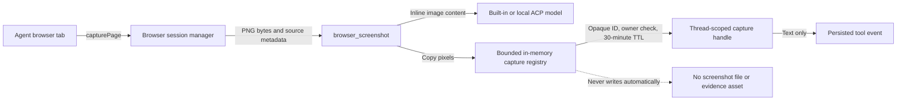
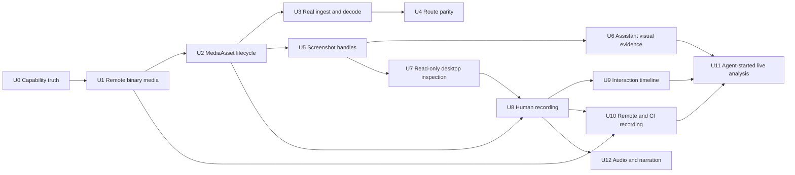

# First-class video input and visual evidence

**Status: Active.** Tracked by
[#2694](https://github.com/copse-dev/agent-pane/issues/2694). U1, the bounded
SSH binary-media foundation, is implemented. The browser portion of U5 now
returns model-visible pixels plus a short-lived capture handle; other sources
and U2–U4/U6–U12 remain proposed.

This is the umbrella plan for making visual debugging a complete loop:

1. a user or runtime gives Copse an image, video, desktop, or recording;
2. the selected agent route can actually inspect it;
3. the agent can point back to the meaningful visual evidence for a bug or fix;
4. the evidence remains understandable after reload, fork, export, or source
   disappearance.

Detailed capture mechanics live in
[`screen-capture-and-remote-video.md`](screen-capture-and-remote-video.md).
VNC transport and control policy live in
[`vnc-remote-desktop.md`](vnc-remote-desktop.md). CI recording is also consumed
by [`fleet-scale.md`](fleet-scale.md). This document owns the shared asset,
routing, evidence, retention, and delivery order across them.

## Product outcome

The finished product should support four distinct user stories without
pretending they are the same capability:

- **Show the agent:** attach an existing image or recording, including one in an
  SSH workspace, and have the selected agent route inspect it.
- **Let the agent look:** take a bounded, read-only screenshot of a named browser,
  VNC, simulator, emulator, window, or display source.
- **Record what happened:** capture a named source plus a privacy-safe interaction
  timeline so a transient bug can be correlated with actions and logs.
- **Show the user the proof:** publish a durable screenshot, frame sequence,
  short clip, or before/after comparison in the assistant response.

First-class does not mean sending raw video to a model. Copse should retain the
recording locally and send only the selected stills, redacted event summaries,
transcripts, or evidence that the user or an authorised tool explicitly chose.

## Current capability audit

The current product has useful pieces, but the end-to-end contract differs by
source and agent route:

| Input or output                       | Human in the app                                                 | Built-in agent                                                    | ACP agent                                                         | Managed/cloud agent                                      | Durable user-visible evidence                         |
| ------------------------------------- | ---------------------------------------------------------------- | ----------------------------------------------------------------- | ----------------------------------------------------------------- | -------------------------------------------------------- | ----------------------------------------------------- |
| Pasted or dropped image               | Attachment is visible                                            | Provider image block                                              | Depends on the ACP/client route                                   | Supported where the adapter accepts image input          | User attachment persists                              |
| Local video attachment                | Film chip and up-to-50 MiB preview                               | `video_frames` returns selected stills                            | Native-tool bridge returns MCP image content                      | No callable local `video_frames`; a path is not portable | Video persists; inspected frames do not               |
| SSH-workspace video                   | U1 adds metadata and preview through the active workspace FS     | U1 adds bounded materialisation for `video_frames`                | Local bridge can reuse the native tool; remote ACP is still gated | No media broker or portable derived survey               | Same limitation as local video                        |
| Browser screenshot tool               | Tool activity names the capture handle                           | PNG pixels plus a short-lived, thread-scoped handle               | Native-tool bridge returns the same PNG                           | Not available                                            | No durable evidence object                            |
| VNC / Simulator / Android desktop     | Live human panes; a human can manually attach a current capture  | No desktop enumeration or screenshot tool                         | No desktop inspection route                                       | No desktop inspection route                              | No capture provenance                                 |
| Agent-inspected `video_frames` output | Not rendered as part of the assistant answer                     | Images are available to the model for that call                   | Images are returned as MCP image content                          | Not available                                            | Images are omitted from persisted/streamed transcript |
| Automated bug/fix demonstration       | Focused e2e screenshots and browser traces exist as test outputs | No tool for publishing a selected screenshot, clip, or comparison | No shared evidence contract                                       | No shared evidence contract                              | No assistant-owned evidence card                      |

U1 also closes a concrete defect behind the SSH-video row: binary reads used to
base64-encode the file through the generic 100 KiB SSH command-output channel,
which corrupted realistic videos. The new transport streams raw bytes to a
private, bounded local materialisation without widening that command boundary.

## Definitions and ownership

Four records keep transient capture mechanics out of messages and prevent raw
paths from becoming the durable API.

### `MediaAsset`

A stable, thread-owned identity for imported or referenced media. It records the
kind, MIME/container metadata, provenance, byte and duration budgets, retention
policy, and a resolvable locator. Locator variants cover a thread blob, local
workspace path, SSH workspace path, recording manifest, and derived artifact.

The ID is what messages and thread metadata persist. A path is an implementation
detail resolved at the moment of use.

### `CaptureHandle`

A short-lived, thread-scoped authority to a screenshot or capture result. It
records the named source, capture time, owner, and backing asset. Tools return
the image content needed by the current agent turn plus this handle; arbitrary
filesystem paths cannot be promoted into evidence.

### `VisualEvidenceRef`

An immutable assistant-owned copy of selected proof: one screenshot, a bounded
clip, an ordered frame set, or a before/after comparison. It includes captions,
labels, timestamps, source provenance, and the tool/run that produced it. The
owning thread retains it independently of the mutable workspace source.

### `RecordingManifest`

A recording is a set of closed, seekable segments plus clocks and source
metadata, not one unbounded file. The detailed schema and capture adapters are
defined in [`screen-capture-and-remote-video.md`](screen-capture-and-remote-video.md).
The manifest is itself a `MediaAsset` locator.

## Implemented browser screenshot flow

The first U5 slice removes the browser screenshot's raw-path handoff. One
capture now fans out into model input for the current turn and a scoped,
temporary reference for a future explicit evidence action:

The image bytes are available to the model only in the live tool-result turn.
The persisted event keeps the handle and source description, not base64 pixels.
The registry is capped at 12 MiB per capture, 64 MiB and 64 entries overall;
expiry, eviction, or process exit removes its authority. U6 will be the explicit
operation that resolves a live handle and publishes a durable evidence object.

## Dependency map

U0 is an ongoing truth requirement rather than a reason to serialize all work.
U2 is the important architectural gate: capture and evidence should not invent
another generation of durable raw-path fields. The browser-only part of U5 can
land before U2 because its backing pixels are transient process memory; U2 still
gates durable evidence and handles backed by VNC, device, or recording assets.

## Work units

Each unit is independently reviewable and should land with the smallest useful
test tier. A status of **implemented here** means this branch contains the code;
it does not claim the change is on `main` before merge.

### U0 — Capability truth pass

**Status:** Started by this plan.

**Deliverables**

- Keep the route matrix above accurate for built-in, ACP, local-model,
  managed/cloud, local-workspace, and SSH-workspace execution.
- Reconcile stale claims in the video, ACP, VNC, computer-use, fleet, privacy,
  and threat-model documents.
- Add one capability-reporting seam that product copy and tool registration can
  consume instead of independently inferring support.

**Acceptance**

- Unsupported routes warn or withhold the affordance; none hand an unusable
  local path to a remote agent.
- Every user-facing promise names whether input is original media, a derived
  survey, or visual-only analysis.

### U1 — Binary remote-media transport

**Status:** Implemented here.

**Deliverables**

- Add `fetchFile` and `sizeOf` to the SSH transport.
- Add size-aware `materializeToLocal` and `readFileBytes` to `WorkspaceFs`.
- Stream SSH bytes into atomic `0600` local files with a 512 MiB cache,
  five-minute expiry, cancellation, timeout, and shutdown cleanup.
- Route video/archive metadata, playback, and tool reads through the correct
  local or SSH backend. Keep app-owned thread attachments local even when the
  active project uses SSH.
- Reject chat-store symlink escape and file growth past the caller's limit.

**Acceptance**

- A multi-megabyte SSH video previews and reaches `video_frames` without using
  command-result stdout.
- Oversized media fails before transfer and again if it grows during transfer.
- The existing 100 KiB command-output cap is unchanged.
- Cache reuse, expiry/cleanup, abort, path containment, and local attachment
  routing have focused tests.

### U2 — Durable `MediaAsset` lifecycle

**Status:** Proposed; next architectural unit.

**Deliverables**

- Introduce stable media IDs and locator variants; migrate `Thread.videos` and
  message attachments away from persisted raw paths.
- Define copy versus reference behavior for thread blobs, workspace files, SSH
  files, recordings, derived frames, and evidence.
- Cover fork, resend, export/import, deletion, orphan collection, stale sources,
  per-thread quota, and retention.
- Resolve assets through an owner-aware service in main; renderer and model input
  never receive broader filesystem authority.

**Acceptance**

- A forked or exported thread either carries its owned media or explicitly marks
  an unavailable external reference.
- Removing an unsent attachment and deleting a thread cannot leave unbounded
  app-owned blobs.
- Existing thread metadata migrates without losing attachments.

### U3 — Real ingest and decoder confidence

**Status:** Proposed.

**Deliverables**

- Avoid `File.arrayBuffer()` for large renderer imports where a streamed main
  process path is available.
- Probe real container, codec, duration, dimensions, and playback support before
  promising analysis; provide progress and cancellation.
- Add generated, valid WebM/MP4 fixtures through the real hidden Chromium decoder
  and the visible playback path. Fake bytes remain for validation-only tests.
- Make decode failures distinguish unsupported codec, corrupt media, missing
  source, cancellation, and budget rejection.

**Acceptance**

- At least one real recording passes import → preview → `video_frames` in CI.
- Unsupported media fails at attach time with actionable copy.
- Large imports do not require a second renderer-sized copy.

### U4 — Agent-route parity

**Status:** Proposed.

**Deliverables**

- Keep native and ACP tool-image results semantically equivalent.
- For managed/cloud agents, derive a bounded timestamped still survey locally and
  send only supported image blocks; never send an unusable local path.
- Gate local-model routes on both tool calling and vision support, with a clear
  text-only fallback.
- Budget images consistently across providers and disclose survey coverage and
  blind spots.

**Acceptance**

- Every selectable agent route either consumes the media, consumes a labelled
  derived survey, or refuses before the turn starts.
- Route conformance tests assert the same timestamps, ordering, and provenance.

### U5 — Model-visible screenshot handles

**Status:** Partially implemented; `browser_screenshot` is complete, while VNC
and device sources remain proposed.

**Deliverables**

- `browser_screenshot` returns image content plus a bounded, session-only,
  thread-scoped `CaptureHandle` instead of exposing a saved path.
- Reuse the same contract for VNC and device sources.
- Preserve the handle in tool events without automatically publishing every
  screenshot into the conversation.

**Acceptance**

- Native and ACP agents see the same screenshot pixels.
- Text-only routes get an explicit unsupported result.
- A handle cannot resolve outside its thread or outlive its retained asset.

### U6 — Assistant visual evidence

**Status:** Proposed.

**Deliverables**

- Add `VisualEvidenceRef` to persisted assistant messages.
- Add a `present_visual_evidence` tool accepting valid capture handles or
  `MediaAsset` selections for screenshots, frame sequences, bounded clips, and
  before/after comparisons.
- Render compact, expandable evidence cards with caption, source, timestamp,
  before/after labels, and unavailable-state copy.
- Copy published evidence immutably into the owning thread.

**Acceptance**

- An agent can demonstrate a reproduced bug and its fix in one response without
  exposing an arbitrary path.
- Evidence survives reload, fork, export, and deletion or mutation of the source.
- Focused browser/Electron e2e asserts the DOM behavior and saves the required
  screenshots for review.

### U7 — Read-only desktop and VNC inspection

**Status:** Proposed.

**Deliverables**

- Add `desktop_sources` and `desktop_screenshot` over browser, VNC, iOS
  Simulator, and Android sources.
- Use a view-only hidden renderer or agent connection for VNC; retain credentials
  in main and never include them in prompts or tool results.
- Keep input authority out of this unit. A screenshot is observation, not control.

**Acceptance**

- A named VNC/device source can be captured without changing the visible human
  session or enabling pointer/keyboard input.
- Disconnect, owner, host, and app shutdown tear down hidden sessions and forwards.

### U8 — Human-started recording core

**Status:** Proposed.

**Deliverables**

- Implement closed segment sets and recording manifests.
- Add a named-source Record/Stop flow, visible recording indicator, crash-safe
  finalisation, quotas, and retention.
- Add local window/display, VNC, Simulator, Android, and browser adapters in that
  order, using Chromium or host capabilities rather than bundling an encoder.
- Attach the completed recording through `MediaAsset` and the existing
  `video_frames` affordance.

**Acceptance**

- A user can record a named source, stop, preview, send, and inspect it without
  finding a file manually.
- A crash loses at most the open segment; closed segments remain readable.
- Entire-display capture is never the default selection.

### U9 — Redacted interaction timeline

**Status:** Proposed.

**Deliverables**

- Record timestamped pointer/touch, scroll, navigation, and safe key metadata for
  Copse-mediated surfaces.
- Redact printable keys by default and never record password values.
- Align events to recording time and expose a concise event summary alongside
  frame results.
- Treat global OS input monitoring as a separate opt-in design, not an implied
  extension of window capture.

**Acceptance**

- A frame can be correlated with the action immediately before it and with
  wall-clock logs within a stated skew.
- Redaction tests cover password fields, printable input, clipboard actions, and
  IME/composition events.

### U10 — Remote and CI recording

**Status:** Proposed.

**Deliverables**

- Capability-probe remote capture tools; write remote segments and lazily fetch
  only segments overlapping the requested window.
- Sweep stale app-owned remote temp directories on stop, abort, and reconnect.
- Add per-test or failure-only WebdriverIO video beside screenshot, HTML, console,
  and structured run artifacts.
- Make finished CI/container recordings addressable by `video_frames` and usable
  as inputs to visual evidence.

**Acceptance**

- A remote 40-minute recording can inspect a ten-second window without pulling
  the whole session.
- A failed visual e2e has a screenshot and short recording with matching test/run
  identity and retention.

### U11 — Agent-started capture and live analysis

**Status:** Proposed; intentionally after human recording and read-only inspection.

**Deliverables**

- Add permission-gated `screen_record` list/start/stop actions behind an explicit
  setting.
- Allow only named sources; prompt for display/window capture and keep lower-risk
  browser/device sources separately policy-controlled.
- Expose only closed segments while recording and disclose the unavailable live
  tail.
- Support stop-on-finding without granting desktop input authority.

**Acceptance**

- Every capture has visible in-app state, an inspectable permission decision, and
  a durable start/stop record.
- Cancellation, app exit, agent exit, and source loss all stop capture and clean
  up bounded temp state.

### U12 — Audio and narration

**Status:** Proposed; optional.

**Deliverables**

- Add explicit-consent audio capture/extraction and local timecoded
  transcription.
- Send transcript text rather than raw audio by default and associate ranges with
  the recording clock.
- Until this lands, label all recording analysis as visual-only.

**Acceptance**

- Audio is never captured or transmitted without a visible opt-in.
- Deleting the recording follows through to its audio and transcript derivatives.

## Delivery milestones

| Milestone                          | Units   | User-visible result                                                                |
| ---------------------------------- | ------- | ---------------------------------------------------------------------------------- |
| M1 — Make the current promise true | U0–U4   | Existing videos work across supported local/SSH and agent routes with honest gaps  |
| M2 — Close the proof loop          | U5–U6   | Agents can inspect a screenshot and publish durable visual evidence                |
| M3 — Observe remote desktops       | U7      | Agents can take bounded read-only browser/VNC/device screenshots                   |
| M4 — Record human reproduction     | U8–U9   | Users record a named source with a redacted, time-aligned interaction history      |
| M5 — Scale and automate            | U10–U12 | Remote/CI recording, permissioned agent capture, live segments, optional narration |

M1 should land before adding more capture entry points. M2 is the smallest unit
that directly answers “show me the meaningful bug and fix.” Agent desktop input
is not part of these milestones; it remains a separate permission and auditing
decision in the VNC plan.

## Security and privacy invariants

- Raw recordings remain local unless the user explicitly exports them. Model
  context receives selected frames, redacted summaries, transcripts, or
  explicitly published evidence.
- Capture is off by default, starts from a named source, and always has a visible
  indicator. Entire-display capture is never preselected.
- Viewing lands before control. No screenshot, recorder, or interaction-timeline
  work silently grants pointer, keyboard, shell, or network authority.
- VNC credentials and remote authentication state stay in main and never enter
  model context, the renderer DOM, recording manifests, or evidence.
- Evidence publication accepts only thread-scoped handles/assets and copies an
  immutable derivative into the thread; it cannot publish an arbitrary path.
- All local and remote reads retain realpath containment, pre-transfer and
  in-stream limits, cancellation, quotas, and deterministic cleanup.
- Password values and printable key content are absent from interaction timelines
  by default. Global input monitoring requires a separate opt-in proposal.

## Validation contract

- **Pure units:** locators, migrations, segment/time mapping, skew arithmetic,
  redaction, retention, capability matrices, size/transfer limits.
- **Component/browser:** attachment states, recorder controls, evidence cards,
  missing-source behavior, accessibility, reload and fork.
- **Electron e2e:** native file ingest, real Chromium decode, desktop capture,
  VNC hidden-window paint, IPC ownership, and shutdown cleanup.
- **Route conformance:** the same fixture through native, ACP, text-only, and
  managed/cloud adapters, asserting either equivalent content or an early,
  explicit refusal.
- **Live harnesses:** TCC, `simctl`, `adb`, real VNC, and SSH capture are opt-in
  machine capabilities and supplement rather than replace deterministic tests.
- **Visual evidence:** every renderer-visible unit includes the smallest focused
  WebdriverIO state assertion and review screenshot required by `AGENTS.md`.

## Decisions still needed

- Default per-thread media and evidence quotas, and whether referenced workspace
  media counts before it is copied.
- Whether managed agents receive an eager survey on attach or only when the user
  asks them to inspect the video.
- Whether published clips are allowed in the first evidence UI or whether v1 is
  screenshots and frame sequences only.
- The initial segment length per adapter; ten seconds is the working default, not
  a cross-platform requirement.
- Whether VNC passwords may be stored at all or must remain session-only.
- Whether captured derived frames persist for reproducibility or are regenerated
  from a retained recording.
