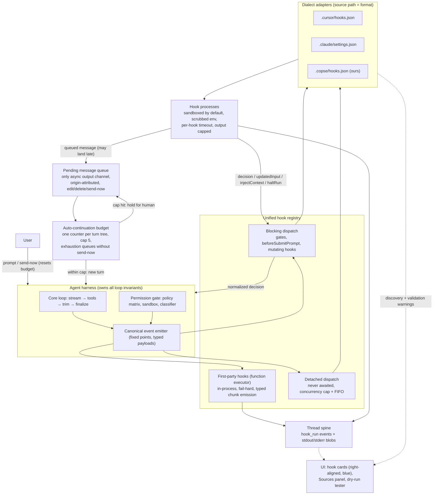

# Hooks platform & feature packs

Status: **planned** — design settled (July 2026); no implementation started. This document
is the source of truth for the phased issue breakdown below. It extends
[`docs/cursor-hooks.md`](../cursor-hooks.md) (current Cursor-hooks support) and folds in
PR #879 (Claude `PreToolUse` hooks) and the direction of PR #840 (permission-decision
audit trail).

## Why

Two motivations, one architecture:

1. **Hook parity and expressiveness.** Copse wires only three of Cursor's hook events
   (`beforeShellExecution`, `beforeMCPExecution`, `beforeReadFile` — path only), and
   supports only a fraction of the response vocabulary other agents honour
   (`updated_input`, `additionalContext`, `continue: false`, follow-up messages, per-hook
   timeouts). Users who bring hooks written for Cursor or Claude Code get silent partial
   behavior.
2. **Harness policy is hardcoded.** Loop nudges, intent steering, todo closeout, and
   post-turn remediation are inline in `run-agent-loop.ts` and `agent-service.ts` — five
   separate auto-continuation mechanisms with five counters and bespoke thread-lifecycle
   handling (the deferred-`done` dance). Each is a candidate to become a named,
   toggleable, individually testable hook. The end state generalizes to **feature
   packs**: a feature (todos, post-turn review, model comparison) is a manifest-bundled
   set of tools + hooks + prompt blocks + UI contributions that enables/disables as one
   unit, like a browser extension.

## Current state (audit)

| Piece                      | Where                                                                             | Status                                                                  |
| -------------------------- | --------------------------------------------------------------------------------- | ----------------------------------------------------------------------- |
| Cursor permission hooks    | `src/main/services/skills/cursor-hooks.ts`, `permission-gate.ts`                  | Wired: shell / MCP / read-path. Fail-open, tighten-only, 5s timeout     |
| Cursor lifecycle events    | `CURSOR_HOOK_EVENTS` in `src/shared/types/cursor-hooks.ts`                        | `beforeSubmitPrompt`, `afterFileEdit`, `stop` parsed for discovery only |
| Claude `PreToolUse` hooks  | PR #879 (`claude-hooks.ts`, shared `HookSummary`/`HookFamily`)                    | In flight; same gate, `.claude/settings.json` discovery                 |
| Permission audit trail     | PR #840 (`decision-log-store.ts`)                                                 | In flight; becomes a subscriber of the `permissionDecision` event (F2)  |
| Loop nudges                | `packages/agent/src/agent-loop-guards.ts`, `run-agent-loop.ts`                    | Inline; migrate in Phase E                                              |
| Intent steering            | `agent-service.ts` + `todo-logic` / `github-link-steering` / `commit-attribution` | Inline; migrate in Phase E                                              |
| Post-turn orchestration    | `post-turn-orchestration.ts` + deferred-`done` in `agent-service.ts`              | Inline; migrate in Phase E                                              |
| Queued messages / send-now | `thread-helpers.ts` (`setQueuePaused`), renderer queue views                      | Exists; becomes the async hook output channel (C2)                      |
| ACP plan ↔ todo mapping    | `src/main/services/acp/session-update-adapter.ts`                                 | Exists; precedent + data model for the declarative pack panel (P2)      |
| Plugin manifest            | `cursor-plugins.ts` (`plugin.json`: skills + MCP)                                 | Exists; feature-pack manifest extends this shape                        |

## Decisions log

These were settled in design review and are **not** open questions. Changing one means
revisiting this document, not silently diverging in an implementation PR.

1. **One registry, one event vocabulary, two executor kinds.** A hook is
   `(canonical event) → decision`. First-party hooks are in-process functions;
   user/project hooks are spawned commands. Same registry, same events, same Sources UI.
2. **Blocking vs async by capability, not by origin.** Decision/mutation hooks
   (tool gates, `beforeSubmitPrompt`, mutating `afterFileEdit`) block — matching Cursor
   and Claude Code. Observation hooks run async, opt-in per hook. Users are allowed to
   slow the agent down with blocking hooks; document the cost, don't forbid it.
3. **Detached async — no drain barrier.** Async hooks dispatch at the step that emitted
   them and are **never awaited** — not by the loop, not by other hooks, not by `stop`.
   "Stop stops agent work": abort/turn-end halts emission of new events but never kills
   or waits for in-flight hooks. Spine records attribute each run to its emitting step.
   The `stop` hook may fire while observation hooks are still running; a hook that needs
   the complete turn uses blocking mode.
4. **The pending-message queue is the only async output channel.** An async hook's
   results land as queued messages (consumed at idle drain, or immediately if the hook
   sets send-now — byte-for-byte the user's send-now semantics). No mid-turn injection
   path exists for async hooks; late results are therefore safe by construction.
5. **One auto-continuation budget.** A single counter per **turn tree** (everything
   descending from one human-originated submission). The ledger counts
   **machine-initiated new model turns** only: hook send-now, `stop`/`subagentStop`
   follow-ups, post-turn remediation cycles, pre-review todo attempts, and todo-closeout
   turns. **In-loop nudges do not count** (truncation-continue, finalize, loop, and
   reasoning-runaway nudges are mid-turn message pushes inside one `runAgentLoop`
   invocation, already bounded by `maxSteps` / `DEFAULT_MAX_LLM_CALLS` and the run
   deadline). Hard cap default 5; existing per-mechanism caps (todo closeout 3,
   pre-review todo attempts 2, remediation cycles 2) remain as local tighteners inside
   the shared cap. Cursor per-script `loop_limit` bounds _that script's_ contributions to
   `min(loop_limit, global remaining)`; `loop_limit: null` (unlimited) is clamped to the
   global cap with a warning — human-in-the-loop is the floor. Continuations are granted
   first-come in completion order. Each granted turn is a fresh run with its own
   step/LLM-call caps and deadline, as today. **The budget is enforced at dispatch
   time**: plain queued messages auto-drain once the thread idles (`drainMessageQueue`),
   so a hook-originated message consumes budget when it _drains_, not when it enqueues.
   Exhaustion (and any hook message arriving over-budget) flips the item to a **held**
   state — `autoDispatch: false` on the queued message — which the drain loop skips
   entirely; only an explicit human action (send-now / release) submits it, and that
   human action starts a fresh turn tree with a reset budget. Plus a visible thread
   note. `COPSE_HOOK_DEPTH` env guard prevents hook→Copse recursion.
6. **Spine recording is always-on.** Every hook execution writes a `hook_run` event to
   the thread spine (event name, hook id, emitting step, wall-clock duration, exit code,
   `parse_ok`, normalized decision) with raw stdout **and stderr** as blobs (stderr is
   currently discarded — must be captured). The response is _derived from_ stdout by
   parsing; both raw and parsed are stored, so a debug print that corrupts a response is
   visible as `parse_ok: false` next to the bytes. Note this is a **schema change**: the
   spine today is message-only (`SpineMessageLine`; `parseSpineLine` skips any
   non-`message` line, which conveniently makes old readers forward-tolerant of the new
   line type) — A3 owns widening the union plus fold/export/docs/tests, **and full-save
   round-tripping**: `writeThread` regenerates `events.jsonl` from `thread.messages`, so
   appended non-message lines must survive full rewrites or they are silently lost.
   The spine also records **toolset fingerprints**: the set of tools offered to the model
   is stored once as a content-addressed blob (sorted tool names + per-tool schema hash)
   and referenced by hash from assistant spine lines and `hook_run` records. Toolsets
   change rarely (pack toggle, MCP connect, readonly mode, subagent allowlist), so dedupe
   makes this near-free — and it supports decision 17 (proving a disabled pack's tool
   existed at call time), "why didn't the model call X" debugging, and eval
   reproducibility. Granularity is per LLM call via the turn's spine line.
7. **Hooks are trusted by declaration; sandboxed by default anyway.** No PII redaction of
   hook payloads (the user/workspace-trust gate is the consent). But hook processes run
   **inside the project sandbox by default** (reversing today's outside-sandbox spawn),
   with a per-hook `sandbox: false` escape in the Copse dialect surfaced in the trust
   prompt. macOS-only enforcement (seatbelt); best-effort elsewhere — a default, not a
   guarantee. Sandbox-blocked hooks surface via the spine + Sources, never silent
   fail-open.
8. **Dialect by source path, not prefixes or sniffing.** `.cursor/hooks.json` → Cursor
   adapter, `.claude/settings.json` → Claude adapter, `.copse/hooks.json` → Copse
   adapter. Adapters own discovery, parsing, matchers, and **wire marshalling both
   directions** (a Claude hook sees Claude's stdin shape and tool names). Foreign files
   stay strictly on their vendor's contract; Copse-native events live only in the Copse
   dialect. Unknown events in a foreign file are warned about, never silently skipped.
9. **Foreign dialects keep vendor failure semantics — including Cursor `failClosed`.**
   Cursor hooks fail open **by default**, but Cursor's per-hook `failClosed: true`
   (crash / timeout / invalid JSON blocks the action instead of allowing it) is part of
   the vendor contract and **must be honoured by the Cursor adapter** — ignoring it
   would silently weaken imported security hooks. Claude exit-code-2 denies; each
   adapter owns its dialect's per-event exit-code table. The Copse dialect's
   `onFailure: open|closed` is the same knob under our naming. First-party (function)
   hooks fail **hard** — a throw is a bug, loud in dev, log-with-telemetry in prod,
   never silently swallowed.
10. **Hook UI is tool-call-style cards, right-aligned, same blue.** Hook executions,
    deny/ask decisions, and queued hook messages render as a distinct card family — not
    as user messages. Provenance (`origin: { kind: 'hook', hookId, event }`) lives in the
    data model; message role stays `user` for the LLM. Editing a hook-queued message
    keeps `kind: 'hook'` with `editedByUser: true` — the spine stays honest about
    authorship.
11. **`injectContext` from async hooks is converted to a queued message** (v1). Only
    blocking hooks inject context at their fire point. This preserves decision 4 and
    keeps turn content deterministic for evals. Claude's `asyncRewake` (background hook
    waking the model mid-turn) is **unsupported in v1** and reported as such by the
    adapter — it is exactly the mid-turn injection path we chose not to have.
12. **`haltRun` (`continue: false`) is allowed from async hooks** and routes through the
    existing abort path, attributed to the hook on a card and in the spine. It is a
    programmatic stop button — the loop already handles that external signal.
13. **Per-hook timeouts, vendor defaults.** Claude command hooks default to 600s; our
    fixed 5s would kill real hooks. Blocking-hook wait pauses the idle deadline the same
    way tool execution does. Async over-cap dispatches (concurrency cap ~8/thread) go
    into a pending-dispatch FIFO (deferred spawn, still detached, no ordering promises;
    cap ~100 then drop-with-spine-record). Nothing ever waits on the FIFO.
14. **Payloads are treated as stable now; stability is _declared_ at publish time.**
    Pre-v1 with zero consumers we don't version payloads, but every dialect wire payload
    is snapshot-tested (G4) so the publish-time stability audit is a diff review.
15. **Feature packs are the end state; two capability tiers, one lifecycle.** Following
    VS Code's built-in-extensions model: first-party packs and user packs share the
    manifest, registry, Settings surface, and disable semantics; first-party packs
    additionally get typed `AgentStreamChunk` emission, typed loop-state access, and
    real renderer views. External hooks can never emit feature chunks (`todo_update`,
    `subagent_*`) — the typed stream stays first-party, which keeps transcripts
    trustworthy.
16. **Async hook outputs are epoch-scoped to their emitting turn tree.** Send-now
    currently aborts the active local run (`sendQueuedMessageNow` in
    `src/renderer/controller/message-queue.ts`), so a late async hook from a completed
    turn must never be able to abort or inject into a newer, unrelated human turn.
    Every hook dispatch carries the id of its emitting turn tree; when the output
    arrives, staleness is checked: a **stale send-now downgrades to a held queued
    message** (`autoDispatch: false` — no abort, and **not** auto-drained at idle: a
    plain queued message would still auto-submit via `drainMessageQueue`, re-opening the
    back door), and a **stale `haltRun` is a no-op**, recorded in the spine as
    suppressed. Only outputs from the _current_ turn tree may abort or auto-submit;
    everything stale waits for a human.
17. **Disabling a pack never breaks history.** Transcript rendering resolves from
    shipped renderer code + spine data, **never from live registration state**. Opening
    an old conversation shows a disabled pack's tool calls, cards, and panels exactly as
    they ran (we ship the code; only _registration for new work_ is removed). Disable
    semantics: tools leave the model's tool list, hooks stop firing, prompt blocks drop
    out, UI contributions stop mounting _for new content_; pack storage persists like a
    disabled browser extension's data.

## Target architecture



### Glossary

Terms invented by this design — use them exactly; do not coin synonyms in code or PRs:

- **Canonical event** — a named point where the harness calls the registry. Harness code
  fires canonical events only; it never knows dialects or executors exist.
- **Executor** — how a hook runs: `function` (in-process, first-party, fail-hard) or
  `command` (spawned process, dialect-owned failure semantics).
- **Dialect** — an on-disk hook config format (Cursor / Claude / Copse), identified by
  source path, translated by its **adapter**.
- **Turn tree** — everything descending from one human-originated submission (typed
  message or human send-now/release). The auto-continuation budget is scoped to it.
- **Epoch** — the turn-tree id carried by every async hook dispatch; outputs from a
  non-current epoch are **stale** (decision 16).
- **Held** — a queued message with `autoDispatch: false`: skipped by `drainMessageQueue`,
  submitted only by explicit human action, which starts a fresh turn tree.
- **Pack** — a manifest-bundled feature (tools + hooks + prompt + UI + settings +
  storage) that enables/disables atomically.

### Canonical events (v1 enumeration)

The registry's event names and firing sites. A1 implements the type; each event lands in
the phase listed. Names are final — changing one is a decisions-log edit, not a refactor.

| Event                                | Kind                   | Fires at (site)                                                          | Phase |
| ------------------------------------ | ---------------------- | ------------------------------------------------------------------------ | ----- |
| `turnStart`                          | blocking, assembly     | `runAgent` after system prompt build, before loop (steering, pins)       | M0    |
| `beforeFinalize`                     | blocking, assembly     | `runAgentLoop` finalize checks (open-todos closeout nudges only)         | M0    |
| `beforeSubmitPrompt`                 | blocking, decision     | Compose path, before `agent:run`                                         | B1    |
| `toolGate`                           | blocking, decision     | `ensureToolPermitted` (maps beforeShell/MCP/ReadFile + `PreToolUse`)     | A2    |
| `afterFileEdit`                      | blocking or async      | Diff-queue / write tools                                                 | B2    |
| `stop`                               | async (detached)       | Turn end or abort, after agent work halts                                | B3    |
| `afterToolUse`                       | async, observation     | After each tool result (generic; shell/MCP variants are payload flavors) | D2    |
| `subagentStart`                      | blocking, decision     | `runSubagent` before spawn                                               | D1    |
| `subagentStop`                       | async (detached)       | `runSubagent` completion                                                 | D1    |
| `sessionStart`                       | async, fire-and-forget | New thread / first turn (sets `sessionEnv`)                              | H4    |
| `compaction`                         | async, observation     | History trim / todo-boundary compaction                                  | later |
| `permissionDecision`                 | async, observation     | After `decideShellPermission` verdict (feeds #840's audit trail)         | F2    |
| `beforeDiffApply` / `afterDiffApply` | blocking / async       | Diff-queue approval flow (Copse-native)                                  | F2    |

### Canonical decision vocabulary

The registry's normalized hook output (A1). Adapters translate each dialect's wire format
to/from this; the harness consumes only this. **Encode the constraints in types, not
review comments**: blocking and async hooks must have _separate outcome types_ so an
async hook cannot return `decision`, `updatedInput`, or `injectContext` at the type
level (decisions 4 and 11 become compiler errors instead of bugs):

```ts
interface HookOutcome {
  decision?: 'allow' | 'deny' | 'ask'
  haltRun?: { reason: string } // continue:false — outranks everything
  updatedInput?: Record<string, unknown> // tool gates only; re-runs policy analysis
  injectContext?: string // blocking hooks only (v1); async → queued message
  agentMessage?: string // fed to the model on deny/ask
  userMessage?: string // shown to the user (hook card)
  queueMessage?: { text: string; sendNow: boolean } // the async channel
  sessionEnv?: Record<string, string> // sessionStart → later hook processes
}
```

### Response-semantics parity (vendor audit)

| Capability                                                    | Cursor                | Claude Code                                                          | This plan                                    |
| ------------------------------------------------------------- | --------------------- | -------------------------------------------------------------------- | -------------------------------------------- |
| `permission` allow/deny/ask (+ Claude `defer`)                | ✅                    | ✅                                                                   | A1/B4 (#879 maps `defer` → `ask`)            |
| Deny reason to agent                                          | ✅                    | ✅ (exit 2)                                                          | B4                                           |
| Message to user (`user_message` / `systemMessage`)            | ✅                    | ✅                                                                   | B4 → hook card                               |
| Rewrite tool input (`updated_input`)                          | ✅                    | —                                                                    | H1                                           |
| Inject context into current turn (`additionalContext`)        | partial               | ✅                                                                   | H2 (blocking only in v1)                     |
| Halt entire run (`continue: false` + `stopReason`)            | ✅                    | ✅                                                                   | H3 (abort path, hook-attributed)             |
| Auto-continue (`followup_message` / Stop `decision: block`)   | ✅                    | ✅                                                                   | C2 + C3 (queue + budget)                     |
| Per-event exit-code protocol                                  | ✅                    | ✅ (rich)                                                            | A2 (per-adapter tables)                      |
| Model identity in payload (`model`/`model_id`/`model_params`) | ✅ (all agent events) | partial (`SessionStart` optional; `resolvedModel` on subagent input) | B4                                           |
| Per-hook `failClosed` (block on crash/timeout/bad JSON)       | ✅                    | —                                                                    | A2 + B4 (decision 9)                         |
| Per-hook `timeout` (Claude default 600s)                      | config                | ✅                                                                   | H4                                           |
| `sessionStart` env propagation                                | ✅                    | ✅                                                                   | H4                                           |
| `suppressOutput`, >10k output spillover                       | —                     | ✅                                                                   | H2 (spillover shares blob machinery)         |
| Non-command executors (`http`/`prompt`/`agent`/`mcp_tool`)    | prompt (desktop)      | ✅                                                                   | Out of scope v1; adapters report unsupported |
| `asyncRewake` (background hook wakes model mid-turn)          | —                     | ✅                                                                   | **Unsupported v1** (decision 11)             |
| Long-tail Claude events (`Notification`, `TeammateIdle`, …)   | —                     | ✅                                                                   | Unsupported-and-reported + G3 drift detector |

## Feature packs

A pack is a manifest-bundled feature. It extends the `plugin.json` shape Copse already
loads (skills + MCP) with the remaining slots:

```
pack manifest
├── tools      MCP config (user packs) or native tool registrations (first-party)
├── hooks      event → handler (command for users, function for first-party)
├── prompt     skills / steering blocks (with trust framing)
├── ui         contributions — see levels below
├── settings   pack-scoped schema, rendered generically in Settings
└── storage    namespaced state; survives disable
```

UI contribution levels:

- **Level 1 — declarative cards**: the hook-card family. User-reachable.
- **Level 2 — named panel slot**: pack supplies structured data, host renders a generic
  list/tree panel. User-reachable. Data model extends the existing chunk vocabulary —
  `todo_update` already round-trips to ACP `plan`
  (`session-update-adapter.ts`), so pack panels are one adapter away from rendering in
  other ACP clients. Precedents: VS Code TreeView, Raycast's fixed component catalog,
  Slack Block Kit, ACP `plan`.
- **Level 3 — real renderer views**: the actual plan panel. First-party privilege
  (VS Code built-in-extensions model).

**Pilot pack: todos.** Tools: `update_todos`. Hooks: `todo-steering` (turn start),
`todo-pin` (turn start), `todo-closeout` (stop, consumes the C3 budget),
`todo-compact-pin` (compaction). Prompt: the steering block. UI: plan panel (level 3) +
`todo_update` binding. Acceptance: disabling the pack removes the tool from the model's
tool list, all four hooks, the steering text, and the panel **in one action**; old
conversations still render todo history (decision 17); `npm run check` dead-code gate
passes because the pack is referenced by the registry, not the loop.

Later packs, in extraction order: post-turn review, model comparison, GitHub-link
steering, commit attribution, memory tools, browser tools. **Not packs** (the platform):
permission gate, context trimming, the step machine, diff queue.

## Issue breakdown

**Milestone 0 (below) is the entry point and ships first.** After it, phases B–H depend
on A1–A2. Critical path: **M0 → A1(full) → A2 → {B\*, C1} → C2 → C3**; D/E/F/G/H/P
parallelize after. Each E/P issue carries the acceptance criterion _“old inline mechanism
deleted”_ (dead-code gate enforces it) and _“feature UI chunks byte-identical; existing
WDIO specs pass unmodified.”_

**Issue filing policy:** this document is canonical; GitHub issues are filed **lazily,
per active milestone/phase** (file M0's three issues now; file a phase's issues when an
agent picks the phase up). Every filed issue links to its row here and states "on
conflict, the plan doc wins — update the doc in the same PR as the behavior change."
This avoids 30 stale issues drifting from the design.

### Milestone 0 — MVP: todos out of the core files

The thin vertical slice: a **function-executor-only registry** plus the two assembly
events, used to extract every inline todo behavior. No dialects, no command executor, no
async dispatch, no queue/budget/epoch, no spine changes, no UI changes — those all come
later and plug into the same seam. Proves the architecture is extensible before anything
external depends on it.

| #    | Issue                             | Scope                                                                                                                                                                                                                                                                                                                                                                               |
| ---- | --------------------------------- | ----------------------------------------------------------------------------------------------------------------------------------------------------------------------------------------------------------------------------------------------------------------------------------------------------------------------------------------------------------------------------------- |
| M0.1 | Registry core (function executor) | In `packages/agent` (Electron-free): typed canonical events (`turnStart`, `beforeFinalize` only), function executor, fail-hard semantics, static registration list, separate blocking/async outcome types (async unused for now but the split exists from day one). Emitting with zero registered hooks changes nothing                                                             |
| M0.2 | Extract turn-start policy         | Todo steering, prior-todos pin, GitHub-link steering, commit steering → named `turnStart` hooks; the `messages[0]` string surgery leaves `runAgent`. Behavior byte-identical, pinned by existing tests                                                                                                                                                                              |
| M0.3 | Extract finalize policy           | Open-todos closeout nudge selection (`OPEN_TODOS_FINALIZE_*`, `MAX_TODO_CLOSEOUT_ATTEMPTS` gating) → `beforeFinalize` hooks; the inline blocks leave `run-agent-loop.ts`. Behavior byte-identical. `STUCK_FINALIZE_NUDGE` is **not** included — despite its name it fires in the mid-loop `shouldForceTextAnswer` context-pressure path, so it is an in-loop nudge and stays for E1 |

M0 acceptance: inline mechanisms deleted (dead-code gate); `npm run check` green;
`todo_update` chunks and plan-panel behavior untouched (pure data plumbing — the
AGENTS.md "demonstrably invisible" exception applies, no visual eval needed);
extensibility proven by registering one additional no-op hook in a test without touching
loop code.

What M0 deliberately does **not** move: the in-loop truncation, reasoning-runaway, loop,
and stuck-finalize nudges (E1 — all four fire at step boundaries under pressure and need
a step-boundary event that M0 doesn't add; `STUCK_FINALIZE_NUDGE` is in-loop despite its
name) and todo compaction pinning. Scope discipline matters more than completeness here.

### Phase 0 — in flight

- Land PR #879 (Claude `PreToolUse`); coordinate `permission-gate.ts` edits with PR #840.

### Phase A — foundations

| #   | Issue                                          | Scope                                                                                                                                                                                                                                                                                                                                                                                                                                                                                                                                                                                                                                                                                                                                                                                                                                                                                                                                 |
| --- | ---------------------------------------------- | ------------------------------------------------------------------------------------------------------------------------------------------------------------------------------------------------------------------------------------------------------------------------------------------------------------------------------------------------------------------------------------------------------------------------------------------------------------------------------------------------------------------------------------------------------------------------------------------------------------------------------------------------------------------------------------------------------------------------------------------------------------------------------------------------------------------------------------------------------------------------------------------------------------------------------------- |
| A1  | Canonical hook model + unified registry        | Event taxonomy; `HookOutcome` vocabulary above; two executor kinds (function / command); executor capability split (function hooks may emit typed chunks + read loop state); function hooks fail hard, command hooks per-dialect semantics                                                                                                                                                                                                                                                                                                                                                                                                                                                                                                                                                                                                                                                                                            |
| A2  | Restructure cursor-/claude-hooks into adapters | Source-path → dialect; adapters own discovery, parse, matchers, wire marshalling both directions, per-event exit-code tables, unsupported-capability reporting. Acceptance: Cursor `failClosed: true` honoured (crash/timeout/invalid JSON blocks) with tests for both failure modes (decision 9)                                                                                                                                                                                                                                                                                                                                                                                                                                                                                                                                                                                                                                     |
| A3  | Spine recording of hook executions             | `hook_run` events per decision 6; capture stderr (currently `'ignore'`); raw streams to blobs; always-on. Includes the spine schema change: widen `SpineMessageLine` to a discriminated `SpineLine` union, update parse/serialize, fold/export paths, `docs/thread-store-format.md`, and tests (old readers skip non-`message` lines, so forward-tolerant). **Full-save preservation required**: `writeThread` rewrites `events.jsonl` from `thread.messages` alone (`explodeThread` → `serializeSpine`), so independently-appended non-message lines would be dropped on the next full save — they must round-trip through rewrites (carried in memory or read-merge-write), with a regression test: append `hook_run` → full save → line survives. **Toolset fingerprints** (decision 6): content-addressed toolset blob (sorted names + schema hashes), referenced by hash from assistant lines + `hook_run` records, per LLM call |
| A4  | Settings toggle + Sources hooks panel          | Expose `cursorHooksEnabled`; per-entry validation warnings; unsupported badges; per-hook error state deduped once per session                                                                                                                                                                                                                                                                                                                                                                                                                                                                                                                                                                                                                                                                                                                                                                                                         |

### Phase B — complete the Cursor-declared surface

| #   | Issue                        | Scope                                                                                                                                                                                                                                                                                                                                                                                                                                                                                                                                                                                                                               |
| --- | ---------------------------- | ----------------------------------------------------------------------------------------------------------------------------------------------------------------------------------------------------------------------------------------------------------------------------------------------------------------------------------------------------------------------------------------------------------------------------------------------------------------------------------------------------------------------------------------------------------------------------------------------------------------------------------- |
| B1  | Wire `beforeSubmitPrompt`    | Blocking, compose path; honour `continue: false` + `user_message`                                                                                                                                                                                                                                                                                                                                                                                                                                                                                                                                                                   |
| B2  | Wire `afterFileEdit`         | Diff-queue / write-tool site; blocking by default (formatters), async opt-in; matchers                                                                                                                                                                                                                                                                                                                                                                                                                                                                                                                                              |
| B3  | Wire `stop`                  | Fires the moment agent work stops (turn end or abort, `status` accordingly); **no drain barrier** (decision 3); follow-ups via C2, not a bespoke protocol                                                                                                                                                                                                                                                                                                                                                                                                                                                                           |
| B4  | Complete permission-hook I/O | Real `conversation_id`/`generation_id`; **model identity in payloads** — Cursor dialect gets `model`/`model_id`/`model_params` on every agent-session event (vendor contract; sourced from thread-model tracking + usage, i.e. the model actually running, and subagent hooks carry the subagent's resolved model incl. local fallback); Claude dialect gets optional `model` on `SessionStart` only, matching their contract; `agentMessage` surfaced (hook card); `ask` escalates to an approval prompt; `beforeReadFile` receives content + deny/redact; `failClosed` behavior covered on every wired permission event (with A2) |

### Phase C — async executor, output channel, budget

| #   | Issue                                | Scope                                                                                                                                                                                                                                                                                                                                                                                                                                                                                                                                                                                                                |
| --- | ------------------------------------ | -------------------------------------------------------------------------------------------------------------------------------------------------------------------------------------------------------------------------------------------------------------------------------------------------------------------------------------------------------------------------------------------------------------------------------------------------------------------------------------------------------------------------------------------------------------------------------------------------------------------- |
| C1  | Detached async executor              | Decision 3 + 13: dispatch at emission, never awaited, step-attributed; concurrency cap ~8/thread + pending-dispatch FIFO; abort stops emission only; **every dispatch carries its emitting turn-tree id** (decision 16)                                                                                                                                                                                                                                                                                                                                                                                              |
| C2  | Hook → pending-message queue channel | Decision 4 + 10 + 16: origin attribution, full edit/delete/send-now affordances, `editedByUser` flag; **new held state `autoDispatch: false` on queued messages — `drainMessageQueue` skips held items; renderer shows held state with an explicit release action; tests cover drain-skip + release**; stale-epoch send-now downgrades to _held_ (not plain queue — plain items auto-drain at idle), staleness checked before the `sendQueuedMessageNow` abort path                                                                                                                                                  |
| C3  | Unified auto-continuation budget     | Decision 5's exact ledger: machine-initiated **new turns** increment (hook send-now, stop/subagent follow-ups, remediation, pre-review todo attempts, closeout); in-loop nudges do not; local caps (3/2/2) as tighteners; per-script `loop_limit` → `min(limit, remaining)`, `null` clamped with warning; grants first-come in completion order; each grant is a fresh run under existing step/LLM/deadline caps; **budget checked at drain time, over-budget items flip to held (`autoDispatch: false`), release-by-human resets as a new turn tree — renderer behavior + tests with C2**; `COPSE_HOOK_DEPTH` guard |

### Phase D — parity tier 2 events

| #   | Issue                                       | Scope                                                                                                 |
| --- | ------------------------------------------- | ----------------------------------------------------------------------------------------------------- |
| D1  | `subagentStart` / `subagentStop`            | Deniable start (matcher on subagent type); stop follow-ups via C2/C3. Sites: `run-subagent.ts` et al. |
| D2  | `afterShellExecution` / `afterMCPExecution` | Async observations with capped output snapshot                                                        |
| D3  | Matcher support                             | Cursor per-event matcher semantics (command text / tool type / subagent type) in adapter dispatch     |

### Phase H — vendor response semantics

| #   | Issue                             | Scope                                                                                                                                                                                |
| --- | --------------------------------- | ------------------------------------------------------------------------------------------------------------------------------------------------------------------------------------ |
| H1  | `updatedInput` on tool gates      | Sequential pipeline across hooks in registration order; **rewritten input re-runs `analyzeShellCommand` / policy matrix**; flagged in spine + card                                   |
| H2  | Current-turn context injection    | `injectContext` from blocking hooks at fire point (system-reminder block); 10k cap with blob spillover; async → queued message (decision 11)                                         |
| H3  | Halt-run semantics                | `haltRun` through the abort path, allowed from async hooks (decision 12); **stale-epoch `haltRun` is a suppressed no-op** (decision 16); `stopReason` on a hook card; spine-recorded |
| H4  | Per-hook timeout + `sessionStart` | Vendor timeout defaults per dialect; blocking wait pauses idle deadline; `sessionStart` fire-and-forget with `sessionEnv` propagation                                                |

### Phase E — first-party migration (payback phase — not optional)

| #   | Issue                           | Scope                                                                                                                                            |
| --- | ------------------------------- | ------------------------------------------------------------------------------------------------------------------------------------------------ |
| E1  | Migrate loop nudges to registry | `LOOP_NUDGE`, `STUCK_FINALIZE`, truncation-continue, reasoning-runaway → named function hooks; behavior byte-identical (pin with existing tests) |
| E2  | Migrate intent steering         | Todos / GitHub-link / commit steering → turn-start function hooks; leaves `runAgent`                                                             |
| E3  | Migrate post-turn orchestration | Review remediation + todo closeout onto turn-boundary events + C3 budget; **deletes the deferred-`done` lifecycle handling**                     |

### Phase F — Copse dialect, native events, sandbox

| #   | Issue                                 | Scope                                                                                                                                  |
| --- | ------------------------------------- | -------------------------------------------------------------------------------------------------------------------------------------- |
| F1  | Copse dialect + published JSON schema | `.copse/hooks.json`: `async`, `onFailure`, `sandbox: false`, `loop_limit` (tighten-only); we publish an official schema                |
| F2  | Copse-native events                   | `beforeDiffApply` / `afterDiffApply` (diff queue), `postTurnReview`, `permissionDecision` observation (aligns with #840's audit trail) |
| F3  | Sandbox hooks by default              | Decision 7: reverse today's outside-sandbox spawn; per-hook escape in trust prompt; blocked-by-sandbox surfaced via A3/A4              |

### Phase G — validation & tooling

| #   | Issue                                | Scope                                                                                                                                                                                       |
| --- | ------------------------------------ | ------------------------------------------------------------------------------------------------------------------------------------------------------------------------------------------- |
| G1  | Hook cards UI                        | Decision 10: tool-call family, right-aligned, blue; executions, decisions, queued messages; origin marker on hook-originated turns; WDIO specs                                              |
| G2  | Dry-run hook tester                  | `hooks:test` IPC + Sources button; synthetic payload per event; show stdin/stdout/stderr/exit/duration                                                                                      |
| G3  | Vendored schemas + CI drift detector | Pin Claude SchemaStore + Cursor community schemas; **warn-level authoring lint only, never a load gate, never remote-fetched**; CI test diffs published event lists vs adapter-known events |
| G4  | Payload snapshot tests               | Decision 14: snapshot every dialect wire payload now                                                                                                                                        |
| G5  | Docs overhaul                        | `docs/hooks.md` architecture doc (this design); fix stale paths (`src/main/services/cursor-hooks.ts` → `skills/cursor-hooks.ts`); document the `loop_limit` clamp divergence                |

### Phase P — feature packs

| #   | Issue                                             | Scope                                                                                                                                                                                       |
| --- | ------------------------------------------------- | ------------------------------------------------------------------------------------------------------------------------------------------------------------------------------------------- |
| P1  | Pack manifest + lifecycle                         | Extend `plugin.json` shape with hooks/prompt/ui/settings/storage slots; registry pack grouping; atomic enable/disable; **history rendering never consults live registration (decision 17)** |
| P2  | Level-2 declarative panel contribution            | Generic list/tree panel from structured pack data; extend the chunk vocabulary (reuse the `todo_update` ↔ ACP `plan` mapping as the data-model seed)                                        |
| P3  | Pack-scoped settings + pack list UI               | Extends A4: packs with enable toggles, their hooks/tools/UI enumerated — the `about:addons` of Copse                                                                                        |
| P4  | Extract todos as the pilot pack                   | Manifest above; acceptance criteria in the pilot-pack section; proves disable semantics + history invariant                                                                                 |
| P5  | Extract post-turn review + model comparison packs | Same pattern; each deletes its inline trigger code                                                                                                                                          |

Sequencing risk: packs are the second floor. P1 must not start before A1/A2 and C3 are
merged, or it freezes their shapes prematurely. P4 (todos) is the forcing function for
every primitive the pack layer needs.

## Execution guidance (for agents implementing this plan)

Rules that steer implementation toward correctness. They are process, but each one
exists because it converts a class of likely mistake into a mechanical failure:

1. **This document is law; change it in the same PR.** If implementation reveals a
   decision is wrong, edit the decisions log alongside the code — never silently
   diverge. Reviewers should reject a semantic change without a matching doc edit.
2. **Contract tests before (or with) behavior.** Every decision with a behavioral
   surface gets a test file named for it, in the house style of
   `permission-platform.test.ts` pinning the permission matrix. Minimum set:
   held-items-never-drain (decision 5), stale-epoch-never-aborts (decision 16),
   budget-ledger increments (decision 5), failClosed both-modes (decision 9),
   hook-run-survives-full-save (decision 6), async-outcome-type-excludes-decisions
   (decision 11 — a type-level test via `@ts-expect-error` is acceptable here).
3. **Make illegal states unrepresentable.** Separate blocking/async outcome types;
   a branded `TurnTreeId`; `held` as part of the queued-message type. Prefer a compile
   error over a review comment over a runtime check, in that order.
4. **Module layout is fixed.** Registry + canonical events + first-party hooks live in
   `packages/agent` (Electron-free — function hooks receive app services via context,
   never import them). Command executor, dialect adapters, spawning, and sandbox live in
   `src/main/services/hooks/`. Renderer hook cards / held-queue UI in
   `src/renderer/views/`. Anything that violates the `packages/agent` purity boundary is
   wrong even if it works.
5. **Test tiers per [`docs/testing-strategy.md`](../testing-strategy.md):** unit tests
   for policy, adapters (against the golden vendor fixtures from G4), budget, epoch;
   component tests for renderer queue/held/card states; e2e only for gate wiring
   end-to-end and the G1 visual specs.
6. **One issue, one PR**, doc section linked, acceptance criteria copied into the PR
   description verbatim.

### Known implementation traps

Collected from design review — each of these was _almost_ a bug in the plan itself:

- **`drainMessageQueue` auto-submits plain queued messages at idle.** Any "queued for
  the human" semantics must use the held state; a plain enqueue is an auto-submit.
- **`sendQueuedMessageNow` aborts the active local run.** Check epoch staleness _before_
  reaching that path, or a late hook kills an unrelated turn.
- **`writeThread` regenerates `events.jsonl` from `thread.messages` alone.** Appending a
  spine line without full-save round-tripping means it vanishes on the next save.
- **Cursor `failClosed` exists.** "Cursor hooks fail open" is only the default; the
  adapter must honour the per-hook flag or imported security hooks silently weaken.
- **The OS sandbox is macOS-only.** `isProjectSandboxEnabled()` is hard-false elsewhere;
  every "sandboxed by default" statement is a _default_, not a guarantee — write code
  and docs accordingly.
- **Hook stdout is the response channel and stderr is currently discarded.** A script's
  debug print corrupts its own response into fail-open `allow`; the spine's `parse_ok`
  exists to make that visible. Capture stderr.
- **In-loop nudges are not continuations.** They live inside one `runAgentLoop` call
  under `maxSteps`/LLM caps; only machine-initiated _new turns_ touch the budget.
  Conflating the two either starves the loop or unbounds it.

## Codebase impact

Total LOC goes up (registry, adapters, executors, budget: ~1.5–2k lines of new bounded
modules). Complexity redistributes out of the three worst files:

- `agent-service.ts` loses the steering string surgery and the deferred-`done` lifecycle
  handling (E2/E3).
- `run-agent-loop.ts` loses inline nudge conditions/injection at ~6 points (E1) and
  becomes a cleaner state machine.
- `permission-gate.ts` stops accreting per-consumer integrations (#879's
  `claudePreToolUseForTool`, #840's audit calls) — one canonical event, N subscribers.

The failure mode that makes this strictly worse: building the hook system while keeping
the inline mechanisms alive. Phase E/P acceptance criteria ("inline mechanism deleted")
exist to prevent that; the dead-code gate enforces them.

## Related

- [`docs/cursor-hooks.md`](../cursor-hooks.md) — current support + security/trust model
- PR #879 — Claude `PreToolUse` hooks (Phase 0)
- PR #840 — permission-decision audit trail (feeds F2)
- [`docs/plans/settings-transparency.md`](./settings-transparency.md) — Sources panel (#639 context)
- [`docs/cursor-plugins.md`](../cursor-plugins.md) — plugin manifest the pack manifest extends
- [`docs/thread-store-format.md`](../thread-store-format.md) — spine format `hook_run` extends
- Cursor hooks reference: <https://cursor.com/docs/hooks> · Claude Code hooks reference:
  <https://code.claude.com/docs/en/hooks>
