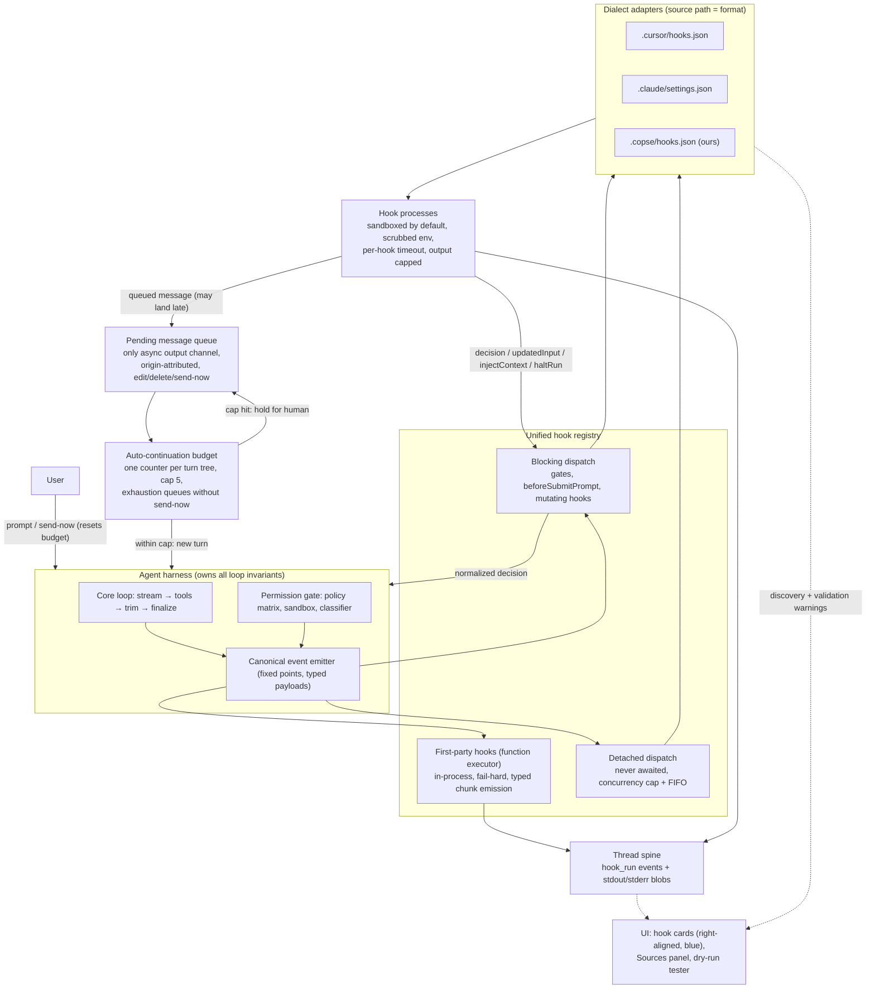

# Hooks platform & feature packs

Status: **Active** — design settled (July 2026). The major hook-platform foundations
and feature-pack phases P1–P7 are on `main`; the next extraction
(`copse.advisor-strategy`) is open in
[#1090](https://github.com/copse-dev/agent-pane/pull/1090). This document is the
source of truth for the phased breakdown below. It extends
[`docs/cursor-hooks.md`](../cursor-hooks.md) (current Cursor-hooks support) and folds in
PR #879 (Claude `PreToolUse` hooks) and the direction of PR #840 (permission-decision
audit trail).

## Why

Two motivations, one architecture:

1. **Hook parity and expressiveness.** Copse wires only three of Cursor's hook events
   (`beforeShellExecution`, `beforeMCPExecution`, `beforeReadFile` — path only), and
   supports only a fraction of the response vocabulary other agents honour
   (`updated_input`, `additionalContext`, `continue: false`, follow-up messages, per-hook
   timeouts). Users who bring hooks written for Cursor or Claude Code get silent partial
   behavior.
2. **Harness policy is hardcoded.** Loop nudges, intent steering, todo closeout, and
   post-turn remediation are inline in `run-agent-loop.ts` and `agent-service.ts` — five
   separate auto-continuation mechanisms with five counters and bespoke thread-lifecycle
   handling (the deferred-`done` dance). Each is a candidate to become a named,
   toggleable, individually testable hook. The end state generalizes to **feature
   packs**: a feature (todos, post-turn review, model comparison) is a manifest-bundled
   set of tools + hooks + prompt blocks + UI contributions that enables/disables as one
   unit, like a browser extension.

## Current state (audit)

| Piece                      | Where                                                                                                                                                             | Status                                                                                                                                                                                                       |
| -------------------------- | ----------------------------------------------------------------------------------------------------------------------------------------------------------------- | ------------------------------------------------------------------------------------------------------------------------------------------------------------------------------------------------------------ |
| Cursor permission hooks    | `src/main/services/hooks/cursor-adapter.ts`, `tool-gate.ts`, `permission-gate.ts`                                                                                 | Wired via `toolGate` (A2): shell / MCP / read-path. Fail-open + `failClosed`, tighten-only, 5s timeout                                                                                                       |
| Cursor lifecycle events    | `CURSOR_HOOK_EVENTS` in `src/shared/types/cursor-hooks.ts`                                                                                                        | `beforeSubmitPrompt` (B1, compose path) + `afterFileEdit` (B2, diff-queue/write site) + `stop` (B3, turn end / abort, detached) wired                                                                        |
| Cursor generic tool events | `postToolUse` / `postToolUseFailure` in `src/main/services/hooks/cursor-adapter.ts`                                                                               | Both map onto canonical `afterToolUse`; success/failure select the wire event, generic matchers use Cursor tool-type tokens, and `additional_context` follows decision 11 through the queued-message channel |
| Claude `PreToolUse` hooks  | `src/main/services/hooks/claude-adapter.ts` (shared `HookSummary`/`HookFamily`)                                                                                   | Wired via `toolGate` (A2); same gate, `.claude/settings.json` discovery                                                                                                                                      |
| Permission audit trail     | PR #840 (`decision-log-store.ts`)                                                                                                                                 | In flight; becomes a subscriber of the `permissionDecision` event (F2)                                                                                                                                       |
| Loop nudges                | `packages/agent/src/agent-loop-guards.ts`, `run-agent-loop.ts`                                                                                                    | Inline; migrate in Phase E                                                                                                                                                                                   |
| Intent steering            | `turnStart` hooks in `packages/agent` (`todo-steering`, `todo-pin`, `github-link-steering`, `commit-steering`); `messages[0]` surgery stays in `agent-service.ts` | Extracted in M0.2                                                                                                                                                                                            |
| Finalize closeout nudges   | `beforeFinalize` hook `todo-finalize-closeout` in `packages/agent`; closeout loop + still-open note stay in `run-agent-loop.ts`                                   | Extracted in M0.3                                                                                                                                                                                            |
| Post-turn orchestration    | `post-turn-orchestration.ts` (`runPostTurnReviewCycle`) + C3 budget                                                                                               | Migrated in E3 — review/remediation + pre-review closeout on the shared C3 budget; deferred-`done` deleted                                                                                                   |
| Queued messages / send-now | `thread-helpers.ts` (`setQueuePaused`), renderer queue views                                                                                                      | Exists; becomes the async hook output channel (C2)                                                                                                                                                           |
| ACP plan ↔ todo mapping    | `src/main/services/acp/session-update-adapter.ts`                                                                                                                 | Exists; precedent + data model for the declarative pack panel (P2)                                                                                                                                           |
| Plugin manifest            | `cursor-plugins.ts` (`plugin.json`: skills + MCP)                                                                                                                 | Exists; feature-pack manifest extends this shape                                                                                                                                                             |

## Decisions log

These were settled in design review and are **not** open questions. Changing one means
revisiting this document, not silently diverging in an implementation PR.

1. **One registry, one event vocabulary, two executor kinds.** A hook is
   `(canonical event) → decision`. First-party hooks are in-process functions;
   user/project hooks are spawned commands. Same registry, same events, same Sources UI.
2. **Blocking vs async by capability, not by origin.** Decision/mutation hooks
   (tool gates, `beforeSubmitPrompt`, mutating `afterFileEdit`) block — matching Cursor
   and Claude Code. Observation hooks run async, opt-in per hook. Users are allowed to
   slow the agent down with blocking hooks; document the cost, don't forbid it.
3. **Detached async — no drain barrier.** Async hooks dispatch at the step that emitted
   them and are **never awaited** — not by the loop, not by other hooks, not by `stop`.
   "Stop stops agent work": abort/turn-end halts emission of new events but never kills
   or waits for in-flight hooks. Spine records attribute each run to its emitting step.
   The `stop` hook may fire while observation hooks are still running; a hook that needs
   the complete turn uses blocking mode.
4. **The pending-message queue is the only async output channel.** An async hook's
   results land as queued messages (consumed at idle drain, or immediately if the hook
   sets send-now — byte-for-byte the user's send-now semantics). No mid-turn injection
   path exists for async hooks; late results are therefore safe by construction.
5. **One auto-continuation budget.** A single counter per **turn tree** (everything
   descending from one human-originated submission). The ledger counts
   **machine-initiated new model turns** only: hook send-now, `stop`/`subagentStop`
   follow-ups, post-turn remediation cycles, pre-review todo attempts, and todo-closeout
   turns. **In-loop nudges do not count** (truncation-continue, finalize, loop, and
   reasoning-runaway nudges are mid-turn message pushes inside one `runAgentLoop`
   invocation, already bounded by `maxSteps` / `DEFAULT_MAX_LLM_CALLS` and the run
   deadline). Hard cap default 5; existing per-mechanism caps (todo closeout 3,
   pre-review todo attempts 2, remediation cycles 2) remain as local tighteners inside
   the shared cap. Cursor per-script `loop_limit` bounds _that script's_ contributions to
   `min(loop_limit, global remaining)`; `loop_limit: null` (unlimited) is clamped to the
   global cap with a warning — human-in-the-loop is the floor. Continuations are granted
   first-come in completion order. Each granted turn is a fresh run with its own
   step/LLM-call caps and deadline, as today. **The budget is enforced at dispatch
   time**: plain queued messages auto-drain once the thread idles (`drainMessageQueue`),
   so a hook-originated message consumes budget when it _drains_, not when it enqueues.
   Exhaustion (and any hook message arriving over-budget) flips the item to a **held**
   state — `autoDispatch: false` on the queued message — which the drain loop skips
   entirely; only an explicit human action (send-now / release) submits it, and that
   human action starts a fresh turn tree with a reset budget. Plus a visible thread
   note. `COPSE_HOOK_DEPTH` env guard prevents hook→Copse recursion.
6. **Spine recording is always-on.** Every hook execution writes a `hook_run` event to
   the thread spine (event name, hook id, emitting step, wall-clock duration, exit code,
   `parse_ok`, normalized decision) with raw stdout **and stderr** as blobs (stderr is
   currently discarded — must be captured). The response is _derived from_ stdout by
   parsing; both raw and parsed are stored, so a debug print that corrupts a response is
   visible as `parse_ok: false` next to the bytes. Note this is a **schema change**: the
   spine today is message-only (`SpineMessageLine`; `parseSpineLine` skips any
   non-`message` line, which conveniently makes old readers forward-tolerant of the new
   line type) — A3 owns widening the union plus fold/export/docs/tests, **and full-save
   round-tripping**: `writeThread` regenerates `events.jsonl` from `thread.messages`, so
   appended non-message lines must survive full rewrites or they are silently lost.
   The spine also records **toolset fingerprints**: the set of tools offered to the model
   is stored once as a content-addressed blob (sorted tool names + per-tool schema hash)
   and referenced by hash from assistant spine lines and `hook_run` records. Toolsets
   change rarely (pack toggle, MCP connect, readonly mode, subagent allowlist), so dedupe
   makes this near-free — and it supports decision 17 (proving a disabled pack's tool
   existed at call time), "why didn't the model call X" debugging, and eval
   reproducibility. Granularity is per LLM call via the turn's spine line.
7. **Hooks are trusted by declaration; sandboxed by default anyway.** No PII redaction of
   hook payloads (the user/workspace-trust gate is the consent). But hook processes run
   **inside the project sandbox by default** (reversing today's outside-sandbox spawn),
   with a per-hook `sandbox: false` escape in the Copse dialect surfaced in the trust
   prompt. macOS-only enforcement (seatbelt); best-effort elsewhere — a default, not a
   guarantee. Sandbox-blocked hooks surface via the spine + Sources, never silent
   fail-open.
8. **Dialect by source path, not prefixes or sniffing.** `.cursor/hooks.json` → Cursor
   adapter, `.claude/settings.json` → Claude adapter, `.copse/hooks.json` → Copse
   adapter. Adapters own discovery, parsing, matchers, and **wire marshalling both
   directions** (a Claude hook sees Claude's stdin shape and tool names). Foreign files
   stay strictly on their vendor's contract; Copse-native events live only in the Copse
   dialect. Unknown events in a foreign file are warned about, never silently skipped.
   _Acknowledged exception (B2):_ the Cursor adapter honours an optional per-hook `glob`
   field on `afterFileEdit` — a Copse convenience, since Cursor's native `afterFileEdit`
   has no per-hook path matcher (the vendor pattern is in-script `file_path` filtering).
   It is additive (absent ⇒ fires for all edits) and full Cursor matcher semantics remain
   deferred to D3, but it is a deliberate, minor divergence from strict vendor parity.
9. **Foreign dialects keep vendor failure semantics — including Cursor `failClosed`.**
   Cursor hooks fail open **by default**, but Cursor's per-hook `failClosed: true`
   (crash / timeout / invalid JSON blocks the action instead of allowing it) is part of
   the vendor contract and **must be honoured by the Cursor adapter** — ignoring it
   would silently weaken imported security hooks. Claude exit-code-2 denies; each
   adapter owns its dialect's per-event exit-code table. The Copse dialect's
   `onFailure: open|closed` is the same knob under our naming. First-party (function)
   hooks fail **hard** — a throw is a bug, loud in dev, log-with-telemetry in prod,
   never silently swallowed.
10. **Hook UI is tool-call-style cards, right-aligned, same blue.** Hook executions,
    deny/ask decisions, and queued hook messages render as a distinct card family — not
    as user messages. Provenance (`origin: { kind: 'hook', hookId, event }`) lives in the
    data model; message role stays `user` for the LLM. Editing a hook-queued message
    keeps `kind: 'hook'` with `editedByUser: true` — the spine stays honest about
    authorship.
11. **`injectContext` from async hooks is converted to a queued message** (v1). Only
    blocking hooks inject context at their fire point. This preserves decision 4 and
    keeps turn content deterministic for evals. Claude's `asyncRewake` (background hook
    waking the model mid-turn) is **unsupported in v1** and reported as such by the
    adapter — it is exactly the mid-turn injection path we chose not to have.
12. **`haltRun` (`continue: false`) is allowed from async hooks** and routes through the
    existing abort path, attributed to the hook on a card and in the spine. It is a
    programmatic stop button — the loop already handles that external signal.
13. **Per-hook timeouts, vendor defaults.** Claude command hooks default to 600s; our
    fixed 5s would kill real hooks. Blocking-hook wait pauses the idle deadline the same
    way tool execution does. Async over-cap dispatches (concurrency cap ~8/thread) go
    into a pending-dispatch FIFO (deferred spawn, still detached, no ordering promises;
    cap ~100 then drop-with-spine-record). Nothing ever waits on the FIFO.
14. **Payloads are treated as stable now; stability is _declared_ at publish time.**
    Pre-v1 with zero consumers we don't version payloads, but every dialect wire payload
    is snapshot-tested (G4) so the publish-time stability audit is a diff review.
15. **Feature packs are the end state; two capability tiers, one lifecycle.** Following
    VS Code's built-in-extensions model: first-party packs and user packs share the
    manifest, registry, Settings surface, and disable semantics; first-party packs
    additionally get typed `AgentStreamChunk` emission, typed loop-state access, and
    real renderer views. External hooks can never emit feature chunks (`todo_update`,
    `subagent_*`) — the typed stream stays first-party, which keeps transcripts
    trustworthy.
16. **Async hook outputs are epoch-scoped to their emitting turn tree.** Send-now
    currently aborts the active local run (`sendQueuedMessageNow` in
    `src/renderer/controller/message-queue.ts`), so a late async hook from a completed
    turn must never be able to abort or inject into a newer, unrelated human turn.
    Every hook dispatch carries the id of its emitting turn tree; when the output
    arrives, staleness is checked: a **stale send-now downgrades to a held queued
    message** (`autoDispatch: false` — no abort, and **not** auto-drained at idle: a
    plain queued message would still auto-submit via `drainMessageQueue`, re-opening the
    back door), and a **stale `haltRun` is a no-op**, recorded in the spine as
    suppressed. Only outputs from the _current_ turn tree may abort or auto-submit;
    everything stale waits for a human.
17. **Disabling a pack never breaks history.** Transcript rendering resolves from
    shipped renderer code + spine data, **never from live registration state**. Opening
    an old conversation shows a disabled pack's tool calls, cards, and panels exactly as
    they ran (we ship the code; only _registration for new work_ is removed). Disable
    semantics: tools leave the model's tool list, hooks stop firing, prompt blocks drop
    out, UI contributions stop mounting _for new content_; pack storage persists like a
    disabled browser extension's data.

## Target architecture



### Glossary

Terms invented by this design — use them exactly; do not coin synonyms in code or PRs:

- **Canonical event** — a named point where the harness calls the registry. Harness code
  fires canonical events only; it never knows dialects or executors exist.
- **Executor** — how a hook runs: `function` (in-process, first-party, fail-hard) or
  `command` (spawned process, dialect-owned failure semantics).
- **Dialect** — an on-disk hook config format (Cursor / Claude / Copse), identified by
  source path, translated by its **adapter**.
- **Turn tree** — everything descending from one human-originated submission (typed
  message or human send-now/release). The auto-continuation budget is scoped to it.
- **Epoch** — the turn-tree id carried by every async hook dispatch; outputs from a
  non-current epoch are **stale** (decision 16).
- **Held** — a queued message with `autoDispatch: false`: skipped by `drainMessageQueue`,
  submitted only by explicit human action, which starts a fresh turn tree.
- **Pack** — a manifest-bundled feature (tools + hooks + prompt + UI + settings +
  storage) that enables/disables atomically.

### Canonical events (v1 enumeration)

The registry's event names and firing sites. A1 implements the type; each event lands in
the phase listed. Names are final — changing one is a decisions-log edit, not a refactor.

| Event                                | Kind                   | Fires at (site)                                                                                  | Phase |
| ------------------------------------ | ---------------------- | ------------------------------------------------------------------------------------------------ | ----- |
| `turnStart`                          | blocking, assembly     | `runAgent` after system prompt build, before loop (steering, pins)                               | M0    |
| `beforeFinalize`                     | blocking, assembly     | `runAgentLoop` finalize checks (open-todos closeout nudges only)                                 | M0    |
| `stepBoundary`                       | blocking, assembly     | `runAgentLoop` step boundaries: pre-stream escalation + post-stream stop-reason (in-loop nudges) | E1    |
| `beforeSubmitPrompt`                 | blocking, decision     | Compose path, before `agent:run`                                                                 | B1    |
| `toolGate`                           | blocking, decision     | `ensureToolPermitted` (maps beforeShell/MCP/ReadFile + `PreToolUse`)                             | A2    |
| `afterFileEdit`                      | blocking or async      | Diff-queue / write tools                                                                         | B2    |
| `stop`                               | async (detached)       | Turn end or abort, after agent work halts                                                        | B3    |
| `afterToolUse`                       | async, observation     | After each tool result (generic; shell/MCP variants are payload flavors)                         | D2    |
| `subagentStart`                      | blocking, decision     | `runSubagent` before spawn                                                                       | D1    |
| `subagentStop`                       | async (detached)       | `runSubagent` completion                                                                         | D1    |
| `sessionStart`                       | async, fire-and-forget | New thread / first turn (sets `sessionEnv`)                                                      | H4    |
| `compaction`                         | async, observation     | History trim / todo-boundary compaction                                                          | later |
| `permissionDecision`                 | async, observation     | After `decideShellPermission` verdict (feeds #840's audit trail)                                 | F2    |
| `beforeDiffApply` / `afterDiffApply` | blocking / async       | Diff-queue approval flow (Copse-native)                                                          | F2    |
| `postTurnReview`                     | async, observation     | After a post-turn review cycle verdict (E3 `runPostTurnReviewCycle`; Copse-native)               | F2    |

**A1 landed** the whole table as typed, registered canonical events (`HOOK_EVENT_NAMES`
/ `HOOK_EVENT_SPECS` / `HookEventPayloads` in `packages/agent/src/hooks/canonical-events.ts`);
only `turnStart`/`beforeFinalize` have fire sites (M0), the rest are typed for their
listed phase to wire without widening the name union. **F2 added `postTurnReview`** —
the Copse-native observation event fired after a post-turn review verdict (E3's
`runPostTurnReviewCycle` seam), taking the catalogue from 15 to 16 (decision-log edit
per execution-guidance rule 1). **E1 added `stepBoundary`** — the
one new canonical event beyond A1's original 14 (then 15) — because the four in-loop
nudges fire at step boundaries under pressure, a point M0's two assembly events do not
cover. It is `blocking, assembly` like the other two in-loop context events, carries the
pressure/escalation + stop-reason signals its nudge hooks read, and fires **without ever
consuming a `ContinuationGrant`** (decision 5: in-loop nudges are not continuations). The "Kind" column maps to
`HookEventSpec.dispatch` (the **default**) + `HookEventSpec.role`; the two dual-dispatch
rows are encoded as `dispatch: 'blocking'` (the mutating default — formatters, diff
approval) plus `asyncOptIn: true`, so `afterFileEdit` carries `asyncOptIn`. This is a
modeling encoding of the existing "blocking or async" wording, not a semantic change.
B2 wired `afterFileEdit` **blocking-only**: no wired dialect can express per-hook async
yet (Cursor has no async flag; the Copse dialect `async` field is F1, the detached
executor C1), so the per-hook async opt-in (decision 2) lands with F1 + C1, not B2.

### Canonical decision vocabulary

The registry's normalized hook output (A1). Adapters translate each dialect's wire format
to/from this; the harness consumes only this. **Encode the constraints in types, not
review comments**: blocking and async hooks must have _separate outcome types_ so an
async hook cannot return `decision`, `updatedInput`, or `injectContext` at the type
level (decisions 4 and 11 become compiler errors instead of bugs):

```ts
interface HookOutcome {
  decision?: 'allow' | 'deny' | 'ask'
  haltRun?: { reason: string } // continue:false — outranks everything
  updatedInput?: Record<string, unknown> // tool gates only; re-runs policy analysis
  injectContext?: string // blocking hooks only (v1); async → queued message
  agentMessage?: string // fed to the model on deny/ask
  userMessage?: string // shown to the user (hook card)
  queueMessage?: { text: string; sendNow: boolean } // the async channel
  sessionEnv?: Record<string, string> // sessionStart → later hook processes
}
```

### Response-semantics parity (vendor audit)

| Capability                                                    | Cursor                | Claude Code                                                          | This plan                                    |
| ------------------------------------------------------------- | --------------------- | -------------------------------------------------------------------- | -------------------------------------------- |
| `permission` allow/deny/ask (+ Claude `defer`)                | ✅                    | ✅                                                                   | A1/B4 (#879 maps `defer` → `ask`)            |
| Deny reason to agent                                          | ✅                    | ✅ (exit 2)                                                          | B4                                           |
| Message to user (`user_message` / `systemMessage`)            | ✅                    | ✅                                                                   | B4 → hook card                               |
| Rewrite tool input (`updated_input`)                          | ✅                    | —                                                                    | H1                                           |
| Inject context into current turn (`additionalContext`)        | partial               | ✅                                                                   | H2 (blocking only in v1)                     |
| Halt entire run (`continue: false` + `stopReason`)            | ✅                    | ✅                                                                   | H3 (abort path, hook-attributed)             |
| Auto-continue (`followup_message` / Stop `decision: block`)   | ✅                    | ✅                                                                   | C2 + C3 (queue + budget)                     |
| Per-event exit-code protocol                                  | ✅                    | ✅ (rich)                                                            | A2 (per-adapter tables)                      |
| Model identity in payload (`model`/`model_id`/`model_params`) | ✅ (all agent events) | partial (`SessionStart` optional; `resolvedModel` on subagent input) | B4                                           |
| Per-hook `failClosed` (block on crash/timeout/bad JSON)       | ✅                    | —                                                                    | A2 + B4 (decision 9)                         |
| Per-hook `timeout` (Claude default 600s)                      | config (30s default)  | ✅ (600s default)                                                    | H4 ✅ (vendor defaults + per-hook override)  |
| `sessionStart` env propagation                                | ✅                    | ✅ (`$CLAUDE_ENV_FILE`, deferred)                                    | H4 ✅ (Cursor `env`; Claude file path later) |
| `suppressOutput`, >10k output spillover                       | —                     | ✅                                                                   | H2 (spillover shares blob machinery)         |
| Non-command executors (`http`/`prompt`/`agent`/`mcp_tool`)    | prompt (desktop)      | ✅                                                                   | Out of scope v1; adapters report unsupported |
| `asyncRewake` (background hook wakes model mid-turn)          | —                     | ✅                                                                   | **Unsupported v1** (decision 11)             |
| Long-tail Claude events (`Notification`, `TeammateIdle`, …)   | —                     | ✅                                                                   | Unsupported-and-reported + G3 drift detector |

## Feature packs

A pack is a manifest-bundled feature. It extends the `plugin.json` shape Copse already
loads (skills + MCP) with the remaining slots:

```
pack manifest
├── tools      MCP config (user packs) or native tool registrations (first-party)
├── hooks      event → handler (command for users, function for first-party)
├── prompt     skills / steering blocks (with trust framing)
├── ui         contributions — see levels below
├── settings   pack-scoped schema, rendered generically in Settings
└── storage    namespaced state; survives disable
```

UI contribution levels:

- **Level 1 — declarative cards**: the hook-card family. User-reachable.
- **Level 2 — named panel slot**: pack supplies structured data, host renders a generic
  list/tree panel. User-reachable. Data model extends the existing chunk vocabulary —
  `todo_update` already round-trips to ACP `plan`
  (`session-update-adapter.ts`), so pack panels are one adapter away from rendering in
  other ACP clients. Precedents: VS Code TreeView, Raycast's fixed component catalog,
  Slack Block Kit, ACP `plan`.
- **Level 3 — real renderer views**: the actual plan panel. First-party privilege
  (VS Code built-in-extensions model).

**Pilot pack: todos.** Tools: `update_todos`. Hooks: `todo-steering` (turn start),
`todo-pin` (turn start), `todo-closeout` (stop, consumes the C3 budget),
`todo-compact-pin` (compaction). Prompt: the steering block. UI: plan panel (level 3) +
`todo_update` binding. Acceptance: disabling the pack removes the tool from the model's
tool list, all four hooks, the steering text, and the panel **in one action**; old
conversations still render todo history (decision 17); `npm run check` dead-code gate
passes because the pack is referenced by the registry, not the loop.

Later packs, in extraction order: post-turn review, model comparison, long-horizon
tasks, roadmap plans, advisor strategy, GitHub-link steering, commit attribution, memory
tools, browser tools.
**Not packs** (the platform): permission gate, context trimming, the step machine,
diff queue.


## Issue breakdown

**Milestone 0 (below) is the entry point and ships first.** After it, phases B–H depend
on A1–A2. Critical path: **M0 → A1(full) → A2 → {B\*, C1} → C2 → C3**; D/E/F/G/H/P
parallelize after. Each E/P issue carries the acceptance criterion _“old inline mechanism
deleted”_ (dead-code gate enforces it) and _“feature UI chunks byte-identical; existing
WDIO specs pass unmodified.”_

**Issue filing policy:** this document is canonical; GitHub issues are filed **lazily,
per active milestone/phase** (file M0's three issues now; file a phase's issues when an
agent picks the phase up). Every filed issue links to its row here and states "on
conflict, the plan doc wins — update the doc in the same PR as the behavior change."
This avoids 30 stale issues drifting from the design.

### Milestone 0 — MVP: todos out of the core files

The thin vertical slice: a **function-executor-only registry** plus the two assembly
events, used to extract every inline todo behavior. No dialects, no command executor, no
async dispatch, no queue/budget/epoch, no spine changes, no UI changes — those all come
later and plug into the same seam. Proves the architecture is extensible before anything
external depends on it.

| #    | Issue                             | Scope                                                                                                                                                                                                                                                                                                                                                                               |
| ---- | --------------------------------- | ----------------------------------------------------------------------------------------------------------------------------------------------------------------------------------------------------------------------------------------------------------------------------------------------------------------------------------------------------------------------------------- |
| M0.1 | Registry core (function executor) | In `packages/agent` (Electron-free): typed canonical events (`turnStart`, `beforeFinalize` only), function executor, fail-hard semantics, static registration list, separate blocking/async outcome types (async unused for now but the split exists from day one). Emitting with zero registered hooks changes nothing                                                             |
| M0.2 | Extract turn-start policy         | Todo steering, prior-todos pin, GitHub-link steering, commit steering → named `turnStart` hooks; the `messages[0]` string surgery leaves `runAgent`. Behavior byte-identical, pinned by existing tests                                                                                                                                                                              |
| M0.3 | Extract finalize policy           | Open-todos closeout nudge selection (`OPEN_TODOS_FINALIZE_*`, `MAX_TODO_CLOSEOUT_ATTEMPTS` gating) → `beforeFinalize` hooks; the inline blocks leave `run-agent-loop.ts`. Behavior byte-identical. `STUCK_FINALIZE_NUDGE` is **not** included — despite its name it fires in the mid-loop `shouldForceTextAnswer` context-pressure path, so it is an in-loop nudge and stays for E1 |

M0 acceptance: inline mechanisms deleted (dead-code gate); `npm run check` green;
`todo_update` chunks and plan-panel behavior untouched (pure data plumbing — the
AGENTS.md "demonstrably invisible" exception applies, no visual eval needed);
extensibility proven by registering one additional no-op hook in a test without touching
loop code.

What M0 deliberately does **not** move: the in-loop truncation, reasoning-runaway, loop,
and stuck-finalize nudges (E1 — all four fire at step boundaries under pressure and need
a step-boundary event that M0 doesn't add; `STUCK_FINALIZE_NUDGE` is in-loop despite its
name) and todo compaction pinning. Scope discipline matters more than completeness here.

### Phase 0 — in flight

- Land PR #879 (Claude `PreToolUse`); coordinate `permission-gate.ts` edits with PR #840.

### Phase A — foundations

| #     | Issue                                          | Scope                                                                                                                                                                                                                                                                                                                                                                                                                                                                                                                                                                                                                                                                                                                                                                                                                                                                                                                                                                                                                                                                                                                                                                                                                                                                                                                                                                       |
| ----- | ---------------------------------------------- | --------------------------------------------------------------------------------------------------------------------------------------------------------------------------------------------------------------------------------------------------------------------------------------------------------------------------------------------------------------------------------------------------------------------------------------------------------------------------------------------------------------------------------------------------------------------------------------------------------------------------------------------------------------------------------------------------------------------------------------------------------------------------------------------------------------------------------------------------------------------------------------------------------------------------------------------------------------------------------------------------------------------------------------------------------------------------------------------------------------------------------------------------------------------------------------------------------------------------------------------------------------------------------------------------------------------------------------------------------------------------- |
| A1 ✅ | Canonical hook model + unified registry        | Event taxonomy; `HookOutcome` vocabulary above; two executor kinds (function / command); executor capability split (function hooks may emit typed chunks + read loop state); function hooks fail hard, command hooks per-dialect semantics. **Landed:** full event catalogue typed in `packages/agent` (`canonical-events.ts`); `HookRegistry.registerCommand` + dispatch alongside function hooks; `FunctionHookContext` (`emitChunk` + `loopState`) vs base `HookContext` split — command hooks get only the base context via `CommandHookRunner`; `CommandHook`/`CommandHookRunner`/`CommandHookResult`/`onFailure` contract in `command-executor.ts`; host runner seam stubbed at `src/main/services/hooks/command-hook-runner.ts` (A2 fills the spawn + dialect adapters). Fire sites, the `updatedInput` pipeline, async detached dispatch, and queue/budget/epoch stay in their later phases.                                                                                                                                                                                                                                                                                                                                                                                                                                                                        |
| A2 ✅ | Restructure cursor-/claude-hooks into adapters | Source-path → dialect; adapters own discovery, parse, matchers, wire marshalling both directions, per-event exit-code tables, unsupported-capability reporting. Acceptance: Cursor `failClosed: true` honoured (crash/timeout/invalid JSON blocks) with tests for both failure modes (decision 9). **Landed:** dialect adapters under `src/main/services/hooks/` (`cursor-adapter.ts`, `claude-adapter.ts`) own discovery / parse / matchers / wire marshalling (both directions) / exit-code tables / unsupported reporting; shared process spawn in `hook-spawn.ts`; the real host runner in `command-hook-runner.ts` spawns via `getDialectAdapter`, applies each hook's `onFailure`, and records the spine; `tool-gate.ts` (`runToolGateHooks`) maps the permission gate's tool check onto the canonical `toolGate` event and fires it through the registry → runner → adapter seam; `permission-gate.ts` now calls that (Cursor beforeShell/MCP/ReadFile + Claude `PreToolUse` all register as `toolGate` command hooks). Cursor `failClosed: true` blocks on crash / timeout / invalid JSON (default still fail-open), pinned by `failClosed-both-modes.test.ts` (both modes × all three failure modes). `CommandHook` gained dialect-agnostic `cwd` / `timeoutMs` spawn attributes. Copse dialect (F1), `updatedInput` (H1), async / queue (C) stay in their phases. |
| A3    | Spine recording of hook executions             | `hook_run` events per decision 6; capture stderr (currently `'ignore'`); raw streams to blobs; always-on. Includes the spine schema change: widen `SpineMessageLine` to a discriminated `SpineLine` union, update parse/serialize, fold/export paths, `docs/thread-store-format.md`, and tests (old readers skip non-`message` lines, so forward-tolerant). **Full-save preservation required**: `writeThread` rewrites `events.jsonl` from `thread.messages` alone (`explodeThread` → `serializeSpine`), so independently-appended non-message lines would be dropped on the next full save — they must round-trip through rewrites (carried in memory or read-merge-write), with a regression test: append `hook_run` → full save → line survives. **Toolset fingerprints** (decision 6): content-addressed toolset blob (sorted names + schema hashes), referenced by hash from assistant lines + `hook_run` records, per LLM call                                                                                                                                                                                                                                                                                                                                                                                                                                       |
| A4    | Settings toggle + Sources hooks panel          | Expose `cursorHooksEnabled`; per-entry validation warnings; unsupported badges; per-hook error state deduped once per session                                                                                                                                                                                                                                                                                                                                                                                                                                                                                                                                                                                                                                                                                                                                                                                                                                                                                                                                                                                                                                                                                                                                                                                                                                               |

### Phase B — complete the Cursor-declared surface

| #     | Issue                        | Scope                                                                                                                                                                                                                                                                                                                                                                                                                                                                                                                                                                                                                                                                                                                                                                                                                                                                                                                                                                                                                                                                                                                                                                                                                                                                                                                                                                                                                                                                                                                                                                                                                                                                                                                                                                                                                                                                                                                                                                                                                                                                                                                                                                                                                                                                                                                                                                                                                                                                                                                                                                                                                                                                                                                                                                                                                                                                                                                                                                                                                                                                                                                                                                                                                                                                                                                                                                                                                                                                                                                                                                                                                                                                                                                                                  |
| ----- | ---------------------------- | ------------------------------------------------------------------------------------------------------------------------------------------------------------------------------------------------------------------------------------------------------------------------------------------------------------------------------------------------------------------------------------------------------------------------------------------------------------------------------------------------------------------------------------------------------------------------------------------------------------------------------------------------------------------------------------------------------------------------------------------------------------------------------------------------------------------------------------------------------------------------------------------------------------------------------------------------------------------------------------------------------------------------------------------------------------------------------------------------------------------------------------------------------------------------------------------------------------------------------------------------------------------------------------------------------------------------------------------------------------------------------------------------------------------------------------------------------------------------------------------------------------------------------------------------------------------------------------------------------------------------------------------------------------------------------------------------------------------------------------------------------------------------------------------------------------------------------------------------------------------------------------------------------------------------------------------------------------------------------------------------------------------------------------------------------------------------------------------------------------------------------------------------------------------------------------------------------------------------------------------------------------------------------------------------------------------------------------------------------------------------------------------------------------------------------------------------------------------------------------------------------------------------------------------------------------------------------------------------------------------------------------------------------------------------------------------------------------------------------------------------------------------------------------------------------------------------------------------------------------------------------------------------------------------------------------------------------------------------------------------------------------------------------------------------------------------------------------------------------------------------------------------------------------------------------------------------------------------------------------------------------------------------------------------------------------------------------------------------------------------------------------------------------------------------------------------------------------------------------------------------------------------------------------------------------------------------------------------------------------------------------------------------------------------------------------------------------------------------------------------------------ |
| B1 ✅ | Wire `beforeSubmitPrompt`    | Blocking, compose path; honour `continue: false` + `user_message`. **Landed:** `beforeSubmitPrompt` fires on the compose path before any agent turn starts (top of `runAgent` in `agent-service.ts`, ahead of the ACP / remote / local dispatch), through the same registry → runner → adapter seam A2 built for `toolGate`. Orchestrator `src/main/services/hooks/before-submit-prompt.ts` (`runBeforeSubmitPromptHooks`) mirrors `tool-gate.ts`: discover Cursor `beforeSubmitPrompt` command hooks (`cursorBeforeSubmitPromptHooks`), register on a fresh registry, emit, reduce. Cursor adapter gained `marshalBeforeSubmitPromptRequest` (stdin: `prompt` + `attachments` + agent-session envelope) and `interpretBeforeSubmitPrompt` (`continue: false` → `haltRun`, carrying `user_message`/`userMessage` and `agentMessage`/`agent_message`); the runner (`command-hook-runner.ts`) dispatches the new event via a shared `spawnInterpretResolve` helper. Claude has no compose-path equivalent, so no Claude hooks participate (vendor audit). A halt aborts the submit — the turn never starts and the blocked prompt never enters LLM history — surfaced through the existing `text`/`done` channel (same DOM as the oversized-turn notice; no new UI, G1 hook cards deferred). `failClosed` honoured (crash/timeout/invalid JSON blocks). `beforeSubmitPrompt` now reports `supported: true` in Sources (`isCursorWiredHookEvent`). Contract tests: `before-submit-prompt.test.ts` (continue:false blocks + carries user_message/agentMessage; continue:true/absent/empty-stdout allow; fail-open vs failClosed; project-trust gating). The existing `toolGate` permission path is unchanged.                                                                                                                                                                                                                                                                                                                                                                                                                                                                                                                                                                                                                                                                                                                                                                                                                                                                                                                                                                                                                                                                                                                                                                                                                                                                                                                                                                                                                                                                                                                                                                                                                                                                                                                                                                                                                                                                                                                                                                                                                                              |
| B2 ✅ | Wire `afterFileEdit`         | Diff-queue / write-tool site; blocking by default (formatters), async opt-in; matchers. **Landed:** `afterFileEdit` fires at the single write choke point every path funnels through — `applyDiffEntry`'s successful `write` result (`src/main/services/diff-queue.ts`), so direct apply, GUI approve / approve-all, and the headless resolver all fire it exactly once per landed content edit (delete / rename / mkdir are excluded — not file _edits_). Blocking by default (decision 2): the write path **awaits** the hook so a formatter finishes before the agent proceeds. Orchestrator `src/main/services/hooks/after-file-edit.ts` (`runAfterFileEditHooks`) mirrors `before-submit-prompt.ts`: discover Cursor `afterFileEdit` command hooks (`cursorAfterFileEditHooks`), register on a fresh registry, emit through the registry → runner → adapter seam. Gated behind `cursorHooksEnabled` (default off) at the fire site, like `toolGate`. Cursor adapter gained `marshalAfterFileEditRequest` (stdin: `conversation_id` / `generation_id` / `file_path` / `edits` (empty in v1, B4 enriches) / `hook_event_name` / `workspace_roots`) and `interpretAfterFileEdit`; the runner (`command-hook-runner.ts`) dispatches the new event via the shared `spawnInterpretResolve` helper. **Matchers:** an optional per-hook `glob` (string \| string[]) matcher filters by edited path (micromatch: absolute + workspace-relative + basename); absent = fire for every edit (Cursor's default). Cursor's native `afterFileEdit` has no declared path matcher — the vendor pattern is in-script `file_path` filtering — so `glob` is a Copse convenience the adapter honours; full Cursor per-event matcher semantics stay D3. **Notification-only ⇒ no control-flow decision:** Cursor's `afterFileEdit` "cannot block the agent or return data", so `interpretAfterFileEdit` always yields a null outcome (a crash / timeout / non-zero exit is recorded as `failed` for the spine + Sources indicator, but the edit already landed, so `failClosed` has nothing to deny post-hoc). `afterFileEdit` now reports `supported: true` in Sources. **Async opt-in deferred (honest):** the event keeps `asyncOptIn: true` in the catalogue, but no wired dialect can express per-hook async yet — Cursor has no async flag and the Copse dialect's `async` field (F1) + detached executor (C1) have not landed — so B2 wires **blocking-only**; the per-hook opt-in lands with F1 + C1. Contract tests: `after-file-edit.test.ts` (fires; blocking await proven by marker-present-on-return; `file_path` on stdin; glob filters incl. array + basename; glob-less fires for all; fail-open + failClosed inert/non-throwing; project-trust gating) and `after-file-edit-diff-site.test.ts` (fires at the `applyDiffEntry` write site when enabled; skipped when disabled; not on conflict; not on delete).                                                                                                                                                                                                                                                                                                                                                                                                                                                                                                                                                                                                                                                                                                                                                                                                                                         |
| B3 ✅ | Wire `stop`                  | Fires the moment agent work stops (turn end or abort, `status` accordingly); **no drain barrier** (decision 3); follow-ups via C2, not a bespoke protocol. **Landed:** `stop` fires at the end of every `runAgent` path (ACP / remote / local) in `agent-service.ts`, in each path's `finally` block, with `status: controller.signal.aborted ? 'aborted' : 'completed'` — so it fires on normal turn end **and** abort, and on the error path too. **Detached (decision 3, no drain barrier):** dispatched `void fireStopHook(...)` → `void runStopHooks(...)`, never awaited, so a slow `stop` hook can never delay the turn's `done`; abort halts emission of new events but never waits for or kills in-flight hooks (`runStopHooks` deliberately does **not** forward the abort signal into the emit — a `stop` already dispatched runs to its own completion). Gated behind `cursorHooksEnabled` (default off) at the fire site, like `toolGate` / `afterFileEdit`. Orchestrator `src/main/services/hooks/stop.ts` (`runStopHooks`) mirrors `after-file-edit.ts`: discover Cursor `stop` command hooks (`cursorStopHooks`), register on a fresh registry, emit through the registry → runner → adapter seam. Cursor adapter gained `marshalStopRequest` (stdin: `status` + agent-session envelope; B4 fills conversation/generation ids + model) and `interpretStop`; the runner (`command-hook-runner.ts`) dispatches the new event via the shared `spawnInterpretResolve` helper. **Notification-only ⇒ no control-flow decision:** Cursor's `stop` carries `status` and returns nothing, so `interpretStop` always yields a null outcome (a crash / timeout / non-zero exit is recorded `failed` for the spine + Sources indicator, but the turn already ended, so even `failClosed` has nothing to block). **Follow-ups deferred to C2 (decision 4), honestly:** Cursor's `stop` is notification-only (no `followup_message` in Copse's documented contract), and B3 invents no bespoke stop follow-up path — should any dialect return a follow-up it must route through the pending-message queue (C2), which owns queue origin attribution + the held state and has not landed yet. `stop` now reports `supported: true` in Sources (`isCursorWiredHookEvent`); every declared Cursor lifecycle event now has a fire site, so no Cursor hook renders the "unsupported" badge (the badge's rendering stays pinned by the component test's synthetic fixture). Matchers: Cursor's `stop` declares none (N/A). Minimal fire-and-forget dispatch only — C1 will generalize it (concurrency cap + FIFO + turn-tree epoch attribution) without changing this seam. Contract tests: `stop.test.ts` (fires on completed; fires on aborted; `status` on stdin correct; **detached — a slow hook does not block the caller**; notification-only crash + failClosed never throw/block; project-trust gating).                                                                                                                                                                                                                                                                                                                                                                                                                                                                                                                                                                                                                                                                                                                                                                                                                                        |
| B4 ✅ | Complete permission-hook I/O | Real `conversation_id`/`generation_id`; **model identity in payloads** — Cursor dialect gets `model`/`model_id`/`model_params` on every agent-session event (vendor contract; sourced from thread-model tracking + usage, i.e. the model actually running, and subagent hooks carry the subagent's resolved model incl. local fallback); Claude dialect gets optional `model` on `SessionStart` only, matching their contract; `agentMessage` surfaced (hook card); `ask` escalates to an approval prompt; `beforeReadFile` receives content + deny/redact; `failClosed` behavior covered on every wired permission event (with A2). **Landed:** the wire payload identity is threaded through the registry as an opaque `AgentSessionInfo` on `HookContext.agentSession` (`packages/agent/hooks/canonical-events.ts`) — pure data, so `packages/agent` stays Electron-free; the host builds it (`src/main/services/hooks/agent-session.ts`, `currentAgentSessionInfo`) from the active run's thread id (`conversation_id`), the recording turn id (`generation_id`, so a hook's wire payload and its `hook_run` spine line agree), and the resolved running model (`getActiveRunModel` in `thread-models.ts`), and the dialect adapters stamp it. The Cursor adapter's shared `agentSessionEnvelope` now emits real ids **plus** `model` / `model_id` / `model_params` (the `{ id, value }[]` array shape, sourced from the model catalog) on **every** agent-session event — `toolGate` (beforeShell/MCP/ReadFile), `beforeSubmitPrompt`, `afterFileEdit`, `stop`; `stop` captures the session **by value** at the fire site before dispatching detached (decision 3), so a slow stop hook still marshals the finished turn. **`beforeReadFile` content**: the host reads the target file eagerly at the `read_file` gate (only when a hook matches) and fills `ToolGatePayload.fileContent`, marshalled as Cursor's `content`, so a redaction / secret-detection hook can inspect the bytes and `deny` — Cursor's `beforeReadFile` response is allow/deny only (no content-rewrite field), so "redact" == deny-on-inspection. **`ask` escalates**: `ensureToolPermitted` → `applyToolGateHooks` (`permission-gate.ts`) routes a hook `ask` to Copse's existing approval prompt (same path as a policy `ask`); approve proceeds, decline blocks — never a silent allow/deny. **`agentMessage` surfaced**: a message-bearing `deny` **throws** so the reason reaches the model as the tool-result error (the existing agent-visible deny path, same as strict-mode / web denies); a bare `deny` stays the plain "User rejected" rejection; the `ask` prompt body carries the hook's message. Dedicated right-aligned hook cards (and `userMessage` on a card-only deny) remain G1. **Claude**: `AgentSessionInfo` carries the model, but Claude's optional `model` on `sessionStart` waits for the `sessionStart` fire site (H4); Claude's `PreToolUse` marshaller accepts the session param for interface parity but stamps no model (matching the vendor audit). **`failClosed` coverage**: `failClosed-both-modes.test.ts` now pins both modes × all three failure modes across **every** wired permission event (beforeShell/MCP/ReadFile), extending A2's shell-only coverage. Contract tests: `permission-hook-io.test.ts` (real ids + model on each event's stdin, captured; `model_params` is an array; beforeReadFile `content`; empty ids/no-model without a session), `permission-gate-hooks.test.ts` (ask→prompt approve/decline, deny throws with agentMessage, bare deny rejects), `agent-session.test.ts` (identity builder + ambient reads). Subagent resolved-model on subagent hooks rides with D1 (the payload plumbing is ready). |

### Phase C — async executor, output channel, budget

| #     | Issue                                    | Scope                                                                                                                                                                                                                                                                                                                                                                                                                                                                                                                                                                                                                                                                                                                                                                                                                                                                                                                                                                                                                                                                                                                                                                                                                                                                                                                                                                                                                                                                                                                                                                                                                                                                                                                                                                                                                                                                                                                                                                                                                                                                                                                                                                                                                                                                                                                                                                                                                                                                                                                                                                                                                                                                                                                                                                                                                                                                                                                                                                                                                                                                                                                                                                                                                                                                                                                                                                                                                                                                                                                                                                                                                                                                                                                                                                                                                                                                                                                                                                                                                                                                                                                                                                                                                                                                                                                                                                                                                                                                                                                                                                                                                                                                                                                                                                                                                                                                                                                                                                                                                                                                                                                                                                                                                                                                                                                                                                                                                                       |
| ----- | ---------------------------------------- | ------------------------------------------------------------------------------------------------------------------------------------------------------------------------------------------------------------------------------------------------------------------------------------------------------------------------------------------------------------------------------------------------------------------------------------------------------------------------------------------------------------------------------------------------------------------------------------------------------------------------------------------------------------------------------------------------------------------------------------------------------------------------------------------------------------------------------------------------------------------------------------------------------------------------------------------------------------------------------------------------------------------------------------------------------------------------------------------------------------------------------------------------------------------------------------------------------------------------------------------------------------------------------------------------------------------------------------------------------------------------------------------------------------------------------------------------------------------------------------------------------------------------------------------------------------------------------------------------------------------------------------------------------------------------------------------------------------------------------------------------------------------------------------------------------------------------------------------------------------------------------------------------------------------------------------------------------------------------------------------------------------------------------------------------------------------------------------------------------------------------------------------------------------------------------------------------------------------------------------------------------------------------------------------------------------------------------------------------------------------------------------------------------------------------------------------------------------------------------------------------------------------------------------------------------------------------------------------------------------------------------------------------------------------------------------------------------------------------------------------------------------------------------------------------------------------------------------------------------------------------------------------------------------------------------------------------------------------------------------------------------------------------------------------------------------------------------------------------------------------------------------------------------------------------------------------------------------------------------------------------------------------------------------------------------------------------------------------------------------------------------------------------------------------------------------------------------------------------------------------------------------------------------------------------------------------------------------------------------------------------------------------------------------------------------------------------------------------------------------------------------------------------------------------------------------------------------------------------------------------------------------------------------------------------------------------------------------------------------------------------------------------------------------------------------------------------------------------------------------------------------------------------------------------------------------------------------------------------------------------------------------------------------------------------------------------------------------------------------------------------------------------------------------------------------------------------------------------------------------------------------------------------------------------------------------------------------------------------------------------------------------------------------------------------------------------------------------------------------------------------------------------------------------------------------------------------------------------------------------------------------------------------------------------------------------------------------------------------------------------------------------------------------------------------------------------------------------------------------------------------------------------------------------------------------------------------------------------------------------------------------------------------------------------------------------------------------------------------------------------------------------------------------------------------------------------- |
| C1 ✅ | Detached async executor                  | Decision 3 + 13: dispatch at emission, never awaited, step-attributed; concurrency cap ~8/thread + pending-dispatch FIFO; abort stops emission only; **every dispatch carries its emitting turn-tree id** (decision 16). **Landed:** the concurrency/FIFO/drop **policy is pure** in `packages/agent` (execution-guidance rule 4) — `AsyncHookDispatcher` (`hooks/async-dispatcher.ts`) is a per-thread scheduler: under a concurrency cap (`DEFAULT_ASYNC_CONCURRENCY_CAP` = 8) it spawns now (`running`); over cap it defers into a pending-dispatch FIFO (`pending`, still detached, spawned FIFO as slots free); over the pending cap (`DEFAULT_ASYNC_PENDING_CAP` = 100) it drops (`dropped`) via an injected `onDrop` sink; **nothing ever waits on the FIFO** (`dispatch` returns synchronously; `whenIdle` is a test/shutdown affordance only). `HookRegistry.emitAsync` (new, with `registerAsync`/`asyncHooksFor` + the `AsyncHook` function-hook type) fires a detached event: it hands every registered async function hook **and** every command hook for the event to the dispatcher and **returns synchronously** with the dispatch accounting (`{ running, pending, dropped }`) — it never awaits a hook (decision 3). **Abort stops emission only:** `emitAsync` is not gated by the abort signal (so `stop` still fires on abort), and the detached run context (`detachedHookContext`) **strips `signal`**, so an in-flight hook (incl. a spawned command process) is never killed or awaited on abort. **Turn-tree id on every dispatch (decision 16):** a branded `TurnTreeId` (`hooks/turn-tree.ts`, `asTurnTreeId`) rides on every `AsyncDispatchTask`, every `DroppedAsyncDispatch` drop record, and every `AsyncOutcomeRecord`. **`stop` migrated** onto the executor: `runStopHooks` (`src/main/services/hooks/stop.ts`) now dispatches through the process-wide shared dispatcher (`async-hook-dispatcher.ts`; drop sink → `recordDroppedAsyncDispatch` spine line) via `emitAsync` instead of B3's `await registry.emit`; the fire site (`fireStopHook` in `agent-service.ts`) supplies `threadId` + a `turnTreeId` (the run's turn/generation id as the per-submission stand-in until C3's turn-tree ledger, falling back to `threadId`). `runStopHooks` returns `{ ran, settled }` where `settled` (`dispatcher.whenIdle(threadId)`) is a **test affordance, never awaited in production**. **C2/C3 not implemented:** async function-hook outcomes (incl. `queueMessage`) are collected to an optional `onAsyncOutcome` host stub tagged with the epoch; no pending-message queue / held state / budget is wired. Contract tests (`packages/agent/src/hooks/async-executor.test.ts`): never-awaited + abort-doesn't-wait + signal-not-forwarded (decision 3); concurrency-cap + FIFO order + drop-with-record + per-thread isolation (decision 13); turn-tree-id-on-every-dispatch + drop-record-carries-epoch + outcome-tagged-with-epoch (decision 16). `stop.test.ts` + `permission-hook-io.test.ts` updated for the detached contract (`settled`).                                                                                                                                                                                                                                                                                                                                                                                                                                                                                                                                                                                                                                                                                                                                                                                                                                                                                                                                                                                                                                                                                                                                                                                                                                                                                                                                                                                                                                                                                                                                                                                                                                                                                                                                                                                                                                                                                                                                                                                                                                                                                                                                                                                                                                                                                                                                                       |
|       |
| C2 ✅ | Hook → pending-message queue channel     | Decision 4 + 10 + 16: origin attribution, full edit/delete/send-now affordances, `editedByUser` flag; **new held state `autoDispatch: false` on queued messages — `drainMessageQueue` skips held items; renderer shows held state with an explicit release action; tests cover drain-skip + release**; stale-epoch send-now downgrades to _held_ (not plain queue — plain items auto-drain at idle), staleness checked before the `sendQueuedMessageNow` abort path. **Landed:** `QueuedUserMessage` (`src/shared/types/thread.ts`) gained `origin?: { kind: 'hook', hookId, event }` (decision 10), `editedByUser?`, `autoDispatch?: false` (the held bit — typed `false`-only so a held item is unrepresentable as auto-dispatching, rule 3), and `epoch?`; `Thread` gained `currentEpoch?` — the reference point the staleness check compares against (the authoritative turn-tree ledger stays C3). Renderer queue policy (`src/renderer/controller/message-queue.ts`): `drainMessageQueue` drains the first **auto-dispatching** item and skips every held one (a queue of only held items drains nothing — decision 5); `enqueueHookMessage` lands an async hook's `queueMessage` (the only async output channel, decision 4) as an origin-attributed `user` bubble and **checks staleness before the send-now abort path** — a non-current epoch is enqueued **held** (no abort, no auto-drain; decision 16, closing the plain-enqueue back door), a current epoch takes the normal send-now / plain-queue path; `releaseHeldMessage` clears the hold, mints a fresh `currentEpoch` (a human release starts a new turn tree — C3 owns the budget reset) and dispatches; `updateQueuedMessageText` flips `editedByUser` while keeping `kind: 'hook'` (decision 10); a typed prompt at idle calls `startHumanTurnTree` (input-bar) so late hooks from an earlier turn read as stale. Host bridge `src/main/services/hooks/hook-queue-channel.ts` translates a C1 `AsyncOutcomeRecord` (epoch-tagged) into the `agent:hook_queue_message` IPC (origin + epoch), wired as the `onAsyncOutcome` sink in `runStopHooks` (`stop.ts`) and sent from `main/index.ts`; the renderer listener (`controller/agent.ts`) calls `enqueueHookMessage`. Async `haltRun` routing stays H3 — a non-`queueMessage` outcome is dropped in the bridge (a stale async `haltRun` is a suppressed no-op, decision 16, which "do nothing here" satisfies until H3 wires the abort path). Renderer held UI (`views/conversation.ts` + `styles/global/input-bar.css`): a held item badges **HELD** with a primary **Release** action (plus Edit / Delete) and carries `data-hook-id`. **C3 not implemented** (budget ledger / `COPSE_HOOK_DEPTH` / `loop_limit`), but the held infrastructure is ready for it. Contract tests (`controller/message-queue.test.ts`): `held-items-never-drain` (decision 5 — held head skipped, plain item behind it drains), `stale-epoch-never-aborts` (decision 16 — stale send-now → held + no abort + no auto-drain; current-epoch send-now takes the abort path), origin + `editedByUser` on edit (decision 10), `releaseHeldMessage` un-holds + fresh turn tree + dispatch, `isStaleEpoch`; component `views/queued-held.test.ts` (held badge + Release DOM; no plain send-now); host bridge unit `hooks/hook-queue-channel.test.ts`; WDIO visual `tests/e2e/queued-held.e2e.ts` (+ `seedHeldQueueFixture`) captures `queued-held.png`.                                                                                                                                                                                                                                                                                                                                                                                                                                                                                                                                                                                                                                                                                                                                                                                                                                                                                                                                                                                                                                                                                                                                                                                                                                                                                                                                                                                                                                                                                                                                                                                                                                                                                                                                                                                                                                                                                                                                                                                     |
| C3 ✅ | Unified auto-continuation budget         | Decision 5's exact ledger: machine-initiated **new turns** increment (hook send-now, stop/subagent follow-ups, remediation, pre-review todo attempts, closeout); in-loop nudges do not; local caps (3/2/2) as tighteners; per-script `loop_limit` → `min(limit, remaining)`, `null` clamped with warning; grants first-come in completion order; each grant is a fresh run under existing step/LLM/deadline caps; **budget checked at drain time, over-budget items flip to held (`autoDispatch: false`), release-by-human resets as a new turn tree — renderer behavior + tests with C2**; `COPSE_HOOK_DEPTH` guard. **Landed:** the budget _policy_ is pure + Electron-free in `packages/agent/hooks/continuation-budget.ts` — `DEFAULT_CONTINUATION_BUDGET = 5`, the `ContinuationLedger` (a `Map<TurnTreeId, number>`, one machine-turn counter per turn tree) with `tryGrant` (grants first-come while budget remains, then holds), `remaining`/`used`/`seed`/`forget`, and the pure helpers `remainingBudget` / `canContinue` / `tightenLocalCap` (a local cap → `min(localCap, remaining)`) / `clampLoopLimit` (numeric → `min(loop_limit, remaining)`; `null` → clamped to the global remaining **with a warning**, human-in-the-loop is the floor). A `ContinuationGrant` interface (`tryGrant`/`remaining`) is the seam the in-run mechanisms consume. **Two enforcement surfaces sharing one counter per turn tree:** (1) the **renderer drain-time** check (`drainMessageQueue`, `message-queue.ts`) — a machine-originated (hook) queued item consumes one unit of `Thread.continuationUsed` when it _drains_ (not when it enqueues); over the cap it flips to **held** (`autoDispatch: false`) with a **visible thread note** (`continuationBudgetHeldNote`) and the drain continues past it so a human item behind it still submits; human-authored queued items never consume budget; `startHumanTurnTree` + `releaseHeldMessage` reset `continuationUsed` to 0 (a human action starts a fresh turn tree with a reset budget). (2) the **main-process in-run tighteners** — a process-wide `ContinuationLedger` singleton (`src/main/services/hooks/continuation-ledger.ts`) keyed by the run's turn-tree id: todo **closeout** (`runAgentLoop`'s `closeOpenTodosBeforeFinalize` consumes a grant per closeout turn → `min(MAX_TODO_CLOSEOUT_ATTEMPTS, remaining)`), the **pre-review todo gate** (`runPreReviewTodoGate` → `min(MAX_PRE_REVIEW_TODO_ATTEMPTS, remaining)`), and **post-turn remediation cycles** (a grant before each `runParentContinuationTurn` → `min(MAX_POST_TURN_REVIEW_CYCLES, remaining)`), all drawing from one counter so the 3/2/2 local caps tighten inside the shared cap of 5. **In-loop nudges do not count** (truncation-continue, `STUCK_FINALIZE`, loop, reasoning-runaway stay bounded by `maxSteps`/`DEFAULT_MAX_LLM_CALLS`/deadline). **Epoch unification (decision 16):** the renderer mints the turn-tree epoch and threads it (`turnTreeId`) + the already-spent count (`continuationBudgetUsed`) on the `agent:run` payload (`refreshPayload` → `parseAgentRunPayload` → `runAgent`); the run `seed`s the ledger with it (so the drain→run direction shares one counter) and uses the same id as the `stop` hook's dispatch epoch, so a `stop` follow-up's staleness check compares against the renderer's live epoch — closing C2's "the authoritative ledger is C3" gap. The run `forget`s its ledger entry in the `finally` (the renderer re-seeds on the next run, keeping the map bounded). **`COPSE_HOOK_DEPTH` guard** (`src/main/services/hooks/hook-depth.ts`): `hook-spawn.ts` stamps a bumped depth into every spawned hook's env (`childHookEnv`), and the command-hook runner **suppresses all command-hook spawns** when it is itself running inside a hook (`hookRecursionGuardTripped`, `MAX_HOOK_DEPTH = 1`), breaking a hook→Copse→hook loop at the first nested level while the top-level app fires normally. Contract tests: `continuation-budget.test.ts` (cap 5; budget-ledger increments; per-turn-tree isolation; local-cap tighteners 3/2/2; `loop_limit` clamp + null-warning; `seed`/`forget`), `message-queue.test.ts` (machine drain increments + seeds the payload; over-budget → held + note; human item drains past a held machine item; human message never spends budget; `startHumanTurnTree`/`releaseHeldMessage` reset), `run-agent-loop.test.ts` (closeout tightened to 0 turns when the shared budget is exhausted), `parse-agent-run-payload.test.ts` (epoch + spent count threaded), `hook-depth.test.ts` (depth guard + env bump + secret scrub), and the component test `queued-held.test.ts` extended for the drain-time over-budget → held path (**same held UI as C2**, only the seed reason differs — over budget vs stale — so no new WDIO visual per AGENTS.md). **Both directions closed:** the run reports its _in-run_ tighten spend **back** to the renderer with a non-visual `continuation_budget` chunk emitted just before the terminal `done` (run→drain direction), folded onto `Thread.continuationUsed` epoch-guarded + monotonic (`foldBackContinuationUsed`, decision 16 — a fold-back from a superseded turn tree is dropped so it never clobbers a human reset); together with the payload seed (drain→run) the two surfaces share one counter per turn tree, so the hard cap of 5 holds across drains and runs. |
| C5    | Wire per-script `loop_limit` enforcement | Decision 5's per-script clause: a hook's machine-turn contributions bounded to `min(loop_limit, remaining)` at drain time. The pure clamp (`clampLoopLimit`) landed with C3 and the Copse dialect parses + validates the field (F1), but **nothing enforces it yet** — the hook's `loopLimit` must ride the queue-message outcome into the renderer drain path with a per-hook spent counter on the thread. Until this lands, the field is documented **reserved** (schema + docs say so) and only the global cap applies.                                                                                                                                                                                                                                                                                                                                                                                                                                                                                                                                                                                                                                                                                                                                                                                                                                                                                                                                                                                                                                                                                                                                                                                                                                                                                                                                                                                                                                                                                                                                                                                                                                                                                                                                                                                                                                                                                                                                                                                                                                                                                                                                                                                                                                                                                                                                                                                                                                                                                                                                                                                                                                                                                                                                                                                                                                                                                                                                                                                                                                                                                                                                                                                                                                                                                                                                                                                                                                                                                                                                                                                                                                                                                                                                                                                                                                                                                                                                                                                                                                                                                                                                                                                                                                                                                                                                                                                                                                                                                                                                                                                                                                                                                                                                                                                                                                                                                                                  |

### Phase D — parity tier 2 events

| #     | Issue                                       | Scope                                                                                                                                                                                                                                                                                                                                                                                                                                                                                                                                                                                                                                                                                                                                                                                                                                                                                                                                                                                                                                                                                                                                                                                                                                                                                                                                                                                                                                                                                                                                                                                                                                                                                                                                                                                                                                                                                                                                                                                                                                                                                                                                                                                                                                                                                                                                                                                                                                                                                                                                                                                                                                                                                                                                                                                                                                                                                                                                                                                                                                                                                                                                                                                                                                                                                                                                                                                                                                                                                                                                                                                                                                                                                                                                                                                                                                                                                                                                                                                                                                             |
| ----- | ------------------------------------------- | ------------------------------------------------------------------------------------------------------------------------------------------------------------------------------------------------------------------------------------------------------------------------------------------------------------------------------------------------------------------------------------------------------------------------------------------------------------------------------------------------------------------------------------------------------------------------------------------------------------------------------------------------------------------------------------------------------------------------------------------------------------------------------------------------------------------------------------------------------------------------------------------------------------------------------------------------------------------------------------------------------------------------------------------------------------------------------------------------------------------------------------------------------------------------------------------------------------------------------------------------------------------------------------------------------------------------------------------------------------------------------------------------------------------------------------------------------------------------------------------------------------------------------------------------------------------------------------------------------------------------------------------------------------------------------------------------------------------------------------------------------------------------------------------------------------------------------------------------------------------------------------------------------------------------------------------------------------------------------------------------------------------------------------------------------------------------------------------------------------------------------------------------------------------------------------------------------------------------------------------------------------------------------------------------------------------------------------------------------------------------------------------------------------------------------------------------------------------------------------------------------------------------------------------------------------------------------------------------------------------------------------------------------------------------------------------------------------------------------------------------------------------------------------------------------------------------------------------------------------------------------------------------------------------------------------------------------------------------------------------------------------------------------------------------------------------------------------------------------------------------------------------------------------------------------------------------------------------------------------------------------------------------------------------------------------------------------------------------------------------------------------------------------------------------------------------------------------------------------------------------------------------------------------------------------------------------------------------------------------------------------------------------------------------------------------------------------------------------------------------------------------------------------------------------------------------------------------------------------------------------------------------------------------------------------------------------------------------------------------------------------------------------------------------------- |
| D1 ✅ | `subagentStart` / `subagentStop`            | Deniable start (matcher on subagent type); stop follow-ups via C2/C3. Sites: `run-subagent.ts` et al. **Landed:** the two callbacks are injected into `runSubagent` (`packages/agent/run-subagent.ts`) so the loop stays Electron-free (rule 4): `onSubagentStart` is a **blocking** gate fired _before_ the spawn — a deny prevents the spawn entirely (the agent loop never runs; the deny message becomes the subagent's summary), and `onSubagentStop` is a detached fire-and-forget notification on completion (success / error / abort). Host orchestrator `src/main/services/hooks/subagent.ts` (`runSubagentStartHooks` mirrors `before-submit-prompt.ts`; `runSubagentStopHooks` mirrors `stop.ts`) discovers the Cursor command hooks, registers them on a fresh registry, and fires through the shared registry → runner → adapter seam; `subagentHookCallbacks` builds the callback pair gated behind `cursorHooksEnabled` (default off — no callbacks ⇒ byte-identical spawn path) and is wired into all three subagent host wrappers (`subagent-service.ts` explore, `review-subagent-runner.ts`, `github/ci-investigator-service.ts`) — the single choke point being `runSubagent` itself. **Cursor declares both events** (`subagentStart` / `subagentStop` added to `CURSOR_HOOK_EVENTS` + `CURSOR_WIRED_HOOK_EVENTS`); the adapter gained `marshalSubagentStartRequest` (stdin: `subagent_type` + `subagent_model` + agent-session envelope) / `interpretSubagentStart` (`permission: deny`, and `ask` which the vendor **treats as deny**, → a `deny` decision that blocks the spawn; `user_message` carried) and `marshalSubagentStopRequest` (stdin: `subagent_type` + `status`) / `interpretSubagentStop`. **Matcher on subagent type (D1 slice of D3):** a per-hook `matcher` (regex string) is parsed generically but _applied only_ by the subagent discovery functions (`cursorSubagentStartHooks` / `cursorSubagentStopHooks`) — matched against the subagent type (`explore` / `investigate_ci`), enough for a deniable start; the full per-event matcher matrix (command text / tool type) stays D3, and other events keep firing-for-all. **Model identity (B4 readiness):** the subagent's resolved model (incl. local→cloud fallback) rides on `HookContext.agentSession` — `subagentHookCallbacks` sets the session model to the subagent's `usageModel`, stamped as both the envelope `model` and Cursor's `subagent_model`. **subagentStop follow-ups via C2/C3, no bespoke protocol:** `interpretSubagentStop` turns a `followup_message` (consumed only on `status: completed`, per vendor) into a `DialectInterpretation.queueMessage`; a new **async command output channel** carries it — `CommandHookResult.queueMessage` (`command-executor.ts`) → `emitAsync` forwards a command hook's `queueMessage` to the same `onAsyncOutcome` sink function hooks use → `hookQueueOutcomeSink` lands it in the renderer pending-message queue (origin `{ kind: 'hook', event: 'subagentStop' }`, epoch-tagged), where the C3 budget gates it at drain time and a stale-epoch send-now downgrades to held (decision 16). `loop_limit` clamping of subagentStop follow-ups reuses C3's `clampLoopLimit` when the Copse dialect / per-script wiring lands (D3/F1) — the global C3 cap already bounds them. `SpineHookRunDecision` gained `queuedMessageChars`. Contract tests: `run-subagent.test.ts` (deny blocks the spawn — provider stream never called; allow proceeds; subagentStop fires on completed + on error; no stop when denied) and `src/main/services/hooks/subagent.test.ts` (deny on `permission: deny` carrying `user_message`; `ask` → deny; allow; matcher fires only for matching type; failClosed blocks a crash, fail-open passes; subagentStop detached with `subagent_type`+`status` on stdin; `followup_message` routes through the queue channel on completed and **not** on error; subagentStop matcher). D2 (afterShell/MCP), D3 (full matcher matrix), and G1 cards are out of scope. |
| D2 ✅ | `afterShellExecution` / `afterMCPExecution` | Async observations with capped output snapshot. **Naming note:** the issue title names the two Cursor vendor events, but the wired canonical event is **`afterToolUse`** (Canonical events table, D2 row: "generic; shell/MCP variants are payload flavors") — Cursor's `afterShellExecution` / `afterMCPExecution` map **onto** `afterToolUse` (the tool name selects the flavor), exactly as `toolGate` unifies beforeShell/MCP/ReadFile. No separate canonical event names were invented. **Landed:** the canonical `afterToolUse` payload gained `input` (shell command / MCP params) + a **capped** `output` snapshot + `durationMs` (`packages/agent/hooks/canonical-events.ts`), extending the base `{ toolName, toolCallId, isError }`. Fire site: `agent-service.ts` wraps the shared parent tool executor (`executeParentTool`) — the single tool-result choke point covering the main loop **and** every post-turn continuation turn — and calls `fireAfterToolUseHook` after each result (success → `isError:false` + normalized output; throw → `isError:true` + `Error: <msg>`), **detached** (`void`, decision 3 — never blocks the loop), gated behind `cursorHooksEnabled` (default off ⇒ byte-identical tool path). Host orchestrator `src/main/services/hooks/after-tool-use.ts` mirrors `stop.ts`: `runAfterToolUseHooks` discovers the matching Cursor command hooks, **caps** `payload.output` to `AFTER_TOOL_USE_OUTPUT_CAP` (16 000 chars, well under the spawn machinery's 1 MB stdin cap — the "don't dump unbounded stdout into hook stdin" trap) via `capToolOutput`, and dispatches through the shared `AsyncHookDispatcher` via `emitAsync` (per-thread cap + FIFO, decision 13; every dispatch carries `turnTreeId`, decision 16). Observation-only: no `onAsyncOutcome` sink (Cursor after-events return nothing). **Cursor dialect:** `afterShellExecution` / `afterMCPExecution` added to `CURSOR_HOOK_EVENTS` + `CURSOR_WIRED_HOOK_EVENTS` (+ `CURSOR_AFTER_TOOL_HOOK_EVENTS`); `cursorAfterEventForTool` is the tool→event flavor selector (`run_shell`→`afterShellExecution`, `mcp__*`→`afterMCPExecution`, else null — so non-shell/MCP tools fire nothing); `cursorAfterToolUseHooks` discovers them as canonical `afterToolUse` `CommandHook`s; the adapter gained `marshalAfterToolUseRequest` (shell: `command` + capped `output` + `duration`; MCP: `tool_name` + `tool_input` JSON-string + `result_json` + `duration`; + agent-session envelope B4) / `interpretAfterToolUse` (notification-only — outcome always null; crash/timeout/non-zero exit → `failed` for spine + Sources only). Runner (`command-hook-runner.ts`) gained the `afterToolUse` branch + `isAfterToolUsePayload` guard (distinguished from `toolGate` by the `isError` field). **Matcher scope:** D2 uses only the tool-type flavor split (`cursorAfterEventForTool`); the per-hook command-text `matcher` is **not** applied here — the full per-event matcher matrix stays D3. Contract tests (`src/main/services/hooks/after-tool-use.test.ts`): fires after shell (afterShellExecution stdin `command`/`output`/`duration`), fires after MCP (afterMCPExecution stdin `tool_name`/`tool_input`-JSON/`result_json`), output capped before stdin, detached (slow hook never blocks), discovery maps vendor names (shell hook never fires for read_file / MCP tools; project-trust gating), notification-only (failClosed can't block), + `capToolOutput` unit cases. D3 (full matcher matrix) and G1 cards remain out of scope.                                                                                                                                                                                                                                                                                                                                                                                                                                                                                              |
| D3 ✅ | Matcher support                             | Cursor per-event matcher semantics (command text / tool type / subagent type) in adapter dispatch. **Landed:** Cursor's per-hook `matcher` (a regex string) is now honoured across **every** wired event, with the field it tests against selected per event — the vendor's "which field the matcher applies to depends on the hook". Evaluation is **centralized** in the Cursor adapter (`src/main/services/hooks/cursor-adapter.ts`): `cursorMatcherSubject(event, ctx)` is an exhaustive-over-`CursorHookEvent` selector (shell command text for `beforeShellExecution`/`afterShellExecution`; the MCP tool name for `beforeMCPExecution`/`afterMCPExecution`; the tool type `Read` for `beforeReadFile`; the tool type `Write` for `afterFileEdit`; the fixed token `UserPromptSubmit` for `beforeSubmitPrompt`; the fixed token `Stop` for `stop`; the subagent type for `subagentStart`/`subagentStop`), and `cursorMatcherMatches(hook, ctx)` runs the regex once — the single dispatch-side filter **every** discovery function now funnels through (no one-off `new RegExp` copies). Applied in `cursorToolGateHooks` (shell command / MCP tool name / read tool-type), `cursorAfterToolUseHooks` (D2's tool-type flavor split **then** the matcher), `cursorBeforeSubmitPromptHooks`, `cursorStopHooks`, and `cursorAfterFileEditHooks`; the D1 subagent discovery's `subagentTypeMatches` is now a thin wrapper over the shared helper (byte-identical behavior). **Defaults / invalid:** an absent matcher fires for every action (Cursor's default); a malformed regex **skips** the hook (skip-and-warn — Cursor's docs are silent on invalid matchers, so Copse chose skip over fail-open so a broken matcher can never accidentally deny/observe every action, consistent with D1's original subagent matcher). **B2 `glob` vs Cursor `matcher` (kept distinct, per the D3 scope note):** `afterFileEdit` now applies **both** filters (both must pass) — `glob` is the Copse-convenience **path** matcher (B2), `matcher` is Cursor's native **tool-type** field (`Write`); documented in `docs/cursor-hooks.md`. **Vendor-doc clarifications:** (1) Cursor's published "available matchers by hook" list does **not** include the dedicated `beforeMCPExecution`/`afterMCPExecution` events — Copse matches them by tool name (the natural analogue of the `MCP:<tool_name>` token the generic `preToolUse` uses), against Copse's canonical `mcp__<server>__<tool>` name; (2) the reference table types `matcher` as `object` but every vendor example (and the "Matcher Configuration" section) shows a **regex string**, which is what Copse parses. No Copse-dialect matchers invented (F1) and no Claude matcher tables changed (parity note only). Contract tests: `cursor-matcher.test.ts` (command-text matcher on beforeShell/afterShell; tool-name matcher on beforeMCP/afterMCP; tool-type matcher on beforeReadFile `Read`≠`TabRead`; fixed-token matchers on beforeSubmitPrompt/stop; subagent-type matcher on subagentStart/Stop; afterFileEdit glob **and** matcher both applied incl. `TabWrite` exclusion; no-matcher fires for all; invalid-regex skips). G1 cards remain out of scope.                                                                                                                                                                                                                                                                                                                                                                                                                                                                                                                                                                                                                                                                                                                                                                                                                      |

### Phase H — vendor response semantics

| #     | Issue                             | Scope                                                                                                                                                                                                                                                                                                                                                                                                                                                                                                                                                                                                                                                                                                                                                                                                                                                                                                                                                                                                                                                                                                                                                                                                                                                                                                                                                                                                                                                                                                                                                                                                                                                                                                                                                                                                                                                                                                                                                                                                                                                                                                                                                                                                                                                                                                                                                                                                                                                                                                                                                                                                                                                                                                                                                                                                                                                                                                                                                                                                                                                                                                                                                                                                                                                                                                                                                                                                                                                                                                                                                                                                                                                                                                                                                                                                                                                                                                                                                                                                                                                                                                                                                                                                                                                                                                                                                                                                                                                                                                                                                                                                                                                                                                                                                                                                                                                                                                                                         |
| ----- | --------------------------------- | --------------------------------------------------------------------------------------------------------------------------------------------------------------------------------------------------------------------------------------------------------------------------------------------------------------------------------------------------------------------------------------------------------------------------------------------------------------------------------------------------------------------------------------------------------------------------------------------------------------------------------------------------------------------------------------------------------------------------------------------------------------------------------------------------------------------------------------------------------------------------------------------------------------------------------------------------------------------------------------------------------------------------------------------------------------------------------------------------------------------------------------------------------------------------------------------------------------------------------------------------------------------------------------------------------------------------------------------------------------------------------------------------------------------------------------------------------------------------------------------------------------------------------------------------------------------------------------------------------------------------------------------------------------------------------------------------------------------------------------------------------------------------------------------------------------------------------------------------------------------------------------------------------------------------------------------------------------------------------------------------------------------------------------------------------------------------------------------------------------------------------------------------------------------------------------------------------------------------------------------------------------------------------------------------------------------------------------------------------------------------------------------------------------------------------------------------------------------------------------------------------------------------------------------------------------------------------------------------------------------------------------------------------------------------------------------------------------------------------------------------------------------------------------------------------------------------------------------------------------------------------------------------------------------------------------------------------------------------------------------------------------------------------------------------------------------------------------------------------------------------------------------------------------------------------------------------------------------------------------------------------------------------------------------------------------------------------------------------------------------------------------------------------------------------------------------------------------------------------------------------------------------------------------------------------------------------------------------------------------------------------------------------------------------------------------------------------------------------------------------------------------------------------------------------------------------------------------------------------------------------------------------------------------------------------------------------------------------------------------------------------------------------------------------------------------------------------------------------------------------------------------------------------------------------------------------------------------------------------------------------------------------------------------------------------------------------------------------------------------------------------------------------------------------------------------------------------------------------------------------------------------------------------------------------------------------------------------------------------------------------------------------------------------------------------------------------------------------------------------------------------------------------------------------------------------------------------------------------------------------------------------------------------------------------------------------- |
| H1 ✅ | `updatedInput` on tool gates      | Sequential pipeline across hooks in registration order; **rewritten input re-runs `analyzeShellCommand` / policy matrix**; flagged in spine + card. **Landed:** the sequential pipeline lives in the registry (`packages/agent/hooks/hook-registry.ts`) so it is Electron-free and covers **both** executor kinds — `HookRegistry.emit` now threads each hook's `updatedInput` into `payload.input` **between hooks** (function hooks then command hooks, registration order) via `threadUpdatedInput`, so the next hook (and the next command hook's marshalled stdin) sees the prior rewrite; a partial rewrite **merges** into the input (untouched fields preserved), matching `mergeBlockingOutcomes`. `toolGate` is the only event that carries `input` and the only outcome that sets `updatedInput` (decisions 4 & 11 keep it off async outcomes at the type level), so threading is a no-op for every other event. `runToolGateHooks` (`src/main/services/hooks/tool-gate.ts`) surfaces the **final** threaded `payload.input` as `HookGateDecision.updatedInput` only when the pipeline actually rewrote it. **Policy re-run (security-critical), host-side:** `permission-gate.ts` `applyToolGateHooks` returns the rewrite; `ensureToolPermitted` applies it **in place** to `check.args` (ToolRegistry passes a fresh parsed-args object, so the mutation both carries the rewrite to `execute()` and makes the downstream gates re-run on it) so `checkShellPermission` → `ensureShellCommandPermitted` → `decideShellPermission` → `analyzeShellCommand` re-analyse the **rewritten** command — a rewrite that turns a contained command into an external one is caught by the matrix, never auto-allowed (a rewrite is never applied without re-analysis). **Cursor dialect:** `CursorHookResponse` accepts `updated_input` (snake_case vendor field; camelCase `updatedInput` also honoured); `outcomeFromResponse` maps a **non-null object** rewrite (arrays/scalars ignored so a stray value can't blank the input) onto the canonical `updatedInput` and stamps `spineDecision.updatedInput = true`. The gated tool input is already marshalled onto the hook's stdin (`command` / `tool_input`) by B4, so a Cursor shell hook reads it and returns `updated_input`. **Spine flag:** the existing `SpineHookRunDecision.updatedInput?: boolean` is now set for both command hooks (via the Cursor interpretation's `spineDecision`) and function hooks (`decisionFromOutcome`), so a rewrite is visible in the `hook_run` line; the dedicated hook **card** stays G1 (not built here). Contract tests: `hook-registry.test.ts` (sequential threading across hooks — each sees the prior rewrite + final payload; partial-rewrite merge; no-rewrite leaves the payload untouched), `cursor-adapter.test.ts` (interprets `updated_input` → canonical; ignores a non-object rewrite; **threads the rewrite into the next command hook's stdin**; flags the rewrite in the `hook_run` spine decision), `permission-gate-hooks.test.ts` (**a rewrite to an external command re-runs the shell policy and prompts on the rewritten `curl …`, not the original; the rewrite is applied to the executed args**; no-rewrite leaves the input untouched). H2/H3/H4 and G1 cards are out of scope.                                                                                                                                                                                                                                                                                                                                                                                                                                                                                                                                                                                                                                                                                                                                                                                                                                                                                                                                                                                                                                                                                                                                                                                                                                                                                                                                                                                                                                                                                                                                                                                                                                  |
| H2 ✅ | Current-turn context injection    | `injectContext` from blocking hooks at fire point (system-reminder block); 10k cap with blob spillover; async → queued message (decision 11). **Landed:** the pure formatting + capping half is Electron-free in `packages/agent/hooks/inject-context.ts` — `buildInjectedContextBlock` wraps a hook's `injectContext` in a `<system-reminder>…</system-reminder>` block (the out-of-band instruction convention H2 introduces — no prior in-code system-reminder pattern existed), capped at `INJECT_CONTEXT_CHAR_CAP` (10 000); on overflow the block is truncated and ends with a note surfacing the true full length, and **`capInjectContext` returns the `overflow`** so nothing is lost — the full raw text already lives in the command hook's stdout blob (decision 6 / A3), which is the "blob spillover" (the spine `hook_run` decision also records `injectContextChars` = full pre-cap length). **Adapters map vendor `additionalContext` → canonical `injectContext`:** the Cursor adapter accepts `additionalContext` / `additional_context` on both the `toolGate` response (`outcomeFromResponse`) and the `beforeSubmitPrompt` response (`beforeSubmitOutcomeFromResponse`); the Claude adapter maps `hookSpecificOutput.additionalContext` on `PreToolUse` (vendor ✅, rides alongside any `permissionDecision`). Each stamps `injectContextChars` on the `hook_run` spine decision. **Two blocking fire points inject into the current turn** (not just `turnStart` assembly): (1) **`toolGate`** — `runToolGateHooks` (`tool-gate.ts`) reduces the merged `injectContext` through `buildInjectedContextBlock` and surfaces it as `HookGateDecision.injectContext` (only on a proceeding gate — a `deny` drops the tool, so nothing to inject into); `permission-gate.ts` (`applyToolGateHooks` → `ensureToolPermitted`) stamps it onto the `PermissionCheck` (a gate-populated **output** field, mirroring H1's in-place `updatedInput` application on the same object), and `ToolRegistry.execute` reads it back off the check and **appends the block to the tool's result** (string or structured, edit stats preserved) so the model reads it in the current turn right after the tool output. (2) **`beforeSubmitPrompt`** — the compose-path decision carries `injectContext`, which `runBeforeSubmitPrompt` (`agent-service.ts`) folds into the local turn's `messages[0]` system message alongside the `turnStart` steering (ACP / remote paths compose out-of-process and have no equivalent injection point — honoured on the local agent-loop path, the compose-path hook's home). **Async cannot inject (decision 11):** the `AsyncHookOutcome` type already excludes `injectContext` (type-level `@ts-expect-error` pinned in `async-outcome-type-excludes-decisions.test.ts`); the runtime companion `async-cannot-inject.test.ts` proves the async command interpretations (`interpretAfterToolUse`, `interpretSubagentStop`) never surface `injectContext` even when a hook prints `additionalContext` — an async follow-up is converted to a `queueMessage` (Claude's `asyncRewake` mid-turn injection is exactly the path we refuse). Contract tests: `inject-context.test.ts` (cap + spillover + system-reminder formatting), `cursor-adapter.test.ts` (additionalContext → block on toolGate incl. snake_case, 10k cap + truncation note, dropped on deny, `injectContextChars` on the spine line), `claude-adapter.test.ts` (PreToolUse additionalContext, alongside allow), `before-submit-prompt.test.ts` (additionalContext → block, dropped on halt), `permission-gate-hooks.test.ts` (block stamped onto the check on allow), `tool-registry.test.ts` (block appended to string + structured results), `async-cannot-inject.test.ts`. H3 (`haltRun` abort path) and G1 hook cards remain out of scope.                                                                                                                                                                                                                                                                                                                                                                                                                                                                                                                                                                                                                                                                                                                                                                                                                                                                                                                                                                                                                                                                                         |
| H3 ✅ | Halt-run semantics                | `haltRun` through the abort path, allowed from async hooks (decision 12); **stale-epoch `haltRun` is a suppressed no-op** (decision 16); `stopReason` on a hook card; spine-recorded. **Landed:** halt routing is a host concern (it owns the run's `AbortController`), so it lives in `src/main/services/hooks/halt-run.ts` (execution-guidance rule 4; `packages/agent` only _carries_ the epoch on every async dispatch — C1). A run registers itself as the thread's **abort target** (`registerHaltTarget(threadId, turnTreeId, abort)`) alongside `abortMap.set` in `agent-service.ts`'s local path and clears it in the `finally` (`clearHaltTarget`, epoch-guarded like `clearActiveRunThread`), so at most one target — the _current_ turn tree — exists per thread. **Async halt (decision 12 + 16):** `requestAsyncHaltRun(record, threadId)` compares the record's emitting epoch (C1's `turnTreeId`) against the registered target; a match routes through `target.abort(reason)` (the same `controller.abort()` the Stop button uses) and returns `halted`, a mismatch — or no active run — is a **suppressed no-op** (`suppressed-stale`), never aborting a newer unrelated human turn. It reaches the abort path through the existing async outcome sink: `hookQueueOutcomeSink` (`hook-queue-channel.ts`) now routes `record.outcome.haltRun` to `requestAsyncHaltRun` (in addition to `queueMessage` → the C2 queue), and `after-tool-use.ts` wires that sink (a first-party async function hook on the mid-turn `afterToolUse` can halt; Cursor's notification-only after-events produce no `haltRun`, so it stays a no-op for them). **Blocking halt (consistent semantics):** a `toolGate` hook's `haltRun` now surfaces on `HookGateDecision.haltRun = { reason, hookId }` (attributed to the first halting hook), and `permission-gate.ts` routes it through `haltRunFromBlockingHook` (aborts the active run via `getActiveRunThread()`) **in addition** to denying the tool — a blocking hook fires synchronously in-run so it is current by construction (no epoch to be stale against). `beforeSubmitPrompt`'s `continue: false` (B1) still blocks the _submit_ before any run exists, so there is nothing to abort there — the abort path is for halts that land while a run is in flight. **`stopReason` (data ready for the G1 card):** the abort callback stashes the hook's reason; the local path's terminal `done` chunk carries it as `stopReason` via `withHookHaltStopReason` (fills only when a hook halted and the loop reported no `stopReason` of its own — never clobbering a real `end_turn`/`max_tokens`). **Spine-recorded (decision 6):** `recordHaltRun` (`hook-run-recorder.ts`) appends a zero-duration `hook_run` _effect_ line — `SpineHookRunDecision` gained `haltApplied` / `haltSuppressedStale` / `stopReason` (bounded) — distinct from the hook's own execution line's `haltRun: true` ("asked to halt"), so an applied abort and a suppressed-stale no-op are both visible in the transcript, never silent (the recorder is injectable for contract tests). The dedicated hook **card** stays G1 (not built here). Contract tests: `halt-run.test.ts` (async current-epoch halt aborts + spine `applied`; stale-epoch + no-active-run halts are suppressed no-ops + spine `suppressed`; no-`haltRun` outcome does nothing; blocking halt aborts the active run + spine `applied`; the sink routes current-epoch halt to abort and suppresses stale). H4 and G1 cards are out of scope.                                                                                                                                                                                                                                                                                                                                                                                                                                                                                                                                                                                                                                                                                                                                                                                                                                                                                                                                                                                                                                                                                                                                                                                                                                                                                                                                                                                             |
| H4 ✅ | Per-hook timeout + `sessionStart` | Vendor timeout defaults per dialect; blocking wait pauses idle deadline; `sessionStart` fire-and-forget with `sessionEnv` propagation. **Landed:** **(1) Vendor timeout defaults per dialect (decision 13).** Copse's historical fixed 5s (`DEFAULT_HOOK_TIMEOUT_MS`, now only a last-resort spawn fallback) would kill real hooks. Each adapter now owns its vendor default, applied at discovery when a hook config omits `timeout`, with a per-hook `timeout` override honoured (both dialects express `timeout` in **seconds** on the wire, normalized to ms): Cursor → `CURSOR_DEFAULT_HOOK_TIMEOUT_MS` = **30_000** (vendor docs, https://cursor.com/docs/hooks); Claude → `CLAUDE_DEFAULT_HOOK_TIMEOUT_MS` = **600_000** (10-min vendor default, https://code.claude.com/docs/en/hooks). `normalizeTimeoutField` / `normalizeClaudeTimeout` parse the field (positive finite seconds → ms; else undefined → fall back to the dialect default); `DiscoveredCursorHook` / `DiscoveredClaudeHook` carry `timeoutMs`, and every `CommandHook` build site uses `h.timeoutMs ?? <dialect default>`. The Cursor test override (`setCursorHookTimeoutForTest`) resets to the vendor default. **(2) Blocking wait pauses the idle deadline (decision 13, "the same way tool execution does").** `AgentRunDeadline.pause/resume` (`packages/agent/agent-loop-limits.ts`) is now **reference-counted** (`pauseDepth`), so a blocking hook that pauses inside an already-paused tool-execution region composes cleanly — only the outermost `resume` records the elapsed pause; a lone pause/resume pair behaves exactly as before. The deadline lives in the loop but the blocking hooks fire from host code, so a host-side registry (`src/main/services/hooks/run-deadline.ts`, mirroring `halt-run.ts`) bridges the gap: the run `registerRunDeadline(threadId, runAbort.deadline)` at start and clears it (identity-guarded) in the `finally`, and each blocking fire site wraps its `registry.emit` in `withRunDeadlinePaused(agentSession?.conversationId, …)` — `tool-gate.ts`, `before-submit-prompt.ts`, `subagent.ts`, `after-file-edit.ts`. A fire site with no registered deadline (e.g. the compose-path `beforeSubmitPrompt` before the run exists) is a transparent pass-through. **(3) `sessionStart` fire-and-forget + `sessionEnv` propagation (decision 3).** The fire site is `src/main/services/hooks/session-start.ts` (`fireSessionStartHook`, called at the top of `runAgent` gated on `cursorHooksEnabled` + `firstTurn = priorMessages.length === 0`); it dispatches through the shared detached executor via `HookRegistry.emitAsync` (per-thread cap + FIFO; carries `turnTreeId`) and is never awaited. A `sessionStart` hook's `env` output flows: adapter `interpretSessionStart` → `DialectInterpretation.sessionEnv` → `CommandHookResult.sessionEnv` → `emitAsync`'s `onAsyncOutcome` → `sessionStartOutcomeSink` → `mergeSessionEnv(threadId, env)` in the per-session store (`session-env.ts`), and the command-hook runner reads `getSessionEnv(conversationId)` and passes it to `spawnHookProcess`, which layers it onto the scrubbed child env (`hook-spawn.ts`, re-applying `COPSE_HOOK_DEPTH` last so a session var can never clobber the recursion guard) — so every **later** hook process spawned in the session inherits it. `fireSessionStartHook` `clearSessionEnv`s first so a prior conversation's vars never leak. **Cursor** parses `{ "env": {…} }` (string values only) and marshals `session_id` / `is_background_agent` / `composer_mode`; **Claude** (B4 readiness) marshals `SessionStart` with `source: 'startup'` and the **optional `model`** slug (its one agent-session event with a model field) — Claude's file-based `$CLAUDE_ENV_FILE` env path is **deferred** (only Cursor's `env` output feeds the store today). `sessionStart` is `async`/fire-and-forget, so it never yields a control-flow outcome; a crash/timeout is spine-recorded only (`SpineHookRunDecision.sessionEnvKeys` records how many vars an env-propagating start exported). `CURSOR_HOOK_EVENTS` / `CURSOR_WIRED_HOOK_EVENTS` gained `sessionStart`. Contract tests: `agent-loop-limits.test.ts` (nested ref-counted pause; unbalanced resume is a no-op), `run-deadline.test.ts` (registry pause/resume incl. throw-safety, pass-through, identity-guarded clear, and a `toolGate` blocking hook pausing the registered deadline for its whole wait), `hook-timeout-defaults.test.ts` (Cursor 30s / Claude 600s defaults + per-hook override + invalid-timeout fallback), `session-start.test.ts` (fires with session id on stdin; detached/no-drain; `env` collected; **propagates into a later hook spawn's env**; session isolation), `claude-adapter.test.ts` (SessionStart discovery + matcher source + optional-`model` marshalling). G1 cards and the F1 Copse dialect schema stay out of scope. |

### Phase E — first-party migration (payback phase — not optional)

| #     | Issue                           | Scope                                                                                                                                                                                                                                                                                                                                                                                                                                                                                                                                                                                                                                                                                                                                                                                                                                                                                                                                                                                                                                                                                                                                                                                                                                                                                                                                                                                                                                                                                                                                                                                                                                                                                                                                                                                                                                                                                                                                                                                                                                                                                                                                                                                                                                                                                                                                                                                                                                                                                                                                                                                                                                                                                                                                                                                                                                                                                                                                                                                                                                                                                                                                                                                                                                                                                                                                                                                                                                                                                                                                                                                                                                                             |
| ----- | ------------------------------- | ----------------------------------------------------------------------------------------------------------------------------------------------------------------------------------------------------------------------------------------------------------------------------------------------------------------------------------------------------------------------------------------------------------------------------------------------------------------------------------------------------------------------------------------------------------------------------------------------------------------------------------------------------------------------------------------------------------------------------------------------------------------------------------------------------------------------------------------------------------------------------------------------------------------------------------------------------------------------------------------------------------------------------------------------------------------------------------------------------------------------------------------------------------------------------------------------------------------------------------------------------------------------------------------------------------------------------------------------------------------------------------------------------------------------------------------------------------------------------------------------------------------------------------------------------------------------------------------------------------------------------------------------------------------------------------------------------------------------------------------------------------------------------------------------------------------------------------------------------------------------------------------------------------------------------------------------------------------------------------------------------------------------------------------------------------------------------------------------------------------------------------------------------------------------------------------------------------------------------------------------------------------------------------------------------------------------------------------------------------------------------------------------------------------------------------------------------------------------------------------------------------------------------------------------------------------------------------------------------------------------------------------------------------------------------------------------------------------------------------------------------------------------------------------------------------------------------------------------------------------------------------------------------------------------------------------------------------------------------------------------------------------------------------------------------------------------------------------------------------------------------------------------------------------------------------------------------------------------------------------------------------------------------------------------------------------------------------------------------------------------------------------------------------------------------------------------------------------------------------------------------------------------------------------------------------------------------------------------------------------------------------------------------------------- |
| E1 ✅ | Migrate loop nudges to registry | `LOOP_NUDGE`, `STUCK_FINALIZE`, truncation-continue, reasoning-runaway → named function hooks; behavior byte-identical (pin with existing tests). **Landed:** a new `stepBoundary` canonical event (the 15th; added to the Canonical events table + `canonical-events.ts` — decision-log edit per execution-guidance rule 1) carries the pressure/escalation signals the pre-stream nudges read and the stop-reason / `streamCappedAsRunaway` signals the post-stream nudges read, keyed by a `phase: 'preStream' \| 'postStream'` discriminant. Four named first-party `BlockingHook<'stepBoundary'>` hooks in `packages/agent/src/hooks/step-boundary-hooks.ts` — `stuck-finalize-nudge` (`shouldForceTextAnswer` → `STUCK_FINALIZE_NUDGE`), `loop-nudge` (`shouldInjectLoopNudge` → `LOOP_NUDGE_USER_MESSAGE`), `truncation-continue` (`isTruncationStopReason` → `TRUNCATION_CONTINUE_NUDGE`), `reasoning-runaway` (`streamCappedAsRunaway` → `REASONING_RUNAWAY_FORCE_ANSWER_NUDGE`) — own the **selection** (condition + text); each returns `injectContext` or abstains. `run-agent-loop.ts` fires `stepBoundary` at the two per-step checkpoints and **applies** the selected text with each nudge's existing mechanism (push user message / run the forced tool-free turn / continue), reading each hook's outcome by id (the four nudges are distinct control-flow triggers, not one merged block). The loop keeps only mechanism: the once-per-run flags (`loopNudgeSent` / `forceTextAttempted`), the reasoning-runaway **streak + give-up terminal** (`MAX_REASONING_RUNAWAY_STREAK` / `REASONING_RUNAWAY_GIVEUP_MESSAGE` — a bounded fallback), and the trim/finalize plumbing. All four inline conditions/constants left the loop (dead-code gate: the constants moved into or are imported by the hooks). **In-loop nudges still do not touch the continuation budget** (decision 5) — the fire path takes no `ContinuationGrant`. Behavior byte-identical, pinned by the unchanged `run-agent-loop.test.ts` / `agent-loop-escalation.test.ts` / `agent-loop-guards.test.ts`; hook-level contract tests in `step-boundary-hooks.test.ts` and registration/catalogue in `hook-registry.test.ts` / `canonical-event-catalogue.test.ts` (now 15 events). E3 (post-turn / deferred-`done`) and E2 (intent steering, done by M0.2) are out of scope.                                                                                                                                                                                                                                                                                                                                                                                                                                                                                                                                                                                                                                                                                                                                                                                                                                                                                                                                                                                                                                                                                                                                                                                                                                                                                                   |
| E2    | Migrate intent steering         | **Done by M0.2** (todo / GitHub-link / commit steering + prior-todos pin are named `turnStart` hooks). Kept as a checklist row so Phase E's "payback" inventory stays complete.                                                                                                                                                                                                                                                                                                                                                                                                                                                                                                                                                                                                                                                                                                                                                                                                                                                                                                                                                                                                                                                                                                                                                                                                                                                                                                                                                                                                                                                                                                                                                                                                                                                                                                                                                                                                                                                                                                                                                                                                                                                                                                                                                                                                                                                                                                                                                                                                                                                                                                                                                                                                                                                                                                                                                                                                                                                                                                                                                                                                                                                                                                                                                                                                                                                                                                                                                                                                                                                                                   |
| E3 ✅ | Migrate post-turn orchestration | Review remediation + todo closeout onto turn-boundary events + C3 budget; **deletes the deferred-`done` lifecycle handling**. **Landed:** the **deferred-`done` dance is gone** — `agent-service.ts` no longer captures the loop's terminal `done` into a `deferredDone` variable to hold the thread "running" while post-turn work runs. The main loop's `done` is suppressed (only its `stopReason` is kept for the one terminal chunk); the run emits a **single** terminal `done` at the very end, after the post-turn orchestration, which is awaited inline — the thread stays "running" through the run's control flow, not a withheld chunk. The **review + remediation sequencing** moved out of the inline `for`-loop in `runAgent` into `runPostTurnReviewCycle` (`post-turn-orchestration.ts`): it owns emitting the `post_turn_review` running/done/skipped/error chunks, applying the verdict's todo patches, and running bounded remediation cycles while the reviewer asks for follow-up and the parent keeps editing. Review execution + the parent remediation turn are **injected** (`runReviewOnce` / `runRemediationTurn`) so the host keeps the coupled bits (review route, spend approval, read-file limits, the `turnChangedFiles` flag the auto-comparison trigger reads) and the cycle stays pure sequencing — pinned by `post-turn-orchestration.test.ts` (skip gates, single-review no-follow-up, remediation bounded by the local cap of 2, **budget-exhausted stops remediation** (decision 5), no-edits stops, verdict todo patches, review-throws → error chunk). Each remediation cycle still consumes one shared `ContinuationGrant` (C3), so the `MAX_POST_TURN_REVIEW_CYCLES` local cap tightens inside the shared budget. **C3 run→drain fold-back completed (the piece C3 deferred to E3):** the run emits a `continuation_budget` chunk (`{ used, turnTreeId }`, `src/shared/types/stream.ts`) just before the terminal `done`, carrying the machine turns it spent in-process (todo closeout / pre-review gate / remediation); the renderer folds it onto `Thread.continuationUsed` via `foldBackContinuationUsed` (`message-queue.ts`) **epoch-guarded** (a human action since minted a new turn tree + reset the budget, decision 16 — a stale fold-back is dropped) and **monotonic** (never lowers the counter), so the next queue drain enforces the shared cap in **both** directions (C3's drain→run seed + this run→drain fold-back). The chunk is **non-visual** (renderer updates state only, no DOM — the AGENTS.md "demonstrably invisible" exception applies), pinned by `message-queue.test.ts` (applies on matching epoch; monotonic; dropped when stale). **No new canonical event was invented** (execution-guidance rule 1, documented here): the post-turn orchestration is host-coupled (providers, review route, git diff, tool registry, spend-approval modal) and cannot be a `packages/agent` first-party function hook without violating the purity boundary (rule 4), and the **external-facing** `postTurnReview` canonical event is explicitly **F2's** scope — inventing one here would preempt F2 and have no consumer. E3 therefore lands the orchestration on the existing registry-adjacent seam (the shared C3 `ContinuationGrant`) at the turn boundary and deletes the deferred-`done` handling, per the task's "prefer reusing/extending existing events if clean; invent only if necessary." The `post_turn_review` UI chunks are byte-identical (existing WDIO specs unmodified). Model comparison (P5) stays inline — out of E3 scope; E2 (intent steering) remains done-by-M0.2. |

### Phase F — Copse dialect, native events, sandbox

| # | Issue | Scope |
| ----- | ------------------------------------- | ------------------------------------------------------------------------------------------------------------------------------------------------------------------------------------------------------------------------------------------------------------------------------------------------------------------------------------------------------------------------------------------------------------------------------------------------------------------------------------------------------------------------------------------------------------------------------------------------------------------------------------------------------------------------------------------------------------------------------------------------------------------------------------------------------------------------------------------------------------------------------------------------------------------------------------------------------------------------------------------------------------------------------------------------------------------------------------------------------------------------------------------------------------------------------------------------------------------------------------------------------------------------------------------------------------------------------------------------------------------------------------------------------------------------------------------------------------------------------------------------------------------------------------------------------------------------------------------------------------------------------------------------------------------------------------------------------------------------------------------------------------------------------------------------------------------------------------------------------------------------------------------------------------------------------------------------------------------------------------------------------------------------------------------------------------------------------------------------------------------------------------------------------------------------------------------------------------------------------------------------------------------------------------------------------------------------------------------------------------------------------------------------------------------------------------------------------------------------------------------------------------------------------------------------------------------------------------------------------------------------------------------------------------------------------------------------------------------------------------------------------------------------------------------------------------------------------------------------------------------------------------------------------------------------------------------------------------------------------------------------------------------------------------------------------------------------------------------------------------------------------------------------------------------------------------------------------------------------------------------------------------------------------------------------------------------------------------------------------------------------------------------------------------------------------------------------------------------------------------------------------------------------------------------------ | --- |
| F1 ✅ | Copse dialect + published JSON schema | `.copse/hooks.json`: `async`, `onFailure`, `sandbox: false`, `loop_limit` (tighten-only); we publish an official schema. **Landed:** the Copse dialect adapter (`src/main/services/hooks/copse-adapter.ts`) discovers `~/.copse/hooks.json` (always) + `<root>/.copse/hooks.json` (trust-gated), parses the native field set, and — being the native dialect — speaks the **canonical** event names + the **canonical decision vocabulary** directly (a thin `copseEnvelope` on stdin, `BlockingHookOutcome` verbatim on stdout), with per-event matchers (regex on tool name / subagent type; `glob` for `afterFileEdit`), the per-event exit-code / `onFailure` table, and unsupported-capability reporting. Registered in `dialect-registry.ts`, so the dialect-agnostic `command-hook-runner.ts` routes Copse hooks with no runner change. **Fields:** `onFailure: open\|closed` maps to `CommandHook.onFailure` (default `open`, `closed` = fail-closed, decision 9); `sandbox: false` (decision 7) + `loop_limit` (decision 5, tighten-only — a numeric bound or `null`→clamped with a warning) + `async` (decision 2) are parsed and carried on `CommandHook` (new optional `sandbox` / `loopLimit` / `async` fields) for F2/F3/C3 to consume. **afterFileEdit async opt-in (F1 + C1):** `after-file-edit.ts` now partitions discovered hooks — blocking ones (Cursor + non-async Copse) are awaited, Copse `async: true` ones dispatch detached via `emitAsync` (thread/epoch derived from the agent-session, like `subagent.ts`). Copse discovery is concatenated into **every** wired fire site (`tool-gate`, `before-submit-prompt`, `after-file-edit`, `stop`, `subagent` start/stop, `after-tool-use`, `session-start`). **Sources:** `HookFamily` gained `'copse'`; `listCopseHooksForSources` feeds the `hooks:list` IPC alongside Cursor/Claude, with warnings merged and known-but-unwired canonical events (F2-native) badged `supported: false`. **Schema:** published at `schemas/copse-hooks.schema.json` (draft 2020-12; `$id` `https://copse.dev/schemas/copse-hooks.schema.json`), documented in `docs/copse-hooks.md`. Contract tests in `copse-adapter.test.ts` (parse / discovery / trust gate / `onFailure` open+closed / `loop_limit` parse + `clampLoopLimit` tighten / `async` opt-in dispatch / matcher / `continue:false`→halt / schema validity + event drift guard). **Not F1:** the F2 native event fire sites (`beforeDiffApply` / `afterDiffApply` / `permissionDecision`) and the F3 sandbox-by-default spawn reversal — `sandbox` is parsed/surfaced only. **Per-script `loop_limit` enforcement is NOT wired** — the field is parsed, validated, and documented as reserved; enforcement is the C5 row (only the global C3 cap applies today). |
| F2 ✅ | Copse-native events | `beforeDiffApply` / `afterDiffApply` (diff queue), `postTurnReview`, `permissionDecision` observation (aligns with #840's audit trail). **Landed:** the four Copse-native events now have wired fire sites. **`beforeDiffApply`** (blocking decision) fires at the single diff-apply choke point `applyDiffEntry` (`diff-queue.ts`) before any queued/direct op lands; a `deny`/`ask`/`haltRun` blocks the apply (returned as an `error` `ApplyResult`, so the diff stays queued for retry). **`afterDiffApply`** (async observation, detached) fires from `recordDecision` — the single terminal-decision choke point — for every terminal outcome (`applied` = approved/applied_directly, else rejected/error; `conflict` is non-terminal and never fires). **`permissionDecision`** (async observation, detached) fires right after the `decideShellPermission` verdict in `ensureShellCommandPermitted` (`permission-gate.ts`), mapping the shell verdict (`prompt`→`ask`) into a clean `HookDecision` observation — an audit-trail-ready seam #840's decision-log-store can subscribe to without this stack depending on #840. **`postTurnReview`** (async observation, detached; **added to the catalogue + this table**, `packages/agent/hooks/canonical-events.ts`) fires after each review verdict via a new optional `onReviewVerdict` callback on `runPostTurnReviewCycle` (`post-turn-orchestration.ts`), wired at the `agent-service.ts` fire site; skips (empty diff / spend not approved) do not fire. Host orchestrators `src/main/services/hooks/diff-apply.ts` (`runBeforeDiffApplyHooks` blocking-reduce like `subagent.ts`; `runAfterDiffApplyHooks` detached like `stop.ts`), `permission-decision.ts` (`runPermissionDecisionHooks` detached), and `post-turn-review.ts` (`runPostTurnReviewHooks` detached) discover Copse hooks, register on a fresh registry, and fire through the registry → runner → adapter seam. All four fire sites are gated behind `cursorHooksEnabled` (default off) so disabled behavior is byte-identical. The Copse adapter (`copse-adapter.ts`) gained discovery + marshal/interpret for all four and lists them in `COPSE_SUPPORTED_EVENTS` (so Sources badges them supported and the published `schemas/copse-hooks.schema.json` enumerates them); Cursor/Claude declare none (Copse-native — foreign adapters have no marshaller, so the runner abstains). Contract tests: `diff-apply.test.ts`, `permission-decision.test.ts`, `post-turn-review.test.ts`, plus updated `copse-adapter.test.ts`. **Not F2:** F3 sandbox-by-default spawn reversal. | |
| F3 ✅ | Sandbox hooks by default | Decision 7: reverse today's outside-sandbox spawn; per-hook escape in trust prompt; blocked-by-sandbox surfaced via A3/A4. **Landed:** the hook spawn now runs **inside the project sandbox by default** (reversing the earlier outside-sandbox spawn). `spawnHookProcess` (`hook-spawn.ts`) routes a sandboxed hook through the shared `spawnShellInProjectSandbox` (the same macOS-seatbelt wrapper `run_shell` uses), overlaying only the hook-specific env (session vars H4 + the `COPSE_HOOK_DEPTH` guard last) on top of the sandbox's scrubbed base + workspace `$TMPDIR`; an unsandboxed hook keeps the prior raw `shell: true` spawn with `childHookEnv()`. **macOS-only enforcement (a default, not a guarantee):** the routing is gated on `isProjectSandboxEnabled()` (hard-false off macOS / when ASRT init failed — the known trap), so on Linux / Windows a "sandboxed" hook still spawns unsandboxed; `HookSpawnResult` reports `sandboxed` truthfully. **Per-hook escape:** only the Copse dialect's `sandbox: false` (parsed in F1, carried on `CommandHook.sandbox`) opts out — the runner passes `hook.sandbox` to the spawn, and Cursor / Claude (which never set the field) default to sandboxed. **Escape surfaced in the trust/enablement UX:** `listCopseHooksForSources` stamps `sandbox: false` on the `HookSummary`, and the Settings → Sources hook row (`settings-dialog.ts`) badges it **"outside sandbox"** (new `.sources-badge-unsandboxed` style) so the granted risk is visible; the project-hook first-run warning already names the escape (F1). **Blocked-by-sandbox is never a silent fail-open:** `applySandboxBlock` (`command-hook-runner.ts`) escalates a sandboxed run to a `failed` interpretation when `detectSandboxFailure` (the shared #104 detector — runner-recorded seatbelt violation count on a non-zero exit, or a wrapper spawn failure; **never** the hook's own stdout, so a hook can't forge/hide it) fires, **regardless of what the hook printed** (defeats a fake `allow` printed before seatbelt kills it). The block is then recorded on the spine (`SpineHookRunDecision.sandboxBlocked: true`, A3-style `hook_run` line via the existing recorder), surfaced in Sources as a per-hook `lastError` (via the adapter's `recordRuntimeFailure`, A4-style), and resolved through the hook's `onFailure` (`closed` → deny; `open` → no-opinion but still recorded) — the "apply dialect onFailure, never silent allow" contract. **Testable without real seatbelt:** `hook-spawn.ts` exposes an injectable `HookSandboxRuntime` (`setHookSandboxRuntimeForTest`) so Linux CI drives the full sandboxed/blocked path with a fake sandbox (real child + synthetic violation count). Contract tests: `hook-spawn.test.ts` (default routes through the sandbox; `sandbox: false` uses the raw spawn; disabled OS sandbox → unsandboxed even for a default hook; violation count + `sandboxed` flag reported; wrapper spawn failure → `spawnError`), `hook-sandbox-block.test.ts` (`applySandboxBlock` pure: clean sandboxed run untouched, unsandboxed untouched, blocked → `failed` + `sandboxBlocked`, a forged `allow` still escalated; runner integration: blocked `onFailure: closed` → deny, `onFailure: open` → abstain but `recordRuntimeFailure` called + spine `sandboxBlocked`), plus `copse-adapter.test.ts` (summary carries `sandbox: false`) and `settings-sources-hooks.test.ts` + a WDIO visual (the "outside sandbox" badge). **Not F3:** G1 hook cards and P packs. | **Trust-prompt surfacing (decision 7) implemented:** the workspace-trust banner (Settings → Sources) enumerates the project `.copse/hooks.json` entries declaring `sandbox: false` **before** the user trusts — `listUnsandboxedProjectHooks` parses the project config trust-independently (display-only, nothing spawns), exposed via the `hooks:unsandboxedProjectHooks` IPC; a wedged sandbox-wrapper promise can no longer hang a blocking hook (the spawn races the per-hook timeout).|

### Phase G — validation & tooling

| # | Issue | Scope |
| ----- | ------------------------------------ | ------------------------------------------------------------------------------------------------------------------------------------------------------------------------------------------------------------------------------------------------------------------------------------------------------------------------------------------------------------------------------------------------------------------------------------------------------------------------------------------------------------------------------------------------------------------------------------------------------------------------------------------------------------------------------------------------------------------------------------------------------------------------------------------------------------------------------------------------------------------------------------------------------------------------------------------------------------------------------------------------------------------------------------------------------------------------------------------------------------------------------------------------------------------------------------------------------------------------------------------------------------------------------------------------------------------------------------------------------------------------------------------------------------------------------------------------------------------------------------------------------------------------------------------------------------------------------------------------------------------------------------------------------------------------------------------------------------------------------------------------------------------------------------------------------------------------------------------------------------------------------------------------------------------------------------------------------------------------------------------------------------------------------------------------------------------------------------------------------------------------------------------------------------------------------------------------------------------------------------------------------------------------------------------------------------------------------------------------------------------------------------------------------------------------------------------------------------------------------------------------------------------------------------------------------------------------------------------------------------------------------------------------------------------------------------------------------------------------------------------------------------------------------------------------------------------------------------------------------------------------------------------------------------------------------------------------------------------------------------------------------------------------------------------------------------------------------------------------------------------------------------------------------------------------------------------------------------------------------------------------------------------------------------------------------------------------------------------------------------------------------------------------------------------------------------------------------------------------------------------- | --- |
| G1 ✅ | Hook cards UI | Decision 10: tool-call family, right-aligned, blue; executions, decisions, queued messages; origin marker on hook-originated turns; WDIO specs. **Landed:** hook activity now renders as a distinct **tool-call-style card family** — right-aligned, filled with the user-message accent (`--accent-soft` + a `color-mix(--accent …)` hairline, i.e. "same blue" = the existing accent token, never a new hue), carrying a zap glyph, a status badge, and the hook id — clearly **not** a user message. A shared, derived display model `HookCard` (`src/shared/hooks/hook-card.ts`) maps an always-on spine `hook_run` record (`SpineHookRunLine`, decision 6) into a renderable card (`hookCardFromSpineLine`), classifying it as `execution` / `decision` (deny/ask) / `halt` and normalizing status (`allow`/`deny`/`ask`/`halted`/`halt-suppressed`/`blocked`/`error`/`ok`); a sandbox block (F3) or a function-hook throw (decision 9) always wins over a printed verdict so a hook can never paint itself "allowed". **Derived, never a second source of truth (decision 17):** cards are attached at fold time by the pure `attachHookCards` (`fold.ts`), which anchors each `hook_run` line to the message it fired within (the turn's user message, since the assistant message finalizes later) and never persists via the message explode path — the spine's `hook_run` lines stay the single source of truth, so opening an old thread shows the cards exactly as they ran even for a now-unregistered hook. `thread-store.readThread` folds them on load. **Live parity:** a per-run live sink in `hook-run-recorder.ts` (`setHookRunLiveSink`, wired in `agent-service.ts`'s local path, cleared in the `finally`) mirrors every spine append onto a new `hook_run` `StreamChunk` (`src/shared/types/stream.ts`); the renderer (`controller/agent.ts`) anchors it to the current turn's message via `addHookCard` (`store/thread-helpers.ts`, deduped by spine id) and re-renders just that message's card family off a `hook_card_added` store event — so a live run and a reloaded thread render an identical family. **Origin marker (decision 10):** `Message.origin` (`{ kind: 'hook', hookId, event }`) + `editedByUser` were added to the data model and persisted on `SpineMessageLine` (round-tripped through `fold.ts`), so a hook-originated turn keeps a small `--accent` marker (`Hook · <id> (<Event>)`) above its body — the message role stays `user` for the LLM, authorship stays honest, and a human edit surfaces an italic `edited` note. `message-queue.enqueueHookMessage` stamps `origin` on the bubble; `updateQueuedMessageText` flips `editedByUser`. **Styling:** new `src/renderer/styles/global/hook-cards.css` (right-aligned `.hook-card-host`, width-constrained `.hook-card`, status tints the glyph + hairline, never the blue fill), a `zapIcon` in `dom/icons.ts`, rendering in `views/conversation.ts`. **Tests:** unit `hook-card.test.ts` + `fold.test.ts` (origin round-trip + `attachHookCards` anchoring/orphan-fallback), component `views/hook-cards.test.ts` (placement, right-alignment, status badges, origin marker, live `addHookCard`), WDIO `tests/e2e/hook-cards.e2e.ts` with `seedHookCardsFixture` (interleaved message + `hook_run` spine lines) → screenshot `tests/e2e/screenshots/hook-cards.png`. `docs/ui-taste.md` extended with the hook-card conventions. **Not G1:** G2 dry-run tester, G3–G5, and P packs. |
| G2 ✅ | Dry-run hook tester | `hooks:test` IPC + Sources button; synthetic payload per event; show stdin/stdout/stderr/exit/duration. **Landed:** Settings → Sources now gives every discovered hook row a **"Test"** button that runs the hook **once** against a _synthetic_ payload for its event and shows the raw `stdin` / `stdout` / `stderr` / exit code / duration plus the derived `parse_ok` + a one-line outcome summary (`allow` / `deny — <msg>` / `no opinion` / `failed — <error>`). The `hooks:test` IPC (`register-handlers.ts`, zod-validated `zHookTestRequest`) delegates to a new host module `src/main/services/hooks/dry-run.ts` (execution-guidance rule 4 — synthesizing wire payloads + spawning is Electron-adjacent, never `packages/agent`). **Side-effect-free by construction:** the dry run does **not** reuse `createCommandHookRunner().run()` (which records the spine, threads session env, and records Sources runtime failures) — it reuses only the pure seams: the dialect adapter's `marshal*`/`interpret*` (A2) and the shared `spawnHookProcess` (A2/F3). So it never records a `hook_run` spine line, never propagates `sessionStart` env (H4), never records a Sources per-hook `lastError`, and **never applies the outcome** — no decision is enforced, no turn is started, no permission is granted (the outcome is _displayed_). It reproduces the **live spawn boundary** faithfully: sandboxed-by-default per F3 (honouring a Copse `sandbox: false` escape), macOS-only enforcement (a default, not a guarantee). **Synthetic payload per event:** `dryRunPlanFor(family, wireEvent)` maps the Sources wire event to a canonical event + tool flavor (Cursor `beforeShellExecution`/`beforeMCPExecution`/`beforeReadFile` → `toolGate` with `run_shell` / `mcp__…` / `read_file`; `afterShell`/`afterMCP` → `afterToolUse`; the rest 1:1; Claude `PreToolUse` → `toolGate`, `SessionStart` → `sessionStart`; Copse's Sources event is already canonical), and `synthesizeCanonicalPayload` builds a representative payload per canonical event; events with no command-hook fire site (first-party assembly events + `compaction`) or no dialect marshaller report `ran: false` without spawning. A bounded `DRY_RUN_TIMEOUT_MS` (15s) keeps the tester responsive regardless of the vendor per-hook timeout defaults. **Tests:** unit/contract `dry-run.test.ts` (payload synthesis shapes, plan mapping, end-to-end stdin/stdout/exit/duration + parse_ok + outcome summary, unsupported-without-spawn, and the **side-effect-free** guarantee — a failing dry run leaves the Sources per-hook `lastError` unset); component `settings-sources-hooks.test.ts` (per-row Test button, click-through renders summary chips + labeled streams, not-runnable notice); WDIO visual `tests/e2e/settings-sources-hook-test.e2e.ts` with a seeded `cat` hook → screenshot `tests/e2e/screenshots/settings-sources-hook-test.png`. The tester `<pre>` streams are added to the `base.css` text-selection allow-list (hook output is copyable content). **Not G2:** G3 vendored schemas / drift detector, G4 payload snapshots, G5 docs. |
| G3 ✅ | Vendored schemas + CI drift detector | Pin Claude SchemaStore + Cursor community schemas; **warn-level authoring lint only, never a load gate, never remote-fetched**; CI test diffs published event lists vs adapter-known events. **Landed:** pinned, committed copies of the two upstream hook-config JSON schemas live under `schemas/vendor/` — `claude-code-settings.schema.json` (Claude Code, from SchemaStore, `hooks` object publishes 30 events) and `cursor-hooks.schema.json` (the community `cursor-hooks` npm schema, `cursor-hooks@1.1.5`, publishes 6 events) — with provenance, pins (source URL + version/date + sha256), and re-vendoring steps in `schemas/vendor/README.md`. **Never remote-fetched:** the app and CI only ever read the committed copies from disk; the network is touched exactly once by a human/agent re-vendoring a pin (`.prettierignore` keeps the vendored JSON byte-identical to upstream so the diff is meaningful). **Warn-level lint, never a load gate (decision 8):** the vendored _published event lists_ are mirrored as TS constants in `src/shared/hooks/vendored-hook-schemas.ts` (`CURSOR_PUBLISHED_HOOK_EVENTS` / `CLAUDE_PUBLISHED_HOOK_EVENTS` + explicit `*_INTENTIONALLY_UNSUPPORTED_EVENTS`), and the **Claude adapter** now emits warn-level authoring warnings when a hooks group targets a declared-but-unwired event — distinguishing an event Claude Code recognises-but-Copse-doesn't-support-yet from an outright unknown (typo) — surfaced through `listClaudeHooks` (now returns `HooksListResult`) into the `hooks:list` IPC / Settings → Sources. The valid hooks still load exactly as before (the Cursor + Copse adapters already warned; this extends the same warn-only lint to Claude). **CI drift detector:** `src/main/services/hooks/vendor-schema-drift.test.ts` reads the committed vendored JSON (offline), extracts each schema's published events (`hooks.properties` keys), and asserts (a) the JSON list equals the TS mirror (pin integrity) and (b) `intentionally-unsupported == published \ wired` per dialect (`CURSOR_WIRED_HOOK_EVENTS` / the new exported `CLAUDE_WIRED_HOOK_EVENTS`) — so a re-vendored schema that adds an unaccounted event fails CI until it is wired or explicitly documented as unsupported (the "Long-tail Claude events" row). Copse wires Claude `PreToolUse` + `SessionStart` (28 events intentionally-unsupported) and all 6 Cursor community-schema events (0 unsupported; the adapter deliberately knows a superset). Short pointer added to `docs/cursor-hooks.md`. **Not G3:** G4 payload snapshot tests, G5 docs overhaul. | |
| G4 ✅ | Payload snapshot tests | Decision 14: snapshot every dialect wire payload now. **Landed:** every dialect wire **request** payload — the stdin JSON a Cursor / Claude / Copse hook actually receives — is now snapshot-tested against a committed golden fixture `src/main/services/hooks/__snapshots__/wire-payloads.json` by `src/main/services/hooks/payload-snapshots.test.ts`. The test marshals a fixed synthetic payload with a fixed `AgentSessionInfo` (so the B4 `model` fields are captured — the maximal wire shape) through each adapter's real `marshal*Request` seam (A2, the same functions the live runner + G2 dry-run use) for **every canonical event each dialect declares a marshaller for**, including the tool-flavor splits (`toolGate` → shell / MCP / read; `afterToolUse` → shell / MCP), and asserts the result is **byte-identical** to the fixture. `getWorkspaceRoot()` is pinned via `setWorkspaceRootForTest` to a fixed POSIX root so `workspace_roots` / `cwd` are deterministic across machines. **Coverage** (a second assertion pins the per-dialect event set so a dropped marshaller is a mechanical failure, never a silent gap): Cursor snapshots 11 shapes (3 `toolGate` flavors, `beforeSubmitPrompt`, `afterFileEdit`, `stop`, 2 `afterToolUse` flavors, `subagentStart` / `subagentStop`, `sessionStart`); Claude 4 (3 `PreToolUse` tool flavors + `SessionStart`); Copse 15 (all supported events incl. the F2 Copse-native `beforeDiffApply` / `afterDiffApply` / `permissionDecision` / `postTurnReview`). The **request direction is the stability contract** (a hook parses what we send); response interpretation stays pinned by the per-adapter contract tests (`cursor-adapter.test.ts` / `claude-adapter.test.ts` / `copse-adapter.test.ts`). **Changing a snapshot is a publish-time stability audit** (decision 14): pre-v1 with zero consumers we do not version payloads, so the reviewed JSON diff of the golden fixture _is_ the stability declaration — an accidental shape change becomes a failing test. The fixture is a generated artifact (regenerate with `UPDATE_HOOK_PAYLOAD_SNAPSHOTS=1 npm test`, then review the diff), written byte-exact by the test and `.prettierignore`d so prettier never reformats the bytes the test compares against (mirroring the G3 vendored-schema precedent). Short cross-link + regeneration steps added to `docs/cursor-hooks.md` (G5 owns the full `docs/hooks.md` overhaul — not this row). **Not G4:** G5 docs overhaul. |
| G5 ✅ | Docs overhaul | `docs/hooks.md` architecture doc (this design); fix stale paths (now `src/main/services/hooks/cursor-adapter.ts` after A2); document the `loop_limit` clamp divergence. **Landed:** a new [`docs/hooks.md`](../hooks.md) is the **dialect-agnostic architecture umbrella** describing the landed design — the unified registry + one canonical event vocabulary + two executor kinds (decision 1), the decision vocabulary and its blocking/async type split (decisions 4/11), dialects-by-source-path with adapters owning wire marshalling (decision 8), blocking-vs-async dispatch + detached async + the queue-as-only-async-channel (decisions 2/3/4/13), the per-turn-tree auto-continuation budget + epoch-scoping (decisions 5/16), always-on spine `hook_run` recording (decision 6), sandbox-by-default macOS-only enforcement (decision 7, F3), enablement/trust/security, the hook-card UI (decision 10, G1), Sources + the dry-run tester (A4, G2), vendored-schema drift + wire-payload snapshots (G3/G4), and the fixed `packages/agent` ↔ `src/main/services/hooks` module layout — cross-linking the plan (design source of truth), the three dialect docs, thread-store format, supply-chain security, UI taste, and the vendored-schema README. The three dialect docs (`cursor-hooks.md` / `claude-hooks.md` / `copse-hooks.md`) and this plan's Related section now point at it. **`loop_limit` clamp divergence documented** as its own section (`docs/hooks.md`, cross-referenced from `docs/copse-hooks.md`): Cursor allows `loop_limit: null` = unlimited; **Copse refuses that** — `clampLoopLimit` (`packages/agent/src/hooks/continuation-budget.ts`) is tighten-only, bounding a numeric limit to `min(n, global remaining)` and **clamping `null` to the global remaining with a warning** because human-in-the-loop is the floor (decision 5, C3). **Stale path fixed:** `docs/security-review-ga.md` M3 referenced the pre-A2 `src/main/services/cursor-hooks.ts` — now `src/main/services/hooks/cursor-adapter.ts`. **Pure docs** — no code behavior changed. **Not G5:** P packs. |

### Phase P — feature packs

| #     | Issue                                             | Scope                                                                                                                                                                                                                                                                                                                                                                                                                                                                                                                                                                                                                                                                                                                                                                                                                                                                                                                                                                                                                                                                                                                                                                                                                                                                                                                                                                                                                                                                                                                                                                                                                                                                                                                                                                                                                                                                                                                                                                                                                                                                                                                                                                                                                                                                                                                                                                                                                                                                                                                                                                                                                                                                                                                                                                                                                                                                                                                                                                                                                                                                                                                                                                                                                                                                                                                                                                                                                                                                                                                                                                                                                                                                                                                                                                                                                                                                                                                                                                                                                                                                                                                                                                   |
| ----- | ------------------------------------------------- | ----------------------------------------------------------------------------------------------------------------------------------------------------------------------------------------------------------------------------------------------------------------------------------------------------------------------------------------------------------------------------------------------------------------------------------------------------------------------------------------------------------------------------------------------------------------------------------------------------------------------------------------------------------------------------------------------------------------------------------------------------------------------------------------------------------------------------------------------------------------------------------------------------------------------------------------------------------------------------------------------------------------------------------------------------------------------------------------------------------------------------------------------------------------------------------------------------------------------------------------------------------------------------------------------------------------------------------------------------------------------------------------------------------------------------------------------------------------------------------------------------------------------------------------------------------------------------------------------------------------------------------------------------------------------------------------------------------------------------------------------------------------------------------------------------------------------------------------------------------------------------------------------------------------------------------------------------------------------------------------------------------------------------------------------------------------------------------------------------------------------------------------------------------------------------------------------------------------------------------------------------------------------------------------------------------------------------------------------------------------------------------------------------------------------------------------------------------------------------------------------------------------------------------------------------------------------------------------------------------------------------------------------------------------------------------------------------------------------------------------------------------------------------------------------------------------------------------------------------------------------------------------------------------------------------------------------------------------------------------------------------------------------------------------------------------------------------------------------------------------------------------------------------------------------------------------------------------------------------------------------------------------------------------------------------------------------------------------------------------------------------------------------------------------------------------------------------------------------------------------------------------------------------------------------------------------------------------------------------------------------------------------------------------------------------------------------------------------------------------------------------------------------------------------------------------------------------------------------------------------------------------------------------------------------------------------------------------------------------------------------------------------------------------------------------------------------------------------------------------------------------------------------------------------------- |
| P1 ✅ | Pack manifest + lifecycle                         | Extend `plugin.json` shape with hooks/prompt/ui/settings/storage slots; registry pack grouping; atomic enable/disable; **history rendering never consults live registration (decision 17)**. **Landed:** the feature-pack layer's manifest + lifecycle live in `packages/agent/src/packs/` (Electron-free, execution-guidance rule 4). **Manifest shape:** `PackManifest` (`pack-manifest.ts`) is a superset of the plugin.json shape (`name`/`version`/`description`/`skills`) with the pack slots — `tools` (native tool names for first-party, or an `mcpServers` config path for user packs), `hooks` (command-hook decls for user packs), `prompt` (steering blocks with `trusted`/`untrusted` framing), `ui` (level-1/2/3 contributions), `settings` (a pack-scoped schema rendered generically in P3), and `storage` (a namespaced decl that survives disable). Following **decision 15** the declarative manifest is shared by first-party + user packs, while the _executable_ first-party contributions (typed function hooks, native tool registrations) live on the runtime `RegisteredPack.contributions`, never in the serializable manifest — a user pack can't smuggle code. `packManifestFromPluginJson()` maps a discovered plugin.json into a `user` `PackManifest` (folding top-level `mcpServers` → `tools.mcpServers`); the published JSON schema is `schemas/copse-pack.schema.json` (draft 2020-12, `$id` `https://copse.dev/schemas/copse-pack.schema.json`), documented in the new [`docs/packs.md`](../packs.md). **Registry pack grouping:** `PackRegistry` (`pack-registry.ts`) groups every pack's contributions by pack id, enabled by default (VS Code built-in-extensions model), with `all()`/`grouping()` for the Settings enumeration (P3) and `active*()` getters (`activeToolNames`/`activeBlockingHooks`/`activeAsyncHooks`/`activePromptBlocks`/`activeUiContributions`) returning **enabled packs only** — the source of truth for _new work_. **Atomic enable/disable:** `disable(id)` flips a single flag, so every contribution kind drops from the active getters at once (tools leave the model tool list, hooks stop firing, prompt blocks drop out, UI stops mounting for new content) with no partial state; pack `storage(id)` is a namespaced bag that is **never cleared on disable** (decision 17), intact on re-enable. **Seam wiring:** `createHookRegistry` now folds each enabled pack's blocking + async hooks in through the same registry the loop uses (`hook-registry.ts`), so P4's todos pack registers its hooks via a `PackRegistry` instead of the static `FIRST_PARTY_HOOKS` list. P1 originally shipped a skeleton `copse.noop` first-party pack (`first-party-packs.ts`) with empty contributions, making the wiring byte-identical to M0 behavior before the real todos pack landed in P4; the skeleton was removed from the shipped list once real packs exercised the lifecycle. **Decision 17 invariant (mechanical, not convention):** the registry exposes no method mapping a historical record through live enablement, and the shipped renderers (`hookCardFromSpineLine`, `getToolDisplayName`) take only spine data — never the registry. Contract tests: `packs/history-never-consults-live-registration.test.ts` (disabling a pack drops its hooks/tools from the active set while a historical `hook_run` card + tool-call display render byte-identically — crossing the real `@copse/agent` ↔ `src/shared` boundary), `packs/enable-disable-atomicity.test.ts` (one disable drops all five contribution kinds; re-enable restores; storage persists), and `packs/pack-registry.test.ts` (grouping, duplicate-id guard, unknown-pack guard, storage read-back). **Not P1:** the level-2 declarative panel (P2), pack-scoped Settings + the pack list UI (P3), extracting the todos pack (P4), and host disk-discovery of user packs / persisting the enable set to `electron-store` (P3/P4).                                                                                                                                                                                        |
| P2 ✅ | Level-2 declarative panel contribution            | Generic list/tree panel from structured pack data; extend the chunk vocabulary (reuse the `todo_update` ↔ ACP `plan` mapping as the data-model seed). **Landed:** the declarative panel data model + seed transforms live in `packages/agent/src/packs/pack-panel.ts` — `PanelData` (`kind: 'list' \| 'tree'`) with `PanelEntry` / `PanelTreeNode` (id, label, status, detail, badges) mirrors ACP `plan`'s ordered-entries-with-status shape (this is what "one adapter away from rendering in other ACP clients" means concretely). `todosToPanelListData()` + `panelListSummary()` are the concrete seed: feeding a `TodoItem[]` yields a `PanelListData` byte-equivalent to what the current todo panel header + rows show, so the P4 todos pack can switch from the app-level `todo_update` to `panel_update` with no visible regression. **Chunk vocabulary:** `panel_update` is now part of `AgentStreamChunk` (`packages/agent/src/wire-types.ts`) so a first-party pack can emit one via `FunctionHookContext.emitChunk` — it carries `packId` + `contributionId` so two packs cannot collide on the same declared panel slot; whole-payload-per-update matches ACP plan's semantics. **Manifest:** `PackUiContribution` gained a `panel?: { kind, header?, ariaLabel? }` refinement required for `level: 2` (the JSON schema + `PackRegistry.register` both fail closed — `InvalidPanelContributionError` fires at register time, not at first emit, so the failure is discoverable during pack authoring). `PackRegistry` gained `activePanelContributions()` (returns enabled packs' level-2 panels paired with their owning pack id); disabling the owning pack drops the panel from that getter alongside its tools/hooks/prompt (atomicity, pinned by `pack-registry-panels.test.ts`). **Renderer:** `src/renderer/views/pack-panel.ts` (`createPackPanelEl`) is the generic list/tree component — self-contained `<section>`, per-row status icon (matches the current todo panel's `checkIcon` / `arrowRightIcon` / `circleIcon` / `closeIcon` family), badges tagged with their `data-badge-kind`. Level-2 is deliberately declarative: no freeform React from a pack yet (that stays level-3, first-party — VS Code built-in-extensions model). **Not P2:** actually emitting `panel_update` from a pack (that lands with the pilot pack in P4), the ACP `panel_update` ↔ `plan` adapter (also P4 — needed only once a pack emits it instead of the app-level `todo_update`), host disk-discovery + Settings pack-list UI (P3). Tests: `pack-panel.test.ts` (data model + seed), `pack-registry-panels.test.ts` (level-2 registration guard + atomic disable), `pack-panel.test.ts` under `src/renderer/views/` (renderer, list + tree)                                                                                                                                                                                                                                                                                                                                                                                                                                                                                                                                                                                                                                                                                                                                                                                                                                                                                                                                                                                                                                                                                                                                                                                                                                                                                                                                                                                                              |
| P3 ✅ | Pack-scoped settings + pack list UI               | Extends A4: packs with enable toggles, their hooks/tools/UI enumerated — the `about:addons` of Copse. **Landed:** host wiring for the feature-pack layer's persistence and Settings surface. **Shared registry provider:** a new module-level seam (`packages/agent/src/packs/default-pack-registry.ts` — `getDefaultPackRegistry` / `setDefaultPackRegistry`) lets `createHookRegistry` read through the host's shared `PackRegistry` every turn instead of reconstructing one, so a persisted disable flip takes effect for _new work_ without threading a registry through every caller. Fallback (no host wiring) still returns a fresh first-party seed, keeping the P1 byte-identical behavior and Electron-free unit tests working. **Host `PackService`** (`src/main/services/packs/pack-service.ts`): owns the shared registry, applies the persisted disable set from `electron-store` at boot, and installs it via `setDefaultPackRegistry` — so the Settings toggle, the loop's hook registry, and the pack list all read the same instance. Storage keys: `packDisabled` (`readonly string[]`, mirrors `mcpDisabledServers`) + `pack.<packId>.settings` (per-pack record keyed by field id). Writes go through `storageUpdate` so concurrent toggles cannot drop each other's change. **IPC:** `packs:list`, `packs:setEnabled`, `packs:setSetting` (`register-handlers.ts`) with zod-validated args; renderer surface is `api.packs.*` in the preload. Values are capped to `boolean` \| `number` \| `string ≤ 8192` so a compromised renderer can't stuff arbitrary payloads. **Atomic enable/disable (P1 contract):** `setEnabled` flips a single flag on the shared registry, so every one of the pack's contribution kinds drops from the active getters at once — pinned by `default-pack-registry.test.ts` (a shared registry disable is visible to the next `createHookRegistry()` call, no re-wiring) and `pack-service.test.ts` (round-trip through `electron-store`, singleton). **Renderer:** a new **Packs** section in Settings (`settings-dialog.ts`), one row per registered pack with (1) an enable/disable toggle wired to `packs:setEnabled`, (2) an enumeration of what the pack contributes — tools / hooks / prompt blocks / UI panels as chips with hover-title lists — and (3) generic form fields for the manifest's `settings` schema (`boolean` / `string` / `number` / `enum`), persisted on `change` through `packs:setSetting`. Disabled rows are visually greyed (`pack-row-disabled`) so the toggle's effect is immediately visible; individual pack-scoped settings stay editable so users can configure a disabled pack before re-enabling. **Projection helper:** `packages/agent/src/packs/pack-summary.ts` — pure, Electron-free `summarizePacks(registry, readSetting)` produces the plain-data `PackSummaryOut` snapshots the renderer consumes (mirrored to `src/shared/types/packs.ts` for the IPC crossing). Setting values are coerced to their declared kind on projection, falling back to the manifest default when storage is corrupt (defensive — pinned by `pack-summary.test.ts`). Visual eval: `tests/e2e/settings-packs.e2e.ts` seeds an empty project, navigates Settings → Packs, asserts the retired `copse.noop` skeleton is absent, disables the shipped `copse.todos` pack (proving the atomic-flag toggle end-to-end), and saves `tests/e2e/screenshots/settings-packs.png` for review. **Not P3:** host disk-discovery of user packs — a discovered `plugin.json` becomes a `RegisteredPack` (`packManifestFromPluginJson` already exists) but the disk walk + trust prompt lives with the pilot pack in P4. The Settings pack list already renders both `first-party` and `user` trust tiers, so plugging discovery in later drops rows into the same list without more UI work.                                                                                                                                                                                                                                                                                                              |
| P4 ✅ | Extract todos as the pilot pack                   | Manifest above; acceptance criteria in the pilot-pack section; proves disable semantics + history invariant. **Landed:** the todos surface (tool + hooks + prompt + level-2 plan panel) is now bundled behind a single first-party pack, `copse.todos` (`packages/agent/src/packs/todos-pack.ts`). The manifest declares `tools: { native: ['update_todos'] }`, a `trusted` steering prompt block (`todo-steering-block` — the `TODO_STEERING_PROMPT` body), a level-2 `plan` UI contribution (`panel: { kind: 'list', header: 'To-dos', ariaLabel: 'To-dos' }`), a namespaced `copse.todos` storage bag, and a `steeringEnabled` pack-scoped setting. The runtime contributions fold the three typed function hooks — `todo-steering`, `todo-pin` (turn start) and `todo-finalize-closeout` (before finalize) — into `createHookRegistry`'s pack pipeline via `FIRST_PARTY_PACKS`. `todo-compact-pin` (compaction) is a plan-declared surface but not yet wired to the loop; it lands with the phase that fires the `compaction` async event. **P4 trap avoided (double-registration):** the three todo hooks are **removed from the static `TURN_START_HOOKS` / `BEFORE_FINALIZE_HOOKS` lists** in the same change, so `FIRST_PARTY_HOOKS` no longer contains a `todo-*` id — combined with the pack fold the total registration is exactly once per turn (pinned mechanically by `todos-pack.test.ts`'s "P4 trap" case). Only `github-link-steering` + `commit-steering` remain in the static turn-start list; `BEFORE_FINALIZE_HOOKS` is now `[]`. **Emission owned by the pack:** `agent-service.ts` emits `panel_update` (P2 chunk vocabulary) alongside the legacy `todo_update` on every plan change, gated on `getDefaultPackRegistry().isEnabled(TODOS_PACK_ID)` so a live Settings toggle stops the panel from mounting on new content without redeploying. `todo_update` is kept as the persisted spine of `thread.todos` — that is the durable history state history rendering resolves from, protecting decision 17 (a disabled todos pack still shows old plans). **ACP adapter:** `session-update-adapter.ts` maps `panel_update` from `copse.todos`/`plan` (list kind only) to ACP `plan` alongside the existing `todo_update` mapping, so external ACP clients (Buzz, cursor-agent) see one plan stream regardless of chunk shape; other panels / tree kinds / wrong contribution ids are dropped. **Panel mount:** the conversation view retires `createTodoListEl` (deleted `src/renderer/views/todo-panel.ts`) and now mounts the generic `createPackPanelEl` fed by `todosToPanelListData(thread.todos)`, tagged with `data-pack-id="copse.todos"` + `data-contribution-id="plan"`. Historical rendering resolves from `thread.todos` (unchanged), never the pack registry — mechanically protected by the shipped `createPackPanelEl` taking only `PanelData`. **Tests:** `packs/todos-pack.test.ts` pins the manifest + contributions + P4 trap + atomic disable; `session-update-adapter.test.ts` covers the new `panel_update` ↔ `plan` mapping (todos-list → plan, non-todos / wrong-contribution / tree kind dropped); `history-never-consults-live-registration.test.ts` (from P1) still passes, so decision 17 stays enforced; the M0/E1 nudge tests carry updated ordering expectations (github/commit fire before the todos-pack hooks now that the pack folds in after the static list). **Visual eval:** `tests/e2e/todos-pack.e2e.ts` seeds a todos-bearing thread, asserts the pack-panel DOM shape (pack ids, panel kind, title, `1/5 done` summary), and saves `tests/e2e/screenshots/todos-pack-plan-panel.png` for review; the pre-existing `tests/e2e/todo-display.e2e.ts` was migrated to the new selectors and continues to pin badges + status icons. `settings-packs.e2e.ts` still passes with the `copse.todos` row added to the Settings pack list. **Not P4:** `todo-compact-pin` (fires with the `compaction` event), user-pack disk discovery and trust prompt (a later phase), and the `panel_update`-driven history channel (today's history flows through `thread.todos`, which is enough to satisfy decision 17). |
| P5 ✅ | Extract post-turn review + model comparison packs | Same pattern; each deletes its inline trigger code. **Landed:** two more first-party packs join `copse.todos` in `FIRST_PARTY_PACKS`. **`copse.post-turn-review`** (`packages/agent/src/packs/post-turn-review-pack.ts`): declarative manifest (trust: `first-party`, storage namespace, no typed contributions — the review is an inline turn-boundary orchestration in `agent-service.ts`, not a static function-hook registration like the P4 todos hooks). **`copse.model-comparison`** (`packages/agent/src/packs/model-comparison-pack.ts`): declares the `compare_models` native tool (`tools: { native: ['compare_models'] }` in the manifest + `toolNames` in the runtime contributions), so `activeToolNames()` reports it while enabled. **Inline trigger deletions (P5 acceptance):** the direct-setting gates that used to duplicate the pack toggle are gone in the same change — `agent-service.ts` now reads `getDefaultPackRegistry().isEnabled(POST_TURN_REVIEW_PACK_ID)` for the post-turn review call site (replacing `getSetting<boolean>('postTurnReviewEnabled', true)`); `isAutoComparisonEnabled()` (`model-comparison-runner.ts`) reads `isEnabled(MODEL_COMPARISON_PACK_ID) && getSetting('modelComparisonAutoOnReview', false)` (replacing the AND of two top-level settings); `registry-bootstrap.ts` gates `compareModelsTool` registration through the new `syncModelComparisonTools(registry)` helper, which reads the pack registry — the deleted `MODEL_COMPARISON_ENABLED_SETTING` import (and constant) is now unreferenced anywhere. **Same-change deletions to keep a single source of truth:** the top-level `postTurnReviewEnabled` and `modelComparisonEnabled` booleans are removed from `RENDERER_WRITABLE_SETTING_SCHEMAS` (`settings-writable.ts`) and their checkboxes are removed from Settings > Experimental (`settings-dialog.ts`, replaced with a hint pointing at Settings > Packs); `postTurnReviewMinChangedLines` and `modelComparisonAutoOnReview` stay top-level because they are orthogonal to enablement. **Live-toggle plumbing:** `packs:setEnabled` for `copse.model-comparison` now re-runs `syncModelComparisonTools(registry)` (`ipc/register-handlers.ts`) so the atomic pack disable drops the tool from the model tool list without an app restart; the boot sequence in `src/main/index.ts` + `src/main/services/acp/acp-app-entry.ts` calls `getPackService()` before `createRegistry()` so the persisted `packDisabled` set is applied to the shared registry before the sync reads it (otherwise the fallback fresh first-party registry — all packs enabled — would silently re-register a tool the user had turned off). **Atomicity (decision 15).** Disabling `copse.post-turn-review` immediately stops the trigger for new turns; disabling `copse.model-comparison` (a) unregisters `compare_models` live and (b) short-circuits the auto-on-review trigger — one flag flip, no partial state. Contract tests pin both: `post-turn-review-pack.test.ts` asserts registration + empty contributions + atomic disable + storage-survives-disable; `model-comparison-pack.test.ts` asserts registration + the `compare_models` tool contribution + `compare_models` appears exactly once across all first-party packs + atomic disable drops it from `activeToolNames()` + storage survives. The pilot-pack `todos-pack.test.ts` "atomic disable" case was updated to assert the _todos pack's own contributions_ leave the active set (not that the whole registry drops to zero) since the seed now carries two more packs. **Not P5:** wiring `postTurnReviewMinChangedLines` / `modelComparisonAutoOnReview` as pack-scoped settings on the manifest (they stay top-level for this extraction), and the later feature packs (GitHub-link steering, commit attribution, memory tools, browser tools) called out in the plan's extraction order.                                                                                                                                                                                                                                          |
| P6 ✅ | Extract long-horizon tasks pack | Same P5 native-tool pattern for issue #558. **Landed (#1084):** first-party pack `copse.long-horizon-tasks` declares `track_long_task`; `syncLongHorizonTasksTools` gates registration at boot and on `packs:setEnabled`; the retired `longHorizonTasksEnabled` setting + Experimental checkbox are deleted in the same change; `migrateLongHorizonTasksEnablement()` preserves prior opt-in and otherwise seeds the pack disabled (default OFF). Pack toggles emit `settings_changed`. Contract tests: `long-horizon-tasks-pack.test.ts`, pack-service migration cases, `settings-packs.e2e.ts` asserts the pack row defaults off, `settings-experimental.e2e.ts` asserts the retired fieldset is gone. See [`long-horizon-tasks.md`](long-horizon-tasks.md). |
| P7 ✅ | Extract roadmap plans pack | Same P5 native-tool pattern for issue #556. **Landed (#1089):** first-party pack `copse.roadmap-plans` declares `roadmap_plan`; `syncRoadmapPlanTools` gates registration at boot and on `packs:setEnabled`; the retired `roadmapPlansEnabled` setting + Experimental checkbox are deleted in the same change; `migrateRoadmapPlansEnablement()` preserves prior opt-in and otherwise seeds the pack disabled (default OFF). Pack toggles emit `settings_changed` so the Roadmap pane titlebar button syncs live. Contract tests: `roadmap-plans-pack.test.ts`, pack-service migration cases, `settings-packs.e2e.ts` asserts the pack row defaults off, `settings-experimental.e2e.ts` asserts the retired fieldset is gone. See [`roadmap-plans.md`](roadmap-plans.md). |
| P8 🔄 | Extract advisor strategy pack | Same P5 native-tool pattern for issue #566. **In flight (#1090):** first-party pack `copse.advisor-strategy` declares the `advisor` tool; `syncAdvisorStrategyTools` gates registration at boot and on `packs:setEnabled`; the retired `advisorStrategyEnabled` setting + Experimental enable checkbox are deleted in the same change (orthogonal `advisorModel` select stays); `migrateAdvisorStrategyEnablement()` preserves prior opt-in and otherwise seeds the pack disabled (default OFF). Pack toggles emit `settings_changed`. Contract tests: `advisor-strategy-pack.test.ts`, pack-service migration cases, `settings-packs.e2e.ts` asserts the pack row defaults off, `settings-experimental.e2e.ts` asserts the retired enable checkbox is gone. See [`advisor-strategy.md`](advisor-strategy.md). |

P4 restack invariant: cancelled todos stay in durable thread state but are omitted
from `todosToPanelListData()` so the extracted pack preserves the pre-existing UI
behavior; if every todo is cancelled, the conversation mounts no plan panel. The
component and e2e assertions use the generic `.pack-panel` DOM rather than the
deleted `.todo-panel` selectors.

Sequencing risk: packs are the second floor. P1 must not start before A1/A2 and C3 are
merged, or it freezes their shapes prematurely. P4 (todos) is the forcing function for
every primitive the pack layer needs.

## Execution guidance (for agents implementing this plan)

Rules that steer implementation toward correctness. They are process, but each one
exists because it converts a class of likely mistake into a mechanical failure:

1. **This document is law; change it in the same PR.** If implementation reveals a
   decision is wrong, edit the decisions log alongside the code — never silently
   diverge. Reviewers should reject a semantic change without a matching doc edit.
2. **Contract tests before (or with) behavior.** Every decision with a behavioral
   surface gets a test file named for it, in the house style of
   `permission-platform.test.ts` pinning the permission matrix. Minimum set:
   held-items-never-drain (decision 5), stale-epoch-never-aborts (decision 16),
   budget-ledger increments (decision 5), failClosed both-modes (decision 9),
   hook-run-survives-full-save (decision 6), async-outcome-type-excludes-decisions
   (decision 11 — a type-level test via `@ts-expect-error` is acceptable here).
3. **Make illegal states unrepresentable.** Separate blocking/async outcome types;
   a branded `TurnTreeId`; `held` as part of the queued-message type. Prefer a compile
   error over a review comment over a runtime check, in that order.
4. **Module layout is fixed.** Registry + canonical events + first-party hooks live in
   `packages/agent` (Electron-free — function hooks receive app services via context,
   never import them). Command executor, dialect adapters, spawning, and sandbox live in
   `src/main/services/hooks/`. Renderer hook cards / held-queue UI in
   `src/renderer/views/`. Anything that violates the `packages/agent` purity boundary is
   wrong even if it works.
5. **Test tiers per [`docs/testing-strategy.md`](../testing-strategy.md):** unit tests
   for policy, adapters (against the golden vendor fixtures from G4), budget, epoch;
   component tests for renderer queue/held/card states; e2e only for gate wiring
   end-to-end and the G1 visual specs.
6. **One issue, one PR**, doc section linked, acceptance criteria copied into the PR
   description verbatim.

### Known implementation traps

Collected from design review — each of these was _almost_ a bug in the plan itself:

- **`drainMessageQueue` auto-submits plain queued messages at idle.** Any "queued for
  the human" semantics must use the held state; a plain enqueue is an auto-submit.
- **`sendQueuedMessageNow` aborts the active local run.** Check epoch staleness _before_
  reaching that path, or a late hook kills an unrelated turn.
- **`writeThread` regenerates `events.jsonl` from `thread.messages` alone.** Appending a
  spine line without full-save round-tripping means it vanishes on the next save.
- **Cursor `failClosed` exists.** "Cursor hooks fail open" is only the default; the
  adapter must honour the per-hook flag or imported security hooks silently weaken.
- **The OS sandbox is macOS-only.** `isProjectSandboxEnabled()` is hard-false elsewhere;
  every "sandboxed by default" statement is a _default_, not a guarantee — write code
  and docs accordingly.
- **Hook stdout is the response channel and stderr is currently discarded.** A script's
  debug print corrupts its own response into fail-open `allow`; the spine's `parse_ok`
  exists to make that visible. Capture stderr.
- **In-loop nudges are not continuations.** They live inside one `runAgentLoop` call
  under `maxSteps`/LLM caps; only machine-initiated _new turns_ touch the budget.
  Conflating the two either starves the loop or unbounds it.

## Codebase impact

Total LOC goes up (registry, adapters, executors, budget: ~1.5–2k lines of new bounded
modules). Complexity redistributes out of the three worst files:

- `agent-service.ts` loses the steering string surgery (E2) and the deferred-`done`
  lifecycle handling (E3 — the `deferredDone` variable and held-back terminal `done` are
  gone; the run emits one terminal `done` after the awaited post-turn orchestration).
- `run-agent-loop.ts` loses inline nudge conditions/injection at ~6 points (E1) and
  becomes a cleaner state machine.
- `permission-gate.ts` stops accreting per-consumer integrations (#879's
  `claudePreToolUseForTool`, #840's audit calls) — one canonical event, N subscribers.

The failure mode that makes this strictly worse: building the hook system while keeping
the inline mechanisms alive. Phase E/P acceptance criteria ("inline mechanism deleted")
exist to prevent that; the dead-code gate enforces them.

## Related

- [`docs/hooks.md`](../hooks.md) — the landed-design architecture umbrella (registry, dialects, async/budget/epoch, cards, sandbox); this plan is its design source of truth (G5)
- [`docs/cursor-hooks.md`](../cursor-hooks.md) — current support + security/trust model
- PR #879 — Claude `PreToolUse` hooks (Phase 0)
- PR #840 — permission-decision audit trail (feeds F2)
- [`docs/plans/settings-transparency.md`](./settings-transparency.md) — Sources panel (#639 context)
- [`docs/cursor-plugins.md`](../cursor-plugins.md) — plugin manifest the pack manifest extends
- [`docs/packs.md`](../packs.md) — the landed feature-pack manifest + registry lifecycle (P1)
- [`docs/thread-store-format.md`](../thread-store-format.md) — spine format `hook_run` extends
- Cursor hooks reference: <https://cursor.com/docs/hooks> · Claude Code hooks reference:
  <https://code.claude.com/docs/en/hooks>
