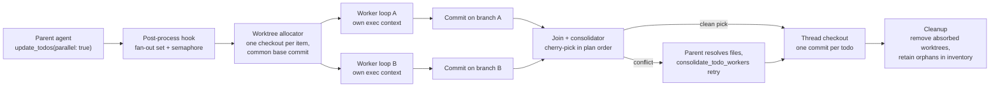

# Parallel todo workers in isolated worktrees

Status: **Proposal.** Not implemented. Extends the [thread worktrees](./thread-worktrees.md)
stack and the existing local todo worker with fan-out execution, commit-per-todo,
and parent-driven consolidation.

## Outcome

Let the parent agent declare todo items independent and run their local workers
concurrently, each in its own linked git worktree, so parallel implementation steps
stop sharing HEAD, the index, and working files. Every worker finishes as exactly
one commit on its own branch. The host mechanically merges those commits back onto
the thread checkout in plan order; any conflict is handed to the parent agent to
resolve with its normal edit tools, because the parent is the only participant with
enough context to reconcile competing changes. Worker checkouts are cleaned up as
soon as their content is absorbed, and anything unabsorbed survives until it is
either absorbed or explicitly discarded — a crashed run never loses work silently.

## Non-goals

- Parallel `explore` subagents (shipped separately in `startLeadingParallelExplores`)
  and parallel `delegate_step` orchestration workers are out of scope; workers mutate
  the tree, explores deliberately do not.
- Cloud-model workers stay serial. Routing today is local-only
  (`shouldRouteToLocal`); widening it is a separate decision.
- Automatic semantic merging. V1 consolidation is cherry-pick-or-escalate; there is
  no line-level auto-merge beyond what git itself performs on a clean pick.

## Current behaviour

- `update_todos` post-processing (`agent-service.ts`) routes at most **one** local
  worker per call: `findNewlyInProgressLocal` returns the first newly in-progress
  local item, and `runTodoWorker` is awaited inline, blocking the parent loop for up
  to 12 worker steps.
- Workers run **directly in the thread execution root** with implementation tools
  (`read_file`, `list_dir`, `search_codebase`, `write_file`, `run_shell`), so they
  see the parent's uncommitted state but also contend with the parent for it.
- `TODO_STEERING_PROMPT` and the `update_todos` description both say _"mark one item
  in_progress at a time"_ — the model is trained to serialize.
- Two known shared-state races limit concurrency even before worktrees enter the
  picture: `runTodoWorker` reads usage from the shared mutable `provider.lastUsage`
  (the exact race explore fixed via per-chunk accumulation in `runSubagent`), and
  concurrent loops share the `lastMeasuredInputTokens` global.

## Design

### Declaration — how the parent asks for parallelism

Add one optional field to the todo schema:

```ts
parallel?: boolean // safe to run concurrently with sibling items
```

Semantics:

- `parallel: true` asserts the item touches no file or resource another
  same-batch item touches, and carries no ordering dependency on one.
- Items flagged in the same `update_todos` call form the candidate fan-out set.
  A qualifying item must _also_ satisfy today's routing gate
  (`assignedModel: 'local'`, `status: 'in_progress'`, has a `check`,
  `localTodoItemsEnabled`, parent not local). Anything else falls back to the
  existing serial path unchanged.
- When fan-out ships, steering in `packages/agent/src/todo-steering.ts` and the
  `update_todos` description changes to mark independent items in_progress
  together while sequential items stay one-at-a-time. The blanket "one item at
  a time" rule remains in force during the serial foundation phases: promising
  concurrency before the host can provide it would strand sibling items that
  are no longer newly in progress.

The plan is already a declarative surface emitted in one call, so this is the
honest version of what `startLeadingParallelExplores` approximates with its
leading-run heuristic: the model states independence instead of the host guessing it.

### Fan-out — allocating worker worktrees

When the post-process hook finds a fan-out set:

1. Snapshot-seed the base. If the thread execution root is dirty, capture a
   snapshot ref (`createWorktreeBackup`) so every worker starts from the parent's
   exact state including staged, unstaged, and untracked content. When clean, the
   base is simply the thread root's current HEAD commit. All workers in one batch
   cut from the **same base**, which is what makes the later merges clean
   three-way merges instead of rolling conflicts.
2. Allocate one linked worktree per item via the existing manager primitives
   (`repositoryLocation`, `git worktree add -b <branch> <path> <baseCommit>`),
   under the project's managed worktree namespace with a distinct owner prefix
   (e.g. `todo-<todoId>` beside thread ids), registered as internal workspace
   roots so path containment treats them exactly like thread worktrees.
   Allocation is serialized per repository (`runSerialized`), the adds themselves
   are cheap.
3. Wrap each worker loop in its own execution context (AsyncLocalStorage nesting
   inside the parent turn's context) so `getAgentExecutionRoot()` resolves to the
   worker worktree for every tool the worker calls, while
   `getAgentProjectRoot()` keeps anchoring trust/config to the real project.
   Subagent briefs already use `agentWorkspaceLabel()`, so workers are told the
   correct root (#1724).
4. Run the batch under a semaphore. Default cap 2 (workers spawn shells and
   installs; explores tolerate 4, writing workers should not), configurable via a
   `todoWorkerParallelism` setting, hard ceiling 4.

The sandbox overlay must include the new worktree paths before any worker spawns —
same validated-overlay treatment thread worktrees get.

### Execution — one worker, one worktree, one commit

`runTodoWorker` keeps its prompt, briefing (`priorSummaries`), and tool filter.
Changes:

- The loop runs inside the worker's execution context; every write and shell
  command lands in the worker's private checkout. Siblings cannot collide on
  files or the index by construction.
- Usage attribution switches to per-chunk accumulation (the `runSubagent`
  pattern), removing the `provider.lastUsage` race. `lastMeasuredInputTokens`
  drift is accepted and documented for v1, matching explore's stance.
- The acceptance `check` executes with cwd set to the **worker** root.
- On completion — pass or fail — the host (never the model) stages everything and
  creates exactly one commit on the worker branch: `git add -A && git commit`,
  message derived from the todo content with the standard co-author trailer.
  Host-side committing is what makes "each todo becomes a commit" deterministic
  and keeps cleanup safe; worker output on a failed check is preserved on its
  branch but gated out of merging.

### Consolidation — merging back, conflicts to the parent

After the batch settles (`Promise.allSettled`, so one worker crash cannot strand
siblings):

1. Require a clean-enough thread root for cherry-picking. If the parent has
   uncommitted edits, hold all worker branches unmerged and return an
   `extraMessage` asking the parent to commit or stash first — never stash or
   auto-commit on the parent's behalf.
2. Attempt `git cherry-pick` of each absorbed-candidate commit onto the thread
   branch in plan order. A clean pick emits `todo_worker_merged` (todoId, sha);
   the todo's completion stays check-gated exactly as today.
3. On conflict: abort that pick, mark the item `needs_consolidation` (a renderable
   state carried on the todo, not a new status enum member in v1 — see open
   questions), and continue with later candidates. Conflicting branches stay
   allocated so the parent can inspect their trees.
4. Surface the outcome through the `update_todos` result `messages` channel the
   parent already reads: merged shas, conflicting items with their branch names
   and the conflicting paths from the aborted pick.

Resolution loop: the parent fixes the files in the thread checkout with its normal
edit tools, then calls a small host-executed `consolidate_todo_workers` tool
(registered only while merges are pending) which retries the remaining picks and
reports again. The parent iterates resolve → retry until clean; it can also pass
`{ discard: [todoId] }` to abandon a worker branch, which is the explicit,
itemized confirmation the deletion invariant requires before destroying unmerged
work. History ends up as one commit per todo, in plan order, on the thread branch.

### Cleanup — retiring worker checkouts

Three terminal states per worker:

| State                                | Worktree                       | Branch                                                    |
| ------------------------------------ | ------------------------------ | --------------------------------------------------------- |
| Merged (picked cleanly)              | removed immediately            | deleted (`-d`; content verified absorbed by pick success) |
| Conflicted, later resolved/discarded | removed on absorb/discard      | deleted with the same verification                        |
| Errored/failed-check, never absorbed | retained for parent inspection | retained                                                  |

Startup recovery follows the worktree-inventory pattern: sweep the managed
namespace by naming convention, prune worker worktrees whose commits are provably
absorbed into the thread branch, retain the rest as orphans with reason
`unmerged`, and surface them in the existing worktree inventory UI rather than
deleting quietly. A batch interrupted mid-run therefore degrades to the pre-feature
world: some stray branches, no data loss, user-visible and reclaimable.

## Product invariants

These are acceptance criteria, not implementation suggestions.

1. A `parallel` todo worker never observes or mutates another worker's files, the
   parent's working files, the shared index, or HEAD mid-run.
2. The parent's checkout is never moved, stashed, committed, or reset by fan-out
   or consolidation without an explicit parent-visible action.
3. Every absorbed todo lands as exactly one commit authored on the worker branch.
4. A worker's output survives its own failure: failed checks and errors leave the
   commit on a retained branch unless explicitly discarded.
5. No unabsorbed worker worktree or branch is ever deleted without the parent's
   itemized discard (which the UI displays) or the user's direct confirmation.
6. Checks gate merging, not committing: a failed acceptance check holds the item
   in_progress and its branch unmerged, with the failure message routed to the
   parent as today.
7. Undeclared (non-`parallel`) items behave exactly as the current serial worker
   path; disabling the feature flag restores today's behaviour bit-for-bit.
8. Worker tool calls resolve against the worker root only; a worker cannot read or
   write outside its worktree any more than a thread can outside its checkout.
9. Concurrent workers cannot attribute usage, todos, hooks, or diffs to the wrong
   run (usage race fixed; per-run contexts everywhere).
10. A crash at any point leaves only conventional git objects: recoverable
    branches and worktrees listed in the inventory, never a locked half-state.

## Architecture



## Integration points

| Area              | Entry point                                                          | Change                                                                               |
| ----------------- | -------------------------------------------------------------------- | ------------------------------------------------------------------------------------ |
| Todo schema       | `src/shared/types/todo.ts`, `todo-tool.ts` input schema              | optional `parallel` field, carried through `applyTodoUpdate` like `assignedModel`    |
| Finder            | `findNewlyInProgressLocal`, `src/shared/todos/todo-logic.ts`         | plural variant returning the whole newly-in-progress local set                       |
| Routing + fan-out | `setTodoToolPostProcess` block, `src/main/services/agent-service.ts` | batch allocation, semaphore, join; replaces the single awaited worker                |
| Worker runtime    | `src/main/services/todo-worker-runner.ts`                            | exec-context wrapping, cwd-scoped checks, per-chunk usage, host-side commit          |
| Worktrees         | `src/main/services/worktree-manager.ts`                              | owner-id prefix for todo workers; reuse allocation/snapshot/serialization primitives |
| Consolidation     | new `src/main/services/todo-consolidation.ts`                        | cherry-pick driver, conflict reporting, absorb verification, discard                 |
| New tool          | `src/main/tools/`                                                    | `consolidate_todo_workers` (registered only while merges pending)                    |
| Recovery          | `worktree-inventory.ts`, `pruneSafeOrphans`                          | todo-worker sweep with `unmerged` retention                                          |
| Steering          | `packages/agent/src/todo-steering.ts`, tool description              | relaxed concurrency rule for declared-independent items                              |
| Settings          | `settings-writable.ts`                                               | `parallelTodoWorkersEnabled` (default off), `todoWorkerParallelism` (default 2)      |
| Renderer          | worker cards (`todo_worker_start/done`)                              | add `todo_worker_merged`, `needs_consolidation` chip, discard affordance             |

## Risks and mitigations

- **Approval interleaving.** N workers hitting `run_shell` approvals at once could
  flood the user. V1 routes approval requests through one serial queue (first-come),
  and the mandatory `check` keeps most worker shells short. Revisit auto-approval
  scopes for checked workers later.
- **Port and lock contention.** Two workers running test suites can bind the same
  dev-server port. Mitigation is documentation plus the low default cap; a shared
  port-allocator is a follow-up, not a blocker for flag-gated rollout.
- **Shared globals.** `lastMeasuredInputTokens` drift is accepted (documented, as
  for explores); the usage race is fixed properly because money is involved.
- **Small models misuse `parallel`.** Declaring independence wrongly produces
  conflicts, which the design already routes to the strongest participant (the
  parent). Worst case cost is a resolution round-trip, not corruption.
- **Disk footprint.** Each batch adds up to `cap` checkouts; absorbed ones are
  removed immediately, and the orphan sweep bounds the rest.

## Phasing

1. **Foundations (serial, flag-off behaviour identical).** Schema field, plural
   finder, and usage-race fix. Keep the one-at-a-time steering until phase 3;
   the schema describes `parallel` as inert groundwork in this phase.
2. **Single worker in a worktree.** Route even the existing one-item path through
   allocation + exec context + commit-on-complete + cleanup. This de-risks the
   worktree mechanics before any concurrency exists.
3. **Fan-out and consolidation.** Semaphore batch, snapshot seeding, cherry-pick
   join, conflict escalation, `consolidate_todo_workers`, discard, crash sweep.
4. **Renderer + rollout.** Cards for merged/conflicted/discard, evals covering
   declaration quality and conflict-resolution loops, then decide the default.

## Open questions

- Is `needs_consolidation` a first-class todo status (renderer + store migration)
  or a transient annotation carried on the item? Leaning transient for v1.
- Does consolidation piggyback on `update_todos` (marking a conflicted item
  completed triggers a retry) instead of a new tool? Rejected for v1: it conflates
  planning with merging and makes the retry semantics implicit.
- Should failed-check worker branches auto-expire (e.g. after the thread closes)?
  Currently retained indefinitely like retired thread branches.
- Cloud workers: if routing widens, do cloud-backed workers join the same
  worktree pool, or does remote execution need its own isolation story?
