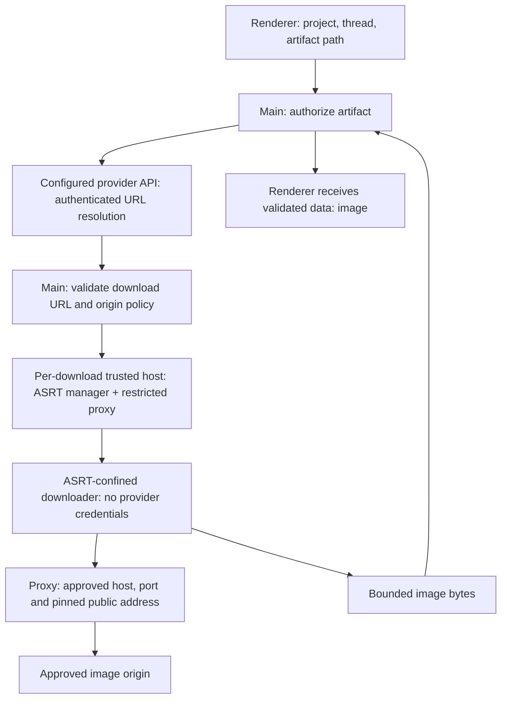

# Sandboxed remote artifact image hydration

Status: proposed design; no download behavior has changed.

## Outcome

Rendering a remote artifact image may contact only the configured provider's
artifact API and approved public image-download destinations. Image bytes are
downloaded in an ASRT-confined subprocess with no provider credentials, workspace
access, or access to the user's profile. A failed policy check or unavailable
sandbox leaves the image unavailable; it never retries through main-process fetch.

This applies to automatic remote-artifact image hydration. Generated HTML canvas
networking and Trusted Types enforcement are separate work. Explicit artifact
links remain a separate user-initiated feature and must not become an automatic
fallback for failed hydration.

## Current path and evidence

- `src/renderer/markdown/artifact-image-policy.ts` accepts artifact-shaped raw image
  sources and emits inert placeholders. An apparent URL's hostname is not used to
  authorize the artifact.
- `src/renderer/markdown/remote-artifact-images.ts` takes agent identity from an
  image attribute or a matching transcript link, then calls IPC automatically.
- `src/main/ipc/register-handlers.ts` checks the main-frame sender and argument
  lengths, then calls `fetchRemoteArtifactImageDataUrl` directly.
- `src/main/services/remote/remote-agent-client.ts` validates the configured API
  base and artifact path, resolves a download URL with provider authentication,
  and fetches that URL using native main-process `fetch`. The second fetch has no
  destination/redirect policy. It checks image MIME and a 15 MiB limit, but fully
  buffers the body before the final size check.
- `src/main/project-sandbox/index.ts` initializes ASRT for wrapped subprocesses;
  it does not confine the main process's native HTTP requests.

See [shell permissions](../shell-permissions.md) and
[network scope isolation](sandbox-network-scope-isolation.md).
The latter establishes why a new download must not widen the Electron main
process's shared ASRT network scope.

## Decisions and trust boundaries

1. Keep authenticated provider API calls in the trusted main process.
2. Create one short-lived download host per admitted download. The host owns its
   ASRT instance, a restricted egress proxy, and one sandboxed downloader child.
3. The host is trusted infrastructure, not itself the sandboxed downloader.
   Calling `SandboxManager.initialize` does not sandbox the calling process.
4. Authorize the artifact against durable project/thread/provider metadata before
   requesting a signed URL. Transcript text supplies a path, not authority.
5. Use an explicit provider download-origin policy, plus public-address checks at
   connection time. A returned URL does not authorize its own destination.
6. Never share a job's proxy, credentials, or mutable allowlist with another job.
7. Do not silently fall back to unsandboxed execution on Windows, sandbox startup
   failure, or a containment violation.
8. Signed download URLs are bearer secrets. Keep them out of renderer state,
   process arguments, environment variables, persisted logs, and error strings.

The parent renderer CSP still governs displaying the data URL. Neither that CSP
nor Chromium's renderer sandbox supplies confinement for native HTTP.

## Authorization and IPC

Replace the hydration request's bare `agentId, path` pair with a schema-decoded
`{ projectId, threadId, path, agentId? }`. The optional agent ID selects among
durable links already belonging to that thread; it is never independently trusted.

The main process must:

- Validate the sender and resolve the requested thread within its project.
- Derive provider, account/configuration identity, and linked remote agent IDs from
  native thread/session records. Do not use whichever project is currently active
  when an asynchronous request completes.
- Require an exact linked-agent match. With no selector, accept only an unambiguous
  linked agent. Do not infer identity from a `cursor.com/agents/...` text match.
- Normalize and validate a relative `artifacts/` path once; reject traversal, NUL,
  absolute paths, backslashes, and ambiguous separator encodings. Do not repeatedly
  decode a path. Encode the validated path as one API query parameter.
- Reject before any network request if provenance is absent or inconsistent.

Existing launch-link persistence is best-effort. Old threads with missing links
therefore need a trusted migration from stored remote-session records or an
explicit remote-agent import/link action. Never repair provenance from model text.
Multiple historical runs in a thread remain supported through exact linked IDs.

This is a supported IPC change for the real renderer, not a test-only switch.
Update preload types, decoders, renderer call sites, and component fixtures together.

## Provider API resolution

The main process calls the configured provider's existing artifact endpoint with
its credential. Apply a bounded response size and timeout and decode the response
schema. Reject HTTP redirects on this credential-bearing metadata request; any
provider needing a different endpoint must configure that endpoint explicitly.

The signed URL is then checked against provider-owned download policy:

- HTTPS only, port 443, no userinfo, no fragments, no IP-literal destinations.
- Exact canonical origins supplied by the provider adapter or explicit supported
  user configuration. Do not reuse the broad web-tool allowlist, grant wildcard
  cloud-storage domains, or automatically allow the hostname from the response.
- Unknown origins fail closed with a bounded error naming only the origin.
- A custom provider requires an explicit download-origin configuration through its
  settings/import surface. Configuring its API origin alone does not authorize
  arbitrary download origins. Do not add a renderer-writable per-request allowlist.
- Signed path/query bytes must survive validation and transport without
  reconstruction that invalidates signatures.

Before shipping, establish the real provider storage origins and redirect patterns
from provider documentation or a controlled authenticated fixture. The repo evidence
does not establish those domains, so this design intentionally invents none.
Local custom APIs may retain their existing metadata-access contract, but automatic
image downloads from private/loopback origins are unsupported in this first version.

## Download host, ASRT, and actual socket policy

Follow the process/lifecycle shape of
`services/acp/acp-session-host.ts` and `acp-session-host-worker.ts`, but do not
copy their broad inherited environment or their agent configuration surface.

Main starts a fixed bundled host executable using an absolute trusted runtime path,
a minimal environment, a private scratch directory, and a parent IPC channel.
It sends a single schema-decoded job after startup. No shell command, executable,
filesystem roots, headers, or sandbox configuration can come from the renderer.

The host initializes its own ASRT manager and supplies a per-job external proxy
through ASRT's supported proxy configuration. It then starts the fixed bundled
downloader inside ASRT. The downloader has:

- Runtime/bundle/system-library reads required to start, but no workspace, profile,
  credentials, or arbitrary home-directory reads.
- No writes except its private scratch directory if the runtime requires one.
- No direct outbound sockets, arbitrary Unix sockets, or listening sockets.
  Only the ASRT-required route to this job's proxy is permitted.
- An explicitly constructed environment: no API tokens, SSH agent, inherited
  proxy bypass variables, `NODE_OPTIONS`, custom CA overrides, or user startup files.
- No renderer preload, Electron APIs, or dynamic code supplied by the artifact.

Build a download-specific sandbox profile. Do not reuse an entire project overlay,
which grants workspace access. Package host and downloader as explicit build inputs
and verify their emitted bundles in the complete-dist checks.

The proxy is a security boundary, not an unrestricted local relay. It authenticates
the job, permits only its approved exact hostnames on port 443, and exposes only the
CONNECT/tunnel functionality needed by the client. Reject unsupported HTTP methods,
malformed authorities, alternate address forms, and unauthorized proxy requests.
Disable unused SOCKS transport; if the ASRT backend needs it, enforce the identical
policy there. No unauthenticated forwarding listener is permitted.

For every new upstream connection, the proxy resolves the requested hostname,
rejects the destination if any returned address is non-public, selects a vetted
address, and connects to that numeric address without a second DNS lookup. Cover
IPv4, IPv6, mapped addresses, loopback, private/link-local, unspecified, multicast,
metadata, and other non-global ranges. Retain the original hostname for TLS SNI
and certificate verification in the downloader's TLS connection. Never disable TLS
verification to support address pinning.

A DNS preflight in main followed by ordinary proxy hostname resolution is insufficient.
Likewise, ASRT's hostname allowlist alone is not evidence of public-address pinning.
The downloader must use an explicit CONNECT-aware HTTPS transport; do not assume
Node's native `fetch` follows proxy environment variables.

Implementation must first prove this external-proxy wiring and confinement with the
pinned ASRT version on macOS and Linux. If an ASRT backend cannot express the required
route/filesystem restrictions, that backend does not support hydration until a
tested implementation exists. There is no fallback that weakens these invariants.

## Redirects, HTTP, and image validation

The downloader issues only GET requests and handles redirects manually:

- At most three redirects, within the original total deadline.
- Resolve each Location against the current URL, then reapply the complete
  scheme/origin policy before attempting the next request.
- Cross-origin redirects require a destination already in the approved policy.
  No HTTPS downgrade, private destination, userinfo, or unbounded loop is allowed.
- Each connection goes through the proxy's DNS/pinning checks, including retries.
- Send no Authorization, cookies, Referer, or inherited headers. A signed URL may
  contain the download token; it does not confer provider API credentials.
- Disable automatic retries initially. A bounded user retry reruns authorization
  and obtains a fresh signed URL rather than replaying an expired URL.
- Request identity content encoding and reject unexpected content encodings in the
  first implementation, avoiding an unbounded decompression step.

Preserve the current 15 MiB maximum, enforced while reading the stream even if
Content-Length is absent or dishonest. Also bound headers, reject non-success
statuses without including response bodies in errors, and stop on the first overrun.

Accept PNG, JPEG, GIF, and WebP only. Check their signatures against the supported
format and claimed MIME; reject SVG, HTML, generic `image/*`, and mismatches.
Perform bounded header inspection for dimensions: initially cap either dimension
at 16,384 and total pixels at 40 million. Keep actual image decoding in Chromium's
image-rendering context; signature/header checks are not a complete decoder audit.
Animation resource limits remain a separate decoder concern.

The host relays bounded byte chunks to main. Main verifies the result schema, job
identity, total byte count, supported MIME, and complete-success marker before
creating a data URL. Partial output must never be displayed or cached.

## Lifecycle, limits, and cache

Initial constants, subject to measured provider compatibility:

| Limit                      | Initial value                           |
| -------------------------- | --------------------------------------- |
| Concurrent download jobs   | 2 app-wide, 1 per thread                |
| Queued jobs                | 16 app-wide, deduplicated               |
| Provider metadata response | 64 KiB, 10 seconds                      |
| Host startup               | 10 seconds                              |
| Download deadline          | 30 seconds including redirects          |
| Response headers           | 32 KiB                                  |
| Image bytes                | 15 MiB                                  |
| Redirects                  | 3                                       |
| Worker protocol frame      | 64 KiB payload, bounded before decoding |
| Result cache               | Existing 64 MiB / 64-entry ceilings     |

A short-lived host handles exactly one job, then shuts down its child, tunnels,
proxy, and ASRT manager. Do not pool hosts or union policies in the first version.
Main tracks the complete process tree and kills it on timeout, invalid protocol,
shutdown, or cancellation. Parent-channel closure triggers cleanup in the host.
Include abrupt parent death and orphan cleanup in native validation.

Tie renderer requests to disposable subscriptions. Switching/unmounting a thread
releases its subscriptions; cancel a shared job when its last subscriber leaves.
Recheck authorization before serving cached results. Cache and in-flight keys include
project, thread, provider, API origin, credential/account generation, agent ID, and
artifact path. Invalidate on credential/provider changes, unlink, deletion, and
explicit refresh; an old in-flight completion must not repopulate an invalidated
cache. Never use a signed URL or raw credential as a cache key or persist either.

Use schema-decoded, versioned messages with a main-generated request ID. Bound input
before JSON decoding, validate chunk order and aggregate size, and reject duplicate
completion or bytes after completion. Parent and host validate independently.
Use `safeJsonParse(text, decodeWithSchema(schema))` for JSON boundaries.

## Failure behavior and diagnostics

Keep the transcript responsive and preserve the image's alt text. Provide a concise
unavailable state and explicit retry for transient failures. Sandbox-unavailable,
unlinked-agent, and denied-origin errors do not offer an unsandboxed retry.

Log request ID, provider, outcome, approved/denied origin, elapsed time, and byte count.
Do not log signed URLs, query strings, cookies, authorization values, response bodies,
or raw network error messages that may embed URLs. Decode failures to bounded error
codes before they cross into renderer logs.

On Windows or unavailable macOS/Linux ASRT, automatic hydration remains unavailable.
Explicit artifact links continue as their separate user-initiated feature; do not
label that browser/download path as sandboxed hydration.

## Implementation sequence and acceptance evidence

1. **Transport feasibility and provider policy.** Prove external-proxy integration
   against pinned ASRT and record actual provider origins. This gates subsequent
   integration; it must not become a permissive runtime fallback.
2. **Authorization and pure policy.** Add durable thread selection, origin/path
   decoders, public-address classification, cache identity, and bounded protocol.
3. **Host and downloader.** Add isolated ASRT lifecycle, proxy pinning, manual
   redirects, streaming limits, and build outputs. Inject transport/process
   dependencies at module boundaries for deterministic tests.
4. **Hydration integration.** Replace automatic byte-fetch use of native fetch,
   wire supported IPC and disposal, and present failure/retry states.
5. **Native and visual validation.** Complete the checks below, then update
   `docs/shell-permissions.md` to document the shipped hydration contract.
   Update this design's status only when its invariants have been demonstrated.

Unit/component evidence must cover unauthorized agents before network, spoofed
transcript identity, traversal, origin mismatch, credential rotation, stale results,
redirect loops/downgrades, DNS rebinding and mixed address answers, TLS name checking,
over-limit chunked bodies, unexpected encodings/MIME, malformed protocol, and every
timeout/cancellation cleanup path. Assert credentials never enter child requests,
environment, arguments, or diagnostic output.

Native containment tests must run on macOS and Linux and prove:

- A permitted download succeeds through the real ASRT-confined child and proxy.
- The child cannot bypass the proxy, reach private/loopback destinations, open
  unrelated sockets, or read a workspace/profile sentinel.
- No other shell or ACP job gains the download host's allowlist.
- A killed host/parent leaves no child, listener, tunnel, or widened scope.
- Tests exercise rebinding at the actual resolver/connect boundary, not just URL
  parsing, and retain TLS verification while connecting to the pinned address.
- Missing ASRT fails before image network access with no native-fetch retry.

Use controlled endpoints and injected resolver/provider fixtures at dependency
boundaries. Do not introduce production flags granting tests private destinations.
Add the smallest focused Electron WebdriverIO spec using real IPC for a successful
image and an unavailable/retry state, assert relevant DOM behavior, and save a
screenshot. Follow the screenshot-validation skill when implementing that UI change.
Use the test oracle and `pnpm run check` before committing implementation.

## Remaining implementation gates and tradeoffs

The security contract above is decided; these facts still require verification:
the provider's real download origins/redirects, pinned ASRT's external-proxy behavior
on both supported platforms, and the minimum packaged-runtime filesystem reads.
Record the results here before claiming containment.

The cost is a short-lived host and sandbox startup per image plus stricter legacy
thread/custom-provider behavior. Deduplication, bounded concurrency, and the existing
memory cache limit that cost. Prefer this explicit behavior to shared allowlist
widening or silently fetching an untrusted destination in main.
