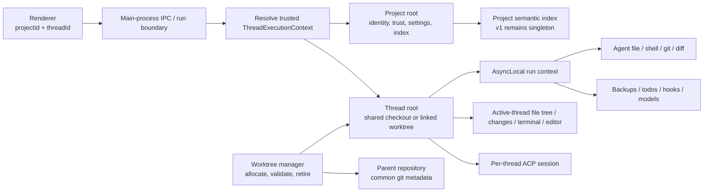

# Per-thread worktrees

Status: implementation plan; no per-thread worktree support is implemented as of
2026-07-19. Related tracking: #349 and #869.

## Outcome

Give each local chat thread an optional git worktree so agents can edit in parallel
without sharing HEAD, the index, or tracked files. The existing project checkout
remains the user's checkout. A thread either uses that shared checkout or owns one
linked worktree for its lifetime.

Allocation is lazy at the first message. The eventual default is:

- project checkout on its resolved default branch: create an isolated worktree;
- project checkout on any other branch: share the project checkout;
- unsupported or ambiguous repository state: share the project checkout and explain
  why;
- an explicit supported user choice: use it.

Do not enable that default until isolation, active-thread UI re-rooting, safe cleanup,
and a clear route for bringing work back have all shipped. Early phases remain behind
`worktreeMode: never`.

## Why this is not a `git worktree add` feature

Today `src/main/services/workspace.ts` exposes one process-global `workspaceRoot`.
File and shell tools, git, diffs, backups, terminals, ACP sessions, hook recording,
path containment, and much of the renderer all assume it is the only checkout.
Threads persist a `gitBranch` label, but they do not own a checkout.

Several services also carry process-global mutable run state. In particular,
`worktree-backup.ts`, `diff-queue.ts`, `thread-models.ts`,
`hook-run-recorder.ts`, and `todo-tool.ts` cannot safely distinguish two concurrent
thread runs. Giving tools different directories before removing those ambiguities can
attribute a backup, hook event, diff, model, or todo to the wrong thread.

The work therefore has two foundations:

1. make thread identity and the effective root explicit at every run boundary;
2. make all mutable run state thread-scoped before allowing concurrent isolated runs.

## Product invariants

These are acceptance criteria, not implementation suggestions.

1. The **project root** remains the user's selected checkout and the source of project
   identity, trust, settings, and the v1 semantic index.
2. The **thread root** is the directory visible to that thread's file, shell, git,
   diff, terminal, hook, and ACP operations. In shared mode it equals the project
   root; in isolated mode it is the linked worktree.
3. Main-process code resolves the thread root from trusted `projectId` + `threadId`.
   Renderer input never supplies an arbitrary root.
4. A missing or invalid isolated worktree blocks writes. It never silently falls back
   to the project checkout. The user can recreate it or explicitly continue shared.
5. Two active threads may read and write the same relative path without sharing files,
   backups, diffs, todos, hooks, model state, terminals, or background processes.
6. The user's checkout, current branch, index, and working files are not mutated when
   an isolated worktree is allocated.
7. Dirty seeding preserves file content, including staged, unstaged, untracked, and
   deleted files. V1 does not promise to preserve the staged/unstaged partition inside
   the new worktree; the UI and tests must state that limitation.
8. No dirty or unmerged worktree is deleted without an explicit, itemized confirmation.
9. Old threads and non-git projects continue in shared mode without migration work.
10. macOS sandboxing permits normal git operations in a linked worktree without
    broadly exposing the parent repository or weakening hook/config protections.

## Architecture

The distinction between project identity and thread execution root is the central
design. This diagram should be kept current if ownership changes during implementation.



### Runtime contract

Add one main-process value object and make it the only way run-scoped code learns its
root:

```ts
type ThreadCheckoutMode = 'shared' | 'worktree'

interface ThreadExecutionContext {
  projectId: string
  threadId: string
  projectRoot: string
  root: string
  checkoutMode: ThreadCheckoutMode
  branch: string | null
}
```

Create it at the `agent:run` boundary after validating that the thread belongs to the
project and that persisted worktree metadata matches a registered git worktree. Install
it with `AsyncLocalStorage` around the complete agent turn. Follow the existing
`agent-run-readonly.ts` / orchestration context patterns rather than adding another
mutable singleton.

Async context is for call paths that are genuinely inside one agent turn. Renderer IPC,
terminal creation, background process management, cleanup, and startup recovery are
not reliably inside that context and must accept `projectId` + `threadId` explicitly.

Do not change `getWorkspaceRoot()` to mean "sometimes a thread root." Keep it as the
project root during migration so trust, indexing, and repo identity cannot accidentally
follow whichever agent happens to be active.

### Current code map

Start each phase from these entry points. Re-run `rg "getWorkspaceRoot\\(" src` during
Phase 1: the current call set is broad and this table intentionally lists ownership
boundaries rather than every mechanical call site.

| Area                         | Current entry point                                                                         | Required direction                                                                                                    |
| ---------------------------- | ------------------------------------------------------------------------------------------- | --------------------------------------------------------------------------------------------------------------------- |
| Thread creation and metadata | `src/shared/store/thread-helpers.ts`, `src/shared/types/thread.ts`                          | Add optional checkout metadata; blank thread creation remains free.                                                   |
| First submit                 | `src/renderer/views/input-bar.ts`                                                           | Stop binding the authoritative branch entirely in renderer; send identity and choice to the main-process transaction. |
| Agent run boundary           | `src/main/index.ts` (`agent:run`)                                                           | Load/validate thread + project and install `ThreadExecutionContext`.                                                  |
| Global root and containment  | `src/main/services/workspace.ts`                                                            | Preserve project root; add trusted thread-root resolution and internal-root registration.                             |
| Agent shell and paths        | `src/main/tools/shell-tool.ts` plus filesystem tools                                        | Read thread root from run context and use it for default cwd/containment.                                             |
| Git                          | `src/main/services/github/git-service.ts`                                                   | Require explicit roots; expose resolved-vs-fallback default-branch state.                                             |
| Sandbox                      | `src/main/project-sandbox/config.ts`, `spawn.ts`                                            | Build a validated worktree overlay including narrowly-scoped git administration paths.                                |
| Backups and diffs            | `src/main/services/worktree-backup.ts`, `diff-queue.ts`                                     | Key state by thread/turn and keep semantic-index refresh on project root.                                             |
| Run globals                  | `src/main/services/thread-models.ts`, `hook-run-recorder.ts`, `src/main/tools/todo-tool.ts` | Replace global active state with thread/turn-owned context.                                                           |
| Renderer IPC                 | `src/main/ipc/register-handlers.ts`                                                         | Add `projectId` + `threadId` to filesystem and git contracts; never accept a root.                                    |
| Terminal/processes           | `src/main/services/exec/terminal-service.ts`, `background-process.ts`                       | Persist owner thread, default to its root, and add awaited stop-by-thread APIs.                                       |
| ACP                          | `src/main/services/acp/acp-agent-service.ts`, `acp-session-pool.ts`                         | Resolve cwd from thread; preserve per-thread pooling and add disposal before retirement.                              |
| Thread deletion              | `src/main/services/thread-store.ts` and renderer delete flows                               | Route deletion through ordered main-process cleanup before removing the thread directory.                             |
| Semantic index               | index/watcher call sites reached from `diff-queue.ts`                                       | Keep the singleton project-rooted in v1; never rebuild it from a worktree root.                                       |

### Root routing table

| Consumer                                                 | Root in v1         | Notes                                                                                       |
| -------------------------------------------------------- | ------------------ | ------------------------------------------------------------------------------------------- |
| Project identity, trust, settings, instruction discovery | Project            | Stable across threads.                                                                      |
| Semantic index and watcher                               | Project            | Known staleness for files changed only in a worktree; add an overlay later.                 |
| Agent file/read/write/search paths                       | Thread             | Path containment uses the same resolved context.                                            |
| Shell default cwd and sandbox overlay                    | Thread             | Explicit in-worktree cwd remains allowed; external paths follow existing permission policy. |
| Git status/diff/commit/branch operations                 | Thread             | Repository identity/remote lookup may use the project root.                                 |
| Diff queue and pre-turn backup                           | Thread + thread ID | State must be isolated even when two shared threads have the same root.                     |
| Hook discovery/config                                    | Project            | Hook invocation cwd and workspace payload use the thread root.                              |
| Hook run records and live events                         | Thread + turn      | Must follow the binding hooks plan.                                                         |
| Todos, run model selection, readonly state               | Thread + turn      | Never process-global mutable pointers.                                                      |
| ACP session                                              | Thread             | Session pool already keys by thread; include root in fingerprint.                           |
| File tree, editor, changes pane                          | Active thread      | Switching threads re-roots these surfaces.                                                  |
| Agent semantic-search tool                               | See note below     | Must not silently disagree with the agent's grep/file search.                               |
| New terminal                                             | Active thread      | Existing terminals keep their original cwd and show owning thread/root.                     |
| Background process                                       | Owning thread      | Needed to stop processes before worktree retirement.                                        |

The routing above contains a deliberate collision that must be resolved in v1, not
deferred: the agent's own tools list **"Agent file/read/write/search paths → Thread"**,
but **"Semantic index and watcher → Project"**. In an isolated thread, `grep`/file
search reads the worktree while the semantic-search tool reads the project index — the
agent gets different answers to the same query depending on which tool it picks, and the
semantic one points at the tree it is _not_ editing. That is a correctness footgun inside
the exact mode this feature creates, not merely "known index staleness" to document
later. Pick one v1 behavior explicitly: either the agent's semantic-search tool maps
results into the thread root and tolerates misses (as the renderer result-open path
already promises), or semantic search is flagged/disabled for isolated threads until the
overlay exists. Do not ship the ambiguous state.

## Persisted model and migration

Add optional metadata; absence always means shared mode. `ThreadMeta` already derives
from `Thread`, so the filesystem-native thread store should round-trip this field once
the shared type is updated.

```ts
interface ThreadWorktree {
  path: string
  branch: string
  baseBranch: string
  baseCommit: string
  createdAt: number
  seededFromDirtyProject: boolean
}

interface Thread {
  // Existing fields omitted.
  worktree?: ThreadWorktree
  worktreeChoice?: 'automatic' | 'shared' | 'worktree'
}

interface Project {
  // Existing fields omitted.
  worktreeMode?: 'from-default-branch' | 'always' | 'never'
}
```

Rules:

- New fields are optional so old thread directories and project settings load unchanged.
- Persisted `path` is diagnostic, not authority. Reconstruct the expected path from the
  configured worktree root, then validate it against `git worktree list --porcelain -z`,
  repository common-dir identity, branch, and thread metadata.
- `worktreeChoice` captures the first-message decision. Do not continuously re-run
  policy after a thread starts.
- Persist allocation metadata before dispatching the first agent run. If persistence
  fails, remove the newly-created clean worktree and leave the message unsent.
- The thread's existing `gitBranch` remains populated for current footer/PR consumers,
  but `worktree.branch` is the authoritative isolated-checkout branch.

## Allocation policy

Implement a pure function in `src/shared/git/worktree-policy.ts` and pin every row with
table-driven tests.

| Situation at first message                         | Automatic decision                                                         |
| -------------------------------------------------- | -------------------------------------------------------------------------- |
| Local git checkout on the resolved default branch  | Worktree                                                                   |
| Local git checkout on a non-default branch         | Shared                                                                     |
| Dirty default-branch checkout                      | Worktree seeded with its file content                                      |
| Not a git repository                               | Shared, with reason                                                        |
| Default branch unresolved or HEAD detached         | Shared, with reason                                                        |
| Repository uses submodules                         | Shared in v1, with reason                                                  |
| SSH project or cloud/remote agent execution        | Shared in v1; local worktrees are not silently mixed with remote execution |
| Explicit shared choice                             | Shared                                                                     |
| Explicit worktree choice in a supported local repo | Worktree                                                                   |
| Explicit worktree choice in an unsupported state   | Block the choice and explain the unsupported condition                     |

Project setting:

- `from-default-branch`: policy above; eventual default;
- `always`: isolate every supported local git thread;
- `never`: share unless the user explicitly chooses a supported worktree; rollout
  default until all phases are complete.

The composer displays the computed outcome before first send and lets the user change
it. Do not derive the branch from the generated thread title: title generation happens
after the first run. Slug the first prompt, add a stable short thread-ID suffix, and
collision-suffix if needed, for example `copse/fix-flicker-a1b2`. Slugging must handle
non-ASCII, emoji, and very long or empty-after-slug prompts deterministically: the
thread-ID suffix guards against collisions but not against an empty or git-invalid slug,
so fall back to a fixed stem (for example `copse/thread-a1b2`) when the slug is empty.

## First-message transaction

The first submit is a transaction; the message must not enter the agent loop while its
checkout is indeterminate.

1. Renderer sends `projectId`, `threadId`, prompt, and the selected policy override.
2. Main process loads the project and thread and evaluates the pure policy against
   fresh git state.
3. Shared result: persist the choice and current branch, then dispatch exactly as now.
4. Worktree result:
   1. serialize allocations for that project;
   2. capture dirty project content when required;
   3. create and validate the linked worktree and branch;
   4. apply the dirty snapshot without changing the project checkout;
   5. persist worktree metadata and `gitBranch`;
   6. optionally run configured bootstrap work;
   7. dispatch the agent with the resolved execution context.
5. Allocation or bootstrap failure leaves the prompt in the composer and shows a
   retryable error. The user can retry, edit setup, or explicitly switch to shared.

Bootstrap failure does not delete a successfully-created dirty worktree. It remains
attached to the thread so a retry cannot lose seeded content.

## Worktree manager

Create `src/main/services/worktree-manager.ts` with a narrow API. It owns git worktree
commands and on-disk placement; callers do not construct paths or invoke `git worktree`
directly.

```ts
allocate(input): Promise<ThreadWorktree>
validate(input): Promise<ValidatedThreadWorktree>
get(threadId): Promise<ValidatedThreadWorktree | null>
retire(threadId, options): Promise<RetireResult>
listProject(projectRoot): Promise<WorktreeRecord[]>
pruneSafeOrphans(projectRoot, knownThreadIds): Promise<PruneReport>
```

Implementation requirements:

- Default placement is `~/.copse/worktrees/<projectId>/<threadId>/`; allow a test and
  deployment override via `COPSE_WORKTREES_DIR`.
- Serialize mutation per project. Two first messages may allocate concurrently, but
  their `git worktree add`, branch collision checks, and metadata updates may not race.
- Parse `git worktree list --porcelain -z`; do not scrape human output or assume paths
  contain no whitespace/newlines.
- Resolve the repository common dir and compare filesystem identity before trusting a
  worktree.
- Use argument arrays, never shell-concatenated prompt/title/path strings.
- Retry branch-name collisions with deterministic suffixes.
- Never use `--force` for normal allocation or startup cleanup.
- Prune only entries whose owning thread is gone, checkout is clean, and branch is
  merged or explicitly retained elsewhere. Report dirty/unmerged orphans to the user.
- Keep internal worktree roots separate from user-openable project roots. Do not call
  `registerAllowedWorkspaceRoot()` in a way that makes them selectable projects.
- Each isolated thread is a full working tree under `~/.copse/worktrees/`, so N threads
  on a large repo means N checkouts on disk with no cap. Surface aggregate worktree disk
  usage somewhere the user can see it, and account for out-of-disk during `allocate` as a
  retryable failure (same path as any other allocation failure) rather than a corrupt
  half-created worktree.

### Dirty checkout seeding

Reuse or extract the non-mutating snapshot machinery in `worktree-backup.ts`, but make
its lifecycle thread-scoped. Tests must cover staged, unstaged, untracked, deleted,
renamed, binary, and ignored files. Ignored files are not copied unless a configured
copy rule includes them.

The snapshot ref must remain reachable until apply succeeds. On success, clean it up
only after verifying the resulting worktree content. On failure, retain enough metadata
to retry or recover and show the ref in diagnostics.

### Sandbox and git metadata

A linked worktree's `.git` is a file pointing into the parent repository's common git
directory. The current macOS overlay only allows the checkout root, so basic commands
such as `git status` or `git commit` will otherwise be denied.

Extend the sandbox from a validated worktree record, not by allowing an arbitrary
parent directory. Permit only the common git metadata and per-worktree administrative
directory required by normal git operation. Preserve existing denial of repository
hooks, config mutation, and unrelated sibling worktrees. Add macOS integration coverage
for status, diff, add, and commit plus negative tests for hooks/config writes.

The OS sandbox remains macOS-only. Linux and Windows continue through the documented
permission policy; the classifier is not an authorization boundary.

State plainly what enforces invariant 6 ("the user's checkout is not mutated") off
macOS. With no OS sandbox there, the guarantee rests entirely on path containment being
tied to the thread root — an agent that traverses out of the worktree back into the
project checkout would violate it. The plan should name the containment check as the
enforcing mechanism on Linux/Windows so no one assumes the sandbox covers it.

## Concurrency foundation

Land this before allocation can be enabled. Audit every process-global mutable value
reachable from an agent turn, not only directory resolution.

Minimum known audit list:

- `worktree-backup.ts`: replace `current` / `inFlight` with thread + turn ownership;
- `diff-queue.ts`: isolate queue, recent decisions, and direct-applied snapshots.
  Note that `decisionWaiters` is keyed by `path` and settled by `recordDecision`,
  which fires from an `ipcMain` callback when the user resolves a diff in the
  renderer. That callback is **not** inside the originating turn's AsyncLocalStorage
  context, so thread identity cannot be recovered from async context on the settle
  path. Two threads editing the same relative path would share one `path` waiter and
  a single user decision would settle both (an invariant-5 violation). The waiter key
  must become `(threadId, turnId, path)` and the thread/turn identity must be carried
  through the renderer round-trip in the IPC payload, not read from ALS. This is the
  one audited service where the ALS model genuinely breaks; scoping by `path` alone is
  the bug, not the fix;
- `thread-models.ts`: remove global active thread/model pointers;
- `hook-run-recorder.ts`: scope recording context and live sink to thread + turn;
- `todo-tool.ts` and `agent-run-todos.ts`: scope post-processing and todo state;
- readonly, steering, orchestration, approval, and abort contexts: prove that existing
  AsyncLocalStorage keys include stable thread/turn identity;
- terminals and background processes: store owner thread ID and provide stop-by-thread;
- ACP session disposal: expose and await dispose-by-thread before worktree retirement.

For hooks, [`hooks-and-feature-packs.md`](./hooks-and-feature-packs.md) is binding. Read
its "Execution guidance" and "Known implementation traps" before changing the recorder
or event flow. If this work changes a hook-system decision, update that plan in the same
PR and add its required contract tests.

Concurrency acceptance test: run two agent contexts simultaneously against two roots,
write different content to the same relative filename, invoke git/diff/backup/todo/hook
paths, and prove every output and persisted event remains attached to its owner.

Phase 0 has no user-visible surface, so this test is the _only_ evidence that the
foundation is isolated — and "run two contexts, repeat" is weak evidence. In Node's
single-threaded loop, cross-attribution bugs only manifest under a specific interleaving
at `await` points; repeating a non-deterministic interleaving proves little. The gate
therefore requires both:

1. **Deterministic interleaving.** The test must force thread B to interleave at the
   exact point thread A holds shared state (for example, while `worktree-backup.ts`
   holds `inFlight` or while a `decisionWaiters` entry is pending), using injected await
   barriers or a controllable scheduler — not `Promise.all` and hope.
2. **A dev-mode runtime guard.** Run-scoped state accessors throw when read without a
   bound `ThreadExecutionContext`. This is cheap defense-in-depth: it converts an
   accidental process-global read into a loud crash instead of a silent
   mis-attribution, and it protects every later phase, not just this test.

## Active-thread UI and IPC

Current renderer filesystem and git IPC often send only a path. Convert those contracts
to include `projectId` + `threadId`; main-process handlers resolve the root and reject a
thread/project mismatch.

When the active thread changes:

- the file tree, file previews, Monaco open/save, search result opening, and changes pane
  re-root to that thread;
- open editor models need an identity containing thread ID, not only relative path, so
  two threads can open `src/index.ts` without sharing a buffer;
- a new terminal starts in the active thread root and records its owner;
- existing terminals and background processes keep their original cwd and display the
  owning thread/root rather than teleporting;
- the semantic search index stays on the project root in v1. Opening a project-index
  result maps its relative path into the active thread root and handles a missing file.

The renderer should cache display state, not authority. Main-process validation remains
mandatory for every read and mutation.

## Missing worktrees and recovery

If validation fails because the directory was deleted, pruned, moved, belongs to another
repo, or points at an unexpected branch:

1. mark the thread checkout unavailable and block agent/file/git writes;
2. leave persisted metadata intact for diagnostics;
3. offer **Recreate worktree** from the recorded base/branch where safe;
4. offer **Continue in shared checkout** only as an explicit destructive-context change;
5. if recreation would omit dirty/unreachable content, explain that and require a choice.

Never automatically change an isolated thread to shared. That turns an infrastructure
failure into edits in the user's checkout.

## Bringing work back

Isolation is not complete without a safe return path. Each isolated thread shows dirty
file count and ahead/behind state relative to `baseBranch`, plus:

1. **Create PR**: commit through existing attribution, push with normal permission
   handling, and open a PR from the owned branch.
2. **Merge into project**: first inspect the project checkout. If it is dirty, on another
   branch, or has moved since allocation, show the exact state and require a safe choice.
   Snapshot project content before any merge attempt. Never silently checkout the base
   branch. Conflicts remain in a recoverable branch/worktree and open the diff flow.
3. **Keep branch**: retain the branch and worktree for manual handling.

After a successful merge/PR and a clean worktree, offer retirement; do not retire it
automatically while a terminal, process, or ACP session is alive.

## Deletion, retention, and startup recovery

Thread deletion becomes an ordered main-process operation:

1. inspect worktree dirty/unmerged state and list live owned resources;
2. for material loss, obtain explicit confirmation showing files/commits/processes;
3. abort the agent run and await completion;
4. dispose the ACP session, terminals, and background processes for that thread;
5. remove a clean/approved worktree through the manager;
6. update branch-retention metadata;
7. delete the thread store directory.

Do not let renderer autosave delete the thread directory before cleanup completes.
Cleanup should be idempotent so a crash between steps is recoverable.

At startup, compare git's registered worktrees, thread metadata, and on-disk paths.
Automatically prune only provably clean, merged, ownerless entries. Surface every other
orphan with retain/reconnect/remove actions. Retention count/age may limit suggestions,
but never overrides the dirty/unmerged rule.

## Environment bootstrap

Linked worktrees do not inherit ignored dependencies or secrets. Add optional project
settings only after the core lifecycle is safe:

- `worktreeSetupCommand`: executed in the validated worktree with normal shell
  permissions and streamed visibly; retryable on failure;
- `worktreeCopyGlobs`: explicit project-relative ignored/untracked files to copy, never
  symlink. Reject absolute paths, traversal, and matches outside the project root.

Do not auto-copy `.env`, credentials, `node_modules`, or package-manager caches. A
one-time hint can recommend configuration after a recognizable missing-dependency
failure. Warm spare worktrees are out of scope for v1.

## Implementation sequence

Each phase should be a reviewable PR (split further if needed). Keep the feature default
off through Phase 5.

### Phase 0 — contract and concurrency fixes

Scope:

- add `ThreadExecutionContext` and AsyncLocal run boundary;
- thread-scope backups, diff queue, model, hook recorder, todos, abort/approval state;
- add owner + disposal APIs for terminals, background processes, and ACP sessions;
- add the two-context concurrency test.

Phase 0 is the crux and the widest slice — it touches backups, diff queue, models, hook
recorder, todos, abort/approval, terminals, background processes, and ACP disposal, with
no user-visible surface to sanity-check it against. Do not treat it as one PR. Land the
dev-mode runtime guard first, then scope one state owner per PR behind that guard so each
migration is independently reviewable and verifiable. A single 40-file PR here is
effectively unreviewable, and the "2–3 weeks for foundation + opt-in" estimate assumes
this decomposition.

Exit gate: concurrent shared-mode runs cannot cross-attribute any audited state. No UI
or worktree creation yet.

### Phase 1 — root-aware primitives

Scope:

- make exported git operations accept an explicit root; remove silent default-branch
  fallback when detection is unresolved;
- make file/path/shell/diff/backup/hook/ACP operations resolve the run's thread root;
- preserve project-root indexing, trust, settings, and instruction discovery;
- introduce trusted internal-root registration distinct from openable projects;
- add the linked-worktree sandbox overlay and negative security tests.

Exit gate: tests can install two synthetic execution contexts and every primitive uses
the correct root; shared mode remains behaviorally identical.

### Phase 2 — manager, persistence, and policy

Scope:

- implement manager allocation, validation, dirty seeding, retirement, and recovery;
- add optional thread/project fields and migration tests;
- implement the pure policy matrix and deterministic branch naming;
- add throwaway-repository tests, including concurrent allocation and collisions.

Exit gate: main-process tests can allocate, reopen, validate, seed, and safely retire a
worktree without renderer involvement.

### Phase 3 — first-message integration and composer state

Scope:

- move first-message checkout decision to a main-process transaction;
- add the pre-send shared/isolated chip and retryable allocation state;
- persist metadata before dispatch and bind existing branch UI;
- ship behind `worktreeMode: never`, with explicit opt-in enabled for testing.

Exit gate: opt-in first send creates exactly one worktree, failures never send the
prompt, and old/shared threads remain unchanged.

### Phase 4 — active-thread UI re-rooting

Scope:

- add project/thread identity to filesystem and git IPC;
- re-root file tree, editor model identity, file preview, changes, and new terminals;
- display terminal/process ownership;
- add focused component tests and visual WDIO coverage.

Exit gate: two threads can display and edit different copies of the same relative path
without buffer or changes-pane leakage.

### Phase 5 — return path and lifecycle

Scope:

- add dirty/ahead/behind status and PR/merge/keep actions;
- implement ordered deletion, missing-worktree recovery, startup reconciliation, and
  safe orphan reporting;
- add crash/idempotency and dirty deletion tests.

Exit gate: a user can opt in, complete work, bring it back, and delete/retain the thread
without CLI cleanup or silent data loss.

### Phase 6 — default flip and bootstrap polish

Scope:

- add setup command/copy-glob settings and visible failure/retry flow;
- collect allocation timing/failure telemetry without paths or prompt content;
- switch new projects to `from-default-branch` only after all prior gates pass;
- document semantic-index staleness and unsupported remote/submodule cases.

Exit gate: default isolation meets the product invariants and has a reversible project
setting.

## Test plan

### Unit and integration

- policy: every matrix row, settings, explicit overrides, detached/unborn HEAD;
- manager: clean/dirty repos, staged/unstaged/untracked/deleted/renamed/binary files,
  collisions, whitespace paths, concurrent allocation, manual deletion, stale git
  entries, submodules, orphans, and idempotent retire;
- context: two concurrent roots and same relative path through file, shell, git, diff,
  backup, todo, hook, model, and abort flows;
- persistence: old thread metadata, round-trip, invalid/tampered path, crash between
  allocation and save;
- sandbox: linked-worktree git status/diff/add/commit and denied hook/config/sibling
  access on macOS;
- lifecycle: live process disposal, dirty/unmerged refusal, partial failure retry;
- renderer components: active-root switching, editor model separation, unavailable
  worktree, allocation retry, deletion confirmation.

### End-to-end and visual

- first send on default branch shows and allocates isolated state;
- non-default and unsupported projects clearly show shared state;
- two active threads edit the same relative path independently;
- switching threads re-roots tree/editor/changes/new terminal;
- bring-back happy path and merge conflict recovery;
- deleting dirty/unmerged worktree shows an itemized prompt;
- missing worktree blocks edits and presents recovery actions.

Any visible change needs a focused WDIO Electron spec and screenshot following
`.cursor/skills/screenshot-validate/SKILL.md`. Prefer remote e2e while iterating when
configured. Before each PR, run the narrow tests while developing, then `npm run check`;
for renderer work also run `npm run build` and the focused e2e specs.

## Definition of done

- All product invariants have named automated coverage.
- No production agent/tool call path resolves a thread operation from active-project
  global state.
- No renderer-provided filesystem root is trusted.
- Shared mode is covered as the `threadRoot === projectRoot` case, not a separate tool
  implementation.
- Concurrent runs pass the cross-attribution test under repetition.
- Worktree deletion and startup cleanup cannot silently remove dirty/unmerged work.
- macOS linked-worktree git operations work in the sandbox without broad parent-repo
  access.
- Active-thread UI, terminals, ACP, hooks, backups, diffs, and todos all show correct
  ownership.
- Bring-back and recovery need no manual filesystem surgery.
- Plan decisions and the binding hooks plan match the landed behavior.

## Known implementation traps

- `getDefaultBranch()` currently has a fallback branch value; policy must distinguish
  "resolved" from "guessed" or detached/no-remote repositories isolate unexpectedly.
- The generated thread title arrives after the first agent run; it cannot name the
  branch used for that run.
- `ThreadMeta` persistence is easy, but current deletion removes the thread directory
  immediately. Cleanup must move ahead of that write path.
- Registering a worktree as an allowed filesystem root must not make it a selectable
  project or broaden workspace switching.
- Rebuilding the singleton semantic index from a thread-root diff path would silently
  replace the project index. Keep index refresh explicitly project-rooted.
- A linked worktree `.git` file escapes into the parent repository. Allowing only the
  checkout root breaks git; allowing the entire parent `.git` directory too broadly
  weakens the sandbox.
- AsyncLocalStorage does not cover later IPC or orphaned background processes. Persist
  owner IDs on those resources.
- `diff-queue.ts` `decisionWaiters` is keyed by `path` and settled from an `ipcMain`
  callback outside the turn's async context. Scoping it by `path` alone lets one user
  decision settle two threads editing the same relative path. Key it by thread + turn +
  path and carry that identity through the renderer round-trip.
- The Phase 0 concurrency gate can false-green: repeating a non-deterministic interleaving
  proves nothing. Force the interleaving deterministically and add a dev-mode guard that
  throws on run-scoped state access with no bound context.
- The agent's grep/file search resolves to the thread root while semantic search resolves
  to the project index. In an isolated thread these disagree on the same query. Resolve
  this in v1 rather than filing it under index staleness.
- Applying a snapshot commit recreates content but may collapse index staging state.
  Do not claim index fidelity unless it is deliberately implemented and tested.
- A missing worktree must not fall back to shared, even if that seems convenient.
- Local merge can disturb the user's checkout branch or dirty state. Inspect and
  snapshot first; never silently checkout the base branch.
- Remote/cloud runs and local worktrees need an explicit future architecture. V1 keeps
  them shared rather than pretending a local checkout controls a remote agent.

## Estimate and main risk

Expected size is 5–7 PRs and roughly 4–6 engineer-weeks including test and review time.
The concurrency/context foundation plus an opt-in, main-process-only isolated run is
roughly 2–3 weeks. Active-thread renderer re-rooting and lifecycle/return UX are the
widest and highest-risk portions.

The feature should not be split by building allocation first. The safest first PR is
Phase 0: it fixes existing concurrency hazards and creates the ownership contract every
later phase needs.
