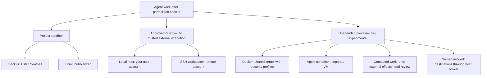

# The project sandbox

When the sandbox is up, ordinary agent commands that stay in the project run
with **network blocked and filesystem access restricted**. They can use the
workspace, selected installed toolchains and limited supporting files and caches.
Writes stay within the permitted project and scratch paths; sensitive project
configuration stays protected. The OS enforces this boundary.

Approval and containment are separate. A command can run without asking inside
the sandbox, or run without asking outside it because you granted host access.
[Permission tiers and trusted commands](auto-approval.md) explain those grants.

## Execution boundaries

The project sandbox wraps local commands. An unattended container contains the
whole agent run in a disposable guest. SSH workspaces use the remote account's
permissions; Copse does not install a sandbox on that host.

## Where it runs

| Platform                        | Sandbox                                                                         |
| ------------------------------- | ------------------------------------------------------------------------------- |
| macOS                           | ASRT seatbelt. This is the original, supported containment.                     |
| Linux                           | bubblewrap. Same contained / external matrix once it is up.                     |
| Windows                         | None. Standard commands prompt; explicit trusted commands are a separate grant. |
| Any platform after init failure | None. Same approval policy as Windows.                                          |

With auto-run enabled in a trusted project, local commands such as `npm test`
and `git status` normally run without a dialog on macOS and Linux. Network
commands such as `curl` or `git push` ordinarily ask before running outside;
an eligible command may instead use an explicit grant or auto-approval tier.

## Why run outside the sandbox?

Some work needs services the project sandbox blocks: `npm install` downloads
dependencies, `git push` publishes commits, and `xcodebuild` uses host build,
signing and simulator services. Approving external execution lets the command
use those services with your user account's filesystem and network permissions.
It is not restricted to the project folder by Copse's project sandbox.

Approval normally covers one operation. Remembering an eligible binary as a
[trusted command](auto-approval.md#trusted-commands) authorizes future matching
commands in trusted projects. A recognized low-risk shell shape can also skip
the prompt at your selected auto-approval tier. Both can authorize execution
outside the sandbox.

In an SSH workspace the command runs as the configured remote account. The
local sandbox does not confine it, and ordinary remote shell commands use the
unsandboxed approval policy even when the local sandbox is active.

## Unattended containers

Enable **Settings → Experimental → Unattended container runs**, then choose
**Run unattended in a container…** from the composer menu. This feature is
experimental and off by default. It requires a supported container engine and
model, and you set time and token budgets before starting.

The run uses a disposable copy of the thread's checkout. Docker uses its
container security profiles; Apple container gives the guest a separate VM.
Both run as a non-root user with a read-only base filesystem, dropped
capabilities, no privilege escalation and resource limits. The guest can write
its own workspace and scratch, but has no host checkout or Docker socket access.

- Work whose effects stay in the guest can run without a prompt, including
  changes that would require confirmation on your host. Hard denials remain.
- Recognized external effects, such as pushing commits or publishing a package,
  are not executed unattended: they are queued for review. External agents'
  own commands that cannot be queued are refused.
- Host escape attempts are denied. Network access has no ordinary route out;
  a host broker allows only named destinations for the run. Command access to
  that broker is separately gated.
- The guest receives the model credential needed for the run, not your ambient
  host credentials. Commits return under a run-specific Git ref for explicit
  adoption; the run does not move your checkout's HEAD or push its results.

Guarded YOLO and unattended container mode cannot be active together. The
container is not a hostile-workload or multi-tenant security guarantee, and a
command analyzer cannot infer every external effect of arbitrary code. Review
the returned changes and run record before adopting results.

## What is not the sandbox

- **Your Shells tab.** User-directed terminals spawn unsandboxed and do not
  prompt where a sandbox is active. The agent cannot type into that tab. This
  is a product choice (GA residual N2), not a bug in the closed #662 gate.
- **Approved external commands.** After you click “Run outside sandbox?”, that
  one command has your user account's permissions. Explicitly trusted commands
  can receive the same access without asking each time.
- **SSH workspaces.** The seatbelt does not follow you onto the remote account.
- **Managed remote agents.** Isolation belongs to Cursor or Anthropic, not to
  Copse’s local jail.

## Windows and init failure

Without a sandbox, standard commands ask and the shape-based auto-approval
dropdown cannot skip the question, including for reads. Explicit trusted-command
grants and Guarded YOLO are separate policies; neither creates an OS sandbox.
See [Permission tiers](auto-approval.md).

If a command fails _because_ the sandbox blocked it, you get the same
“Run outside sandbox?” question after the failure. That is the retry, not a
second product.

The contributor [permission contract](../shell-permissions.md) contains the
[mode overview](../shell-permissions.md#permission-modes-and-grants) and
[tool restriction table](../shell-permissions.md#high-level-tool-restrictions).
