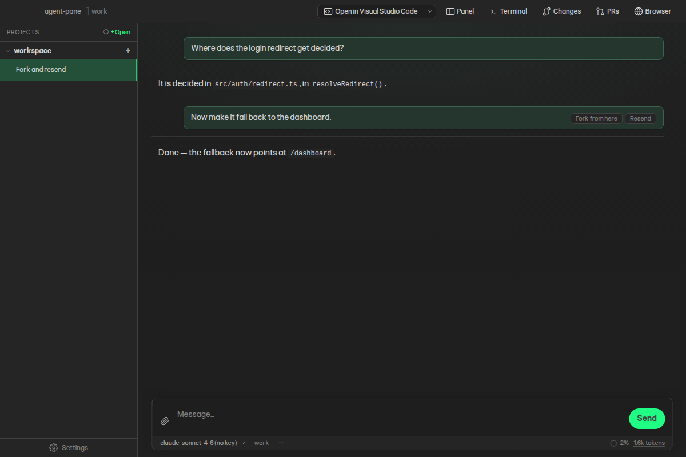
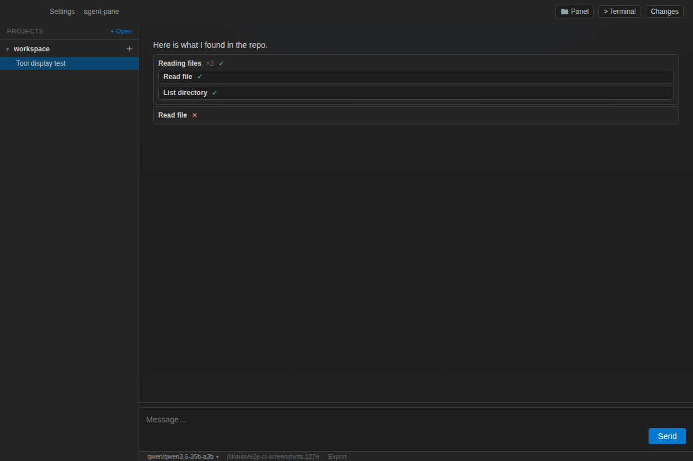
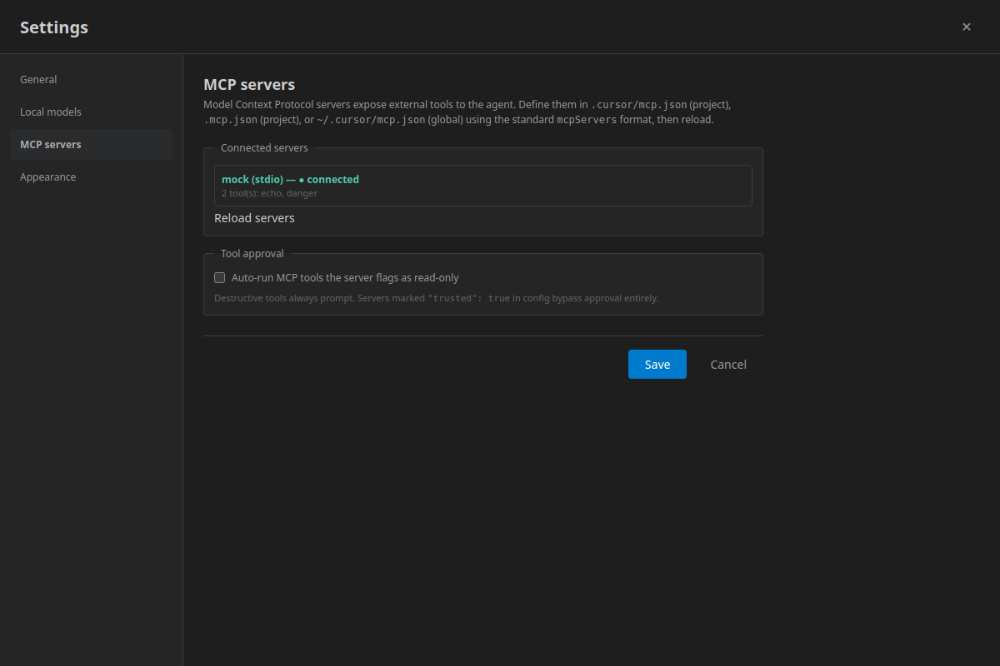
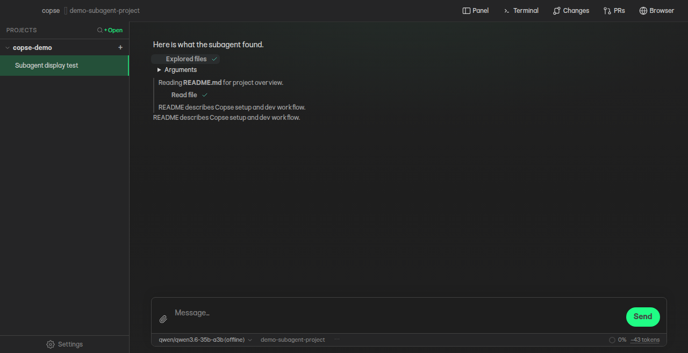

<!-- Generated from site/index.html by scripts/sync-site-markdown.mts.
     Do not edit by hand — edit the page and run `npm run site:md`. -->

Free & open source Desktop native

# Copse is an AI coding workspace that stays on your machine

An agentic workspace, not a chat tab bolted onto an editor.

Bring the cloud model, local model, or coding agent you already trust.  
Follow its work, shape how much autonomy it has, and keep the whole project on your machine.

Coming soon

[Open demo fullscreen](demo/main/?scenario=landing)

Copse talks straight to the model or coding agent you choose — there’s no Copse server in between. Work stays inside the project sandbox, and Copse asks before crossing the boundaries you set. Recognised low-risk commands can run automatically, with every decision recorded.

## Powerful tools, all at your control

Branch from any prompt without changing the original thread.

### Branch any investigation

Fork a whole thread or restart from an earlier prompt with the same model context. Resend the last request, queue the next one, and keep the original untouched.

### Explore in parallel

Hand focused research to subagents while the main conversation keeps moving. Their reasoning, tools, failures, and conclusions remain inspectable in the transcript.

### Bring the evidence

Attach files, editor selections, images, screen recordings, video, and zip archives. Copse safely unpacks bundles and keeps their contents with the thread.

### Use the agent you want

Connect directly to cloud providers, run local models, or use compatible coding agents installed on your machine. Switch without leaving the workspace.

### See every action

Tool calls, commands, diffs, subagents, hooks, and failures stay visible. Related activity groups together without hiding the underlying steps.

### Set the boundary

Keep work inside the project sandbox, approve access beyond it, or allow recognised low-risk command shapes. Permission decisions have a durable audit trail.

### Keep the whole record

Conversations live as ordinary files. Export a portable transcript or the complete thread folder, including plans, attachments, tool data, and nested agents.

One model picker

## Choose how Copse thinks

Pick a provider, then choose its API, cloud agent, installed agent, or model server. Copse sends requests straight from your machine to the route you select.

Direct cloud

### Use your own provider account

OpenAI, Anthropic, Gemini, OpenRouter, Groq, Together AI, Fireworks, and more.

Local models

### Keep inference on your hardware

Connect LM Studio, Ollama, llama.cpp, Jan, vLLM, or another compatible endpoint.

Coding agents

### Use the tools already on your machine

Connect compatible installed agents and keep their work visible inside Copse.

- OpenAI
- Anthropic
- Grok
- Together AI
- Fireworks AI
- Gemini
- Mistral

Privacy you can inspect

### Know where your data goes

Copse has no hosted backend and sends no product telemetry. Provider policy badges show retention and training defaults; OpenRouter uses zero-data-retention, non-training routes by default, and direct OpenAI requests opt out of storage.

[Read the privacy details →](privacy.md)

## Other features

### Worktrees per thread

Give concurrent tasks isolated branches without losing the state of the main checkout.

### Search by meaning

Find relevant code with bundled semantic indexing and explore results in chat.

### Git, shells, and browser

Run tests, review changes and pull requests, or exercise a local site beside the chat.

### Plans that survive the turn

Keep durable project knowledge and multi-step plans beside the conversation.

### Skills and plugins

Add reusable instructions, tools, hooks, panels, and focused agent behaviours.

### Extend what the agent can do

Connect MCP servers, JavaScript tools, compatible hooks, and existing Cursor sources.

Free, open source, and built in public

## Coming soon

Copse is still in development. The macOS build and the source repository aren’t public yet — this page is a preview of what we’re making.
